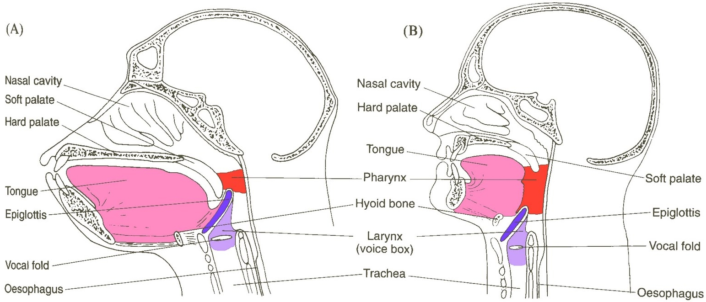
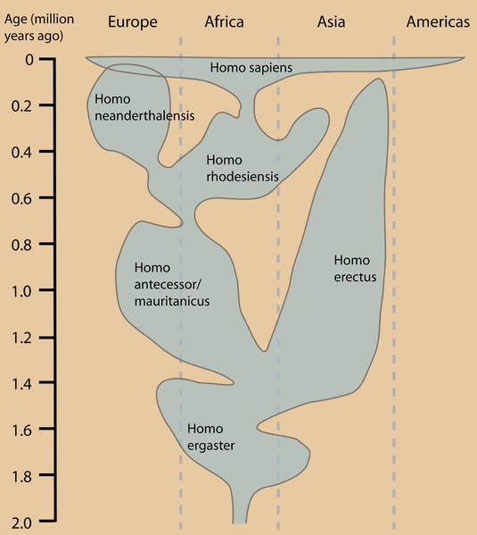
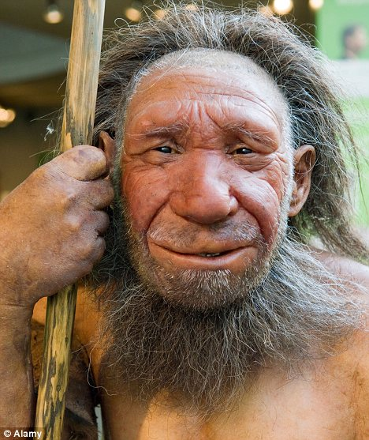
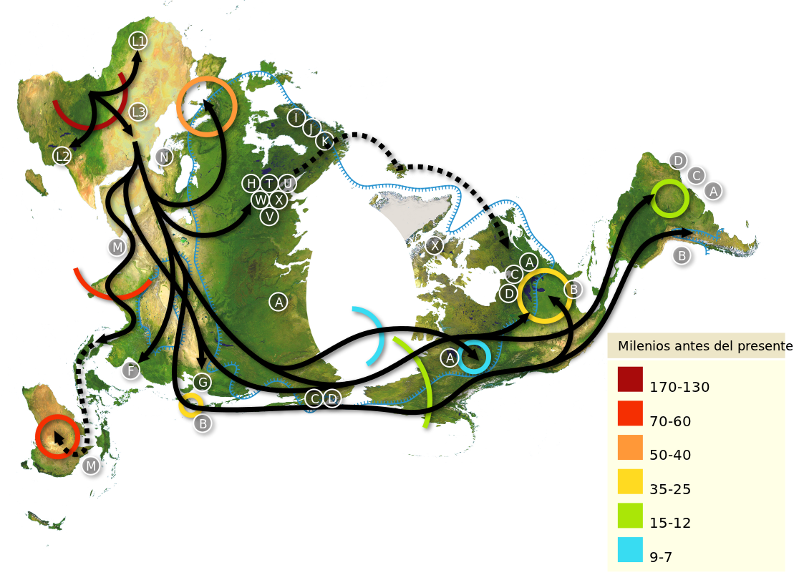

<!-- portada                                                                   -->

# El origen del lenguaje

## Introducción a la Lingüística.

Área de Lingüística, Fac. de Filología, UCM | 3/10/2013

Víctor Peinado | v.peinado@filol.ucm.es  

--SLIDE--

## Los orígenes del lenguaje

*Masticar, lamer y absorber son actos extremadamente comunes entre los mamíferos los cuales, si se observan sin más, presentan similitudes obvias con el habla.* (MacNeilage, 1998)

--SUBSLIDE--

- Habitualmente, no solemos concebir el hecho de hablar como algo similar con masticar o absorver, aunque todas estas actividades implican realizar movimientos con la boca, los labios y la lengua.

- Lo cierto es que desconocemos cuál es el origen del lenguaje. Se sospecha que el lenguaje hablado pudo desarrollarse hace entre 100.000 y 50.000 años (hace 3000-1500 generaciones).

- No ha sido posible encontrar evidencias directas ni artefactos relacionados con el habla de nuestros antepasados, de manera que no podemos conocer el aspecto del lenguaje en las primeras estapas de la historia evolutiva.

--SLIDE--

## El origen divino

- Para la mayoría de las religiones el lenguaje parece tener un origen divino.

- Según la tradición bíblica, Dios creó a Adán y 

    > formó del suelo a todos los animales del campo y las aves del cielo, y los llevó ante el hombre para ver cómo los llamaba y para que cada ser viviente tuviera el nombre que el hombre le diera.

- Según la tradición hindú, el lenguaje es obra de la diosa Sarasvati, esposa de Brahma, creador del universo. 

--SUBSLIDE--
## El origen divino

- A lo largo de la historia se han realizado distintos experimentos para intentar descubrir esta lengua divina original. 

    *-* EJEMPLO *-*

- La hipótesis de partida es que si se permitía a unos niños crecer sin contacto de ninguna lengua, estos terminarían por usar espontáneamente la lengua originaria dada por Dios. (??)

--SLIDE--
## La hipótesis de los sonidos naturales (guau-guau)

- Esta hipótesis se basa en la idea de que las palabras primitivas serían imitaciones de los sonidos de la naturaleza que los hombres primitivos escuchabn a su alrededor.

    - P. ej. un ave volando y que emite un sonido similar a *gra-gra*, o un pájaro que canta emitiendo algo similar a *cu-cu*, pueden terminar utilizándose para designar a estos animales.

--SUBSLIDE--

- En realidad, en todas las lenguas modernas existen palabras que imitan los sonidos naturales: las **onomatopeyas**.
	
    - P. ej., en castellano, además de todos los sonidos de los animales pueden tener origen onomatopéyico palabras como *bomba, chapotear, mugir, zumbar, sesear...*

- Pero no es fácil determinar el origen del resto de palabras que utilizamos para designar objetos del mundo que no emiten sonidos o entidades abstractas.

--SLIDE--

## La adaptación física

- En lugar de centrarnos en los tipos de sonidos como posible origen del lenguaje, podemos examinar los rasgos físicos que poseemos los seres humanos y compararlos con los de otras especies, asumiendo que estas diferencias son las responsables de la generación de los sonidos del habla.
	
- P. ej., en determinado momento de nuesta evolución, nuestros antepasados homínidos abandonaron la postura cuadrúpeda y comenzaron a caminar sobre dos patas. Al quedar libres las extremidades anteriores, se reajustaron sus funciones y se emplearon para otros fines (p.ej., agarrar objetos, construir herramientas).

--SUBSLIDE--

- Si examinamos esqueletos del tracto vocal de hombres del Neanderthal de hace unos 60.000 años, podemos sugerir que eran capaces de producir de manera diferenciada sonidos consonánticos. Pero es necesario acercarnos más en el tiempo (hasta hace 35.000 años) para encontrar restos fósiles con semejanzas evidentes con los hombres modernos.

- Por si solos, estos rasgos nos tendrían por qué dar lugar necesariamente al lenguaje. Pero sí constituyen indicios de que una criatura que los poseyera probablemente sería capaz de hablar.

- En los *H. sapiens* modernos, los dientes no están inclinados (como lo están en algunos simios) sino que son rectos y todos de un tamaño parecido. Esta caraterístisca no resulta útil para cortar comida, pero sí para producir de manera diferenciada sonidos como [d], [t], [f], [&theta;]. 

--SUBSLIDE--

- Los labios humanos están conectados con una musculatura mucho más compleja que en otros animales, lo que peemite producir sonidos como [p] y [b].

- La lengua es más pequeña, gruesa y musculosa que en otros animales, lo que permite generar una amplia variedad de sonidos dentro de la cavidad oral.

--SUBSLIDE--

- La laringe tiene una posición más baja y crea una cavidad amplia llamada **faringe**. Esto tiene sus pros y sus contras:  
  
    - permite que las cuerdas vocales produzcan sonidos más claramente diferenciados y variados, pero;
    - no podemos respirar y tragar al mismo tiempo, es más fácil atragantarse.

- [Wikipedia: posición de la laringe y el hueso hioides en los mamíferos y los homo sapiens modernos](http://es.wikipedia.org/wiki/Evolucion_humana#Aparici.C3.B3n_del_lenguaje_simb.C3.B3lico)
  

--SLIDE--

## El cerebro humano

- El cerebro humano es el responsable del control de todos estos componentes físicos disponibles para la potencial producción de sonidos articulados.
- El cerebro de *H. sapiens* posee un tamaño inusualmente grande en relación con el tamaño del cuerpo.
- El cerebro está lateralizado: cada hemisferio está especializado en unas tareas determinadas. 
- En la mayoría de los humanos, las áreas encargadas del control de los movimientos motores implicados en el habla y en la manipulación de objetos se encuentran localizadas en el hemisferio izquierdo.
- El hemisferio izquierdo tiene desarrollado en su corteza áreas específicas que posibilitan el lenguaje jdsimbólico basado en significantes acústicos: el área de Wernicke y el área de Broca.

--SUBSLIDE--

- Resulta plausible una relación en el desarrollo de ambos tipos de habilidades y podemos hacer una analogía entre construir herramientas y el lenguaje.
- Para contruir un hacha no basta con agarrar una piedra. Necesitamos agarrar dos piedras y hacerlas chocar.
- Con el desarrollo del lenguaje, parece que existió una fase en la que los humanos primitivos, de manera rudimientaria, fueron capaces de nombrar los objetos del mundo, produciendo siempre un mismo ruido específico. 
- Esta fase, crucial en el desarrollo del lenguaje, aún carecía de organización estructural.
- Después de un determinado tiempo, los seres humanos terminaron perfeccionando esta capacidad de generar mensajes combinando vocalizaciones específicos.

--SLIDE--

## El origen genético

- Un bebé humano durante sus primeros años de vida es un ejemplo viviente del desarrollo del lenguaje y de otras habilidades que nos hacen humanos.
-  En el momento de nacer, el cerebro del bebé pesa 1/4 del peso de un adulto y su laringe se encuentra más elevada.
- En relativamente poco tiempo, el cerebro se desarrolla, el bebé adopta una postura erguida y aprende a caminar sobre dos piernas. 
- Y comienza a hablar. Incluso los bebés sordos de nacimiento, en las condiciones apropiadas, son cac de utilizar la lengua de signos con fluidez y en muy poco tiempo.
- Este conjunto de desarrollos tan complejos y veloces han llevado a hipotizar sobre el origen genético del lenguaje.
- Chomsky y sus seguidores defiended la capacidad innata de los seres humanos para el lenguaje.
- Somos los únicos seres capacitados para el **lenguaje**, ¿pero somos los únicos capacitados para la **comunicación**?

--SLIDE--

# Los orígenes del lenguaje: la teoría gradualista

--SLIDE--

## Planteemos el problema

- Si existen zonas del cerebro relacionadas con el lenguaje y somos capaces de comprobar si algunas razas de homínidos poseían tales zonas (e incluso, si somos capaces de reconstruir a partir de fósiles la evolución de esas partes del cerebro) podríamos tener una aproximación a algo así como la «evolución de la posibilidad del lenguaje». 
- Si una especie de homínido resulta tener algo que no tienen otras y sí tenemos nosotros, y este algo está relacionado con el lenguaje, podemos suponer que esta especie podría haber tenido un lenguaje como el nuestro, pero no las otras.
- Si para la fonación hacen falta determinadas características de la boca, la lengua y la laringe, etc. y determinada especie de homínidos, pero no otras, posee estás características, podemos pensar que dicha especie podría articular sonidos similares a los nuestros.   

--SLIDE--
## ¿Surgió el lenguaje por mutación genética?

- Tal y como explica la teoría de la evolución, cualquier cambio significativo implica mutaciones en una parte considerable del genoma.
- Las mutaciones aprovechan lo que ya existe y, o bien le añaden nuevas funcionalidades, o bien cambian una función antigua por otra nueva, aunque relacionada.
- Chomsky y sus seguidores defienden el origen genético e innato del lenguaje. Consideran además que el lenguaje es un módulo cerebral independiente que, en un momento dado de la evolución de los homínidos, surgió con motivo de una mutación radical que implantó los principios de la Gramática Universal en el cerebro. 
- Pero esta concepción, entendida de manera radical, es problemática. Veamos por qué.

--SUBSLIDE--

- Para empezar, nada que tenga base genética es exactamente igual en todos los seres humanos. De hecho, se producen continuamente mutaciones por infinidad de motivos. 
	
P. ej., encontramos niños que nacen sordos, ciegos, siameses con dos cabezas, seis dedos, con gigantismo/enanismo, Down, etc.
	
- Sin embargo, no encontramos niños que presenten diferencias lingüísticas con respecto a sus padres.
	
P. ej., no existen niños que combinen las estructuras sintácticas de manera diferente o enlacen los morfemas de maneras distintas.
	
- El lenguaje sería el único órgano en todos los seres vivos que es igual en todos los casos: esta hipótesis es excesiva.
	
- Podemos entender el lenguaje no como una mutación completamente nueva y radical, sino como el producto de pequeños cambios paulatinos a lo largo del tiempo. De esta manera es precisamente como actúa la selección natural.

--SLIDE--

## ¿Sirve de algo estudiar a los monos?

- Hace unos 6M años, los homínidos se separaron de los antepasados de nuestros parientes más próximos: los actuales chimpancés.
- Las comparaciones no son sencillas, principalmente porque los chimpancés también han evolucionado en estos últimos millones de años. 
- El estudio de los chimpancés en su hábitat natural ha permitido diversos descubrimientos:
    - son capaces de utilizar herramientas sencillas: ramitas para cazar termitas, piedras para abrir frutos. 
    - cazan en grupo y comparten el botín.
    - utilizan piedras para ahuyentar a los depredarores.
- El uso de herramientas cambia de un grupo a otro: ¿existen diversas culturas?

--SUBSLIDE--

- El estudio de chimpancés en cautividad también ha sido amplio. 
- Se ha tratado de criar chimpancés (también gorillas y orangutanes) desde el nacimiento dentro de una familia como si fueran bebés humanos, incluso en compañía de estos.
- La triste realidad es que ninguno de ellos aprendió a hablar (algo comprensible, dado que su aparato fonatorio no es compatible con los sonidos de las lenguas humanas) pero tampoco a utilizar lenguajes gestuales (para los que en principio no tienen ninguna limitación física).
- El caso más espectacular y famoso es el de una chimpancé bonobo llamada Kanzi que aprendió a reconocer oralmente hasta 125 signos y era capaz de crear *oraciones* sencillas agrupando dos conceptos utilizando un vocabulario de imágenes.

--SUBSLIDE--

- Fue capaz de discriminar oraciones como *echa la leche en el agua* y *echa el agua en la leche*, o *haz que el perro muerda a la serpiente* y *haz que la serpiente muerda al perro*. 
- Lo llamativo es que aprendió sin instrucción lingüística, cuando los investigadores trataban de enseñar a comunicarse (con éxito nulo) a su madre.
- Kanzi creció desde recién nacida en un entorno en el que la comunicación y el trato interpersonal estaba muy desarrollado, mucho más que en su entorno natural. Esto posibilitó desarrollar sus capacidades al límite. 
- Igual que en los niños humanos, la necesidad de comunicarse empujó la actividad simbólica y la secuenciación de símbolos.
- Kanzi alcanzó un pre-lenguaje rudimentario, pero ni ella ni nungún otro mono antropoide ha sido capaz de alcanzar el desarrollo lingüístico de un niño humano de 2 años.

--SUBSLIDE--

## Comparación tracto vocal mono-humano

--SLIDE--

## ¿Cuándo surgió el lenguaje?

- Es una pregunta difícil de responer.
    - ¿Cuándo hablamos de lenguaje propiamente dicho?
    - ¿Existen fases intermedias entre la forma de comunicación de los chimpancés y la nuestra?
- Algunos investigadores situán los inicios del lenguaje en el *H. habilis* (hace 2M años) y el *H. erectus* (hace 1,5M años). 
- Estos homínidos podrían tener un pre-lenguaje, un mecanismo de comunicación mínimo sin los principios de la sintaxis.
	
--SUBSLIDE--

- Otros investigadores defienden que los orígenes del lenguaje son mucho más recientes, cuando aparció el *H. sapiens* (hace 200.000 - 150.000 años).
- Sin embargo, hasta hace 35.000 años no aparecen las primeras representaciones artísticas que dejan translucir ciertas capacidades simbólicas.
- Según el registro fósil, hasta hace 10.000 años los humanos no tenían un riego cerebral similar al nuestro.

--SLIDE--
## Evolución humana

--SLIDE--
## ¿Hablaban los Neanderthales?

--SUBSLIDE--
## ¿Hablaban los Neanderthales?

- Si los neanderthales eran una especie distinta a la nuestra, cabe la posibilidad de que su lenguaje nos pareciera tan extraño e inaccesible como el de cualquier otra especie animal.
- Muchos autores coinciden en decir que el aparato fonatorio neanderthal era más limitado que el nuestro. 
    - Solo podrían articular vocales en el ámbito de [e] y [o].
    - Los sonidos vocálicos serían fuertemente nasalizados.
    - Aparentemente, podrían pronunciar la mayoría de nuestros sonidos consonánticos, salvo las velares [k] y [g].

--SUBSLIDE--

- A pesar de lo aparentemente limitado de este sistema, si lo comparamos con lenguas modernas, es lo suficientemente rico para permitir la comunicación articulada.
- La única pega es el tamaño y la posición de la lengua neandertal, que sugiere que tenían una expresión lenta y poco eficaz.

--SLIDE--

## Hipótesis gradualista del lenguaje

- El lenguaje empezó a desarrollarse paulatinamente hace 2M años y la evolución gradual desembocó en algo parecido a nuestra lenguas actuales hace unos 100.000 años.
- Desde ese momento, podemos ver un proceso de aumento de complejidad del lenguaje y una progresiva automatización (paralelo al desarrollo de una sintaxis).
- El origen del lenguaje es un elemento más del conjunto de la vida y la cultura humana: todo debió de evolucionar simultáneamente.

--SUBSLIDE--

1. ¿Cómo pasamos a una producción intencional, voluntaria y arbitraria del lenguaje?
2. ¿Cómo se crean las palabras y cómo crece el vocabulario?
3. ¿Cómo se crean unidades complejas a partir de palabras?
4. ¿Cómo se perfecciona el sistema fonatorio?

--SLIDE--

## Producción intencional, voluntaria y arbitraria

- Partamos de la idea de que los primeros homínidos manejaban un conjunto de gritos y señales básicos para la comunicación (algo similar a los chimpancés actuales): existe un grito para avisar al resto de la manada de la existencia de comida, otro grito para alertar de un depredador, etc.
- Estos gritos o señales son involuntarias, casi automáticos: cuando alguien ve comida o un depredador, produce el grito correspondiente.

--SUBSLIDE--

- A partir de un determinado momento, alguien aprende a hacer las señales de manera voluntaria y se comienzan a utilizar para otros fines (p. ej., evitar ser atrapado por un depredador, engañar a tus compañeros para quedarte con la comida).
- De esta manera se convierten en signos básicamente arbitrarios, dirigidos a un fin concreto y con una función simbólica.

--SLIDE--

## Aumento de vocabulario

- Las palabras se corresponden con conceptos: es imprescindible que el concepto exista y que alguien empareje el concepto y el símbolo que lo representa.
- Por definición siempre se ha dicho que el signo lingüístico es la unión arbitraria entre un significante y un significado. 
- No hay nada en la palabra *agua* que denote líquido, humedad, bebida...  
- De hecho, es tan arbitrario que en otras lenguas utilizan otros signos para designar el mismo concepto: *water, eau, acqua, Wasser, yaku, ma, shui...* 

--SUBSLIDE--

- Sin embargo, el signo lingüístico no es tan arbitrario como parece. Existe la fonética expresiva que permite explicar por qué asociamos de manera universal determinados sonidos a significados concretos.
    - el sonido [i] se asocia con objetos pequeños.
    - los sonidos [o] y [u] se asocia con objetos grandes o pesados.
    - el sonido [&#643;] se asocia con cosas que fluyen.
    - el sonido [k] con cosas que se rompen
    - etc.

--SLIDE--

## Palabras y gestos

- Imagínese que producimos una vocalización que signifique *objeto largo y estrecho*. 
- En este ejemplo, vamos a llamarla *ded*. Ya tenemos una palabra. 
- La podemos utilizar para designar muchísimas cosas: una rama de árbol, el brazo, la pierna, los dedos de la mano, un sendero, la cola de un animal, una serpiente.
- Podemos hacer variaciones de las palabras para distinguir estos sonidos (alargar más o menos la vocal, cambiar el tono, etc.) o podemos acompañar la pronunciación con gestos.
- No hay razón para pensar que los homínidos primitivos no utilizaban combinaciones de vocalizaciones y lenguaje gestual (de hecho, estas combinaciones existen en lenguas actuales).

--SUBSLIDE--

- Una hipótesis plausible para explicar el origen del vocabulario es pensar en combinaciones de vocalizaciones con sentidos generales y especificaciones a través de gestos. Es un mecanismo muy productivo. 
- Nuestros homínidos primitivos podrían incorporar también gestos que incluyeran movimientos con la lengua y los labios. De esta manera, la boca quedaba configurada con determinadas características acústicas. 

--SUBSLIDE--

- ¿Qué pasa si nuestro homínido expulsa aire de los pulmones en ese momento? Obtendría un sonido directamente relacionado con el gesto inicial.
- Ya tenemos algo parecido a un lenguaje primitivo: vocalizaciones, combinaciones de vocalizaciones y gestos con las manos, gestos de la cara, etc. Quizá no es mucho, pero es más sofisticado que el lenguaje de los chimpancés.
- El uso de todos estos mecanismos podría favorecer el desarrollo de otras capacidades del cerebro.

--SLIDE--

## ¿Qué es la sintaxis?

- Las frases y oraciones no son una mera sucesión de palabras, sino que poseen una estructura jerárquica. Unas palabras *dependen de* o *están relacionadas con* otras.
- Cuanto más frecuente y simple sea una actividad, tanto más automatizada llegará a hacerse, hasta el punto de que no necesitemos planificarla ni seremos conscientes de cómo la realizamos.
- Con el lenguaje pasa algo parecido. Al preparar un discurso, necesitamos planificar qué queremos decir y cómo queremos trasmitirlo. Al hablar con un amigo en la calle, habitualmente, no pensamos en cómo estructuramos los elementos de nuestro discurso. 

--SUBSLIDE--

- Por el momento, y sin necesidad de profundizar más, podemos entender la **sintaxis** como la **automatización de procesos lingüísticos**.
- El hemisferio cerebral derecho se especializa en realizar actividades globales y creativas en estrecha dependencia del contexto concreto. 
- En el hemisferio izquierdo (donde residen las áreas del lenguaje) se realizan las tareas frecuentes y rutinarias qe exigen precisión pero que ya están automatizadas.

--SLIDE--

## Gestos, verbos y sintaxis

-  ¿Cómo nos comunicamos cuando intentamos hablar con un extranjero? (ej. viaje de Colón)
-  ¿Cómo le pedimos a un indígena americano de s. XVI que nos dé comida? Probablemente, señalemos al indígena, después a nosotros mismos, a continuación un gesto que indica *algo que sale del indígena hacia nosotros* y por último el gesto de *llevarnos algo a la boca*.    
-  Es decir, establecemos puntos de referencia (indígena, comida, yo) y una relación entre estos puntos (tú me das la comida, y yo como).

--SUBSLIDE--

-  Siempre es el mismo procedimiento: puntos de referencia y un gesto icónico que indica la relación entre ellos.
-  Algo similar ocurre en los verbos y los argumentos de las lenguas actuales. Los verbos indican relaciones, los argumentos (CD, CI, CC) indican puntos de referencia.

--SLIDE--

## ¡Ya tenemos pre-lenguaje!

-  Una lengua que utilizara estos procedimientos estaría prácticamente al mismo nivel que las nuestras. 
-  La principal diferencia es que lo que para nosotros es automático, para estos homínidos no lo es tanto. Falta la sintaxis, que es precisamente el elemento que permite automatizar las estrategias de la comunicación. 
-  A medida que pasa el tiempo, sucesivas mutaciones van perfeccionando el aparato fonatorio, el cerebro y las áreas más significativas del lenguaje. 

--SUBSLIDE--

-  Paralelamente, se desarrollan distintas funciones del lenguaje:
	
	-  Fase referencial: usamos palabras para referirnos a objetos de la realidad.
	-  Fase pragmática: los enunciados se vuelven más complejos, p. ej., al relatar algo como una sucesión de palabras en un orden icónico.
	-  Fase sintáctica: automatizamos los procesos lingüísticos.
	

--SLIDE--

## Resumen

-  El origen del lenguaje ha sido durante mucho tiempo un tema casi tabú. Aquí presentamos distintas hipótesis que se han manejado:
	
    1. El origen divino.
    2. La hipótesis de los sonidos naturales (o del guau-guau).
    3. La adaptación física.
    4. El origen genético e innato del lenguaje, entendido como un módulo, una estructural cerebral independiente (lingüística generativa y vertiente *chomskyana*).

--SUBSLIDE--

- A continuación, presentamos en profundidad una **hipótesis gradualista** del origen y desarrollo del lenguaje contraria al innatismo (lingüística cognitiva).		
- Esta hipótesis gradualista defiende el lenguaje, no como una mutación nueva y radical, sino como fruto de las capacidades del cerebro que se han desarrollado paulatinamente. 
- Intenta explicar el desarrollo del lenguaje como un proceso de aumento de complejidad del lenguaje y una progresiva automatización (sintaxis).
- El origen del lenguaje es un elemento más del conjunto de la vida y la cultura humana, paralelo al desarrollo de otras capacidades cerebrales y del ser humano social (contrucción y manejo de herramientas, capacidad simbólica, etc.).

--SLIDE--

## Mapa de las migraciones humanas

--SLIDE--
## Referencias

- Bernárdez, E. *¿Qué son las lenguas?* Alianza Ensayo. 2004.
- Kenneally, C. *The First Word: The Search for the Origins of Language*. Penguin Books. 2008.
- Tusón Valls, J. *Introducción al lenguaje*. UOC. 2003.
- Yule, G. *El lenguaje*. Ediciones AKAI. 2007. 
- Wikipedia: [Evolución humana](http://es.wikipedia.org/wiki/Evoluci\%C3\%B3n\_humana)

