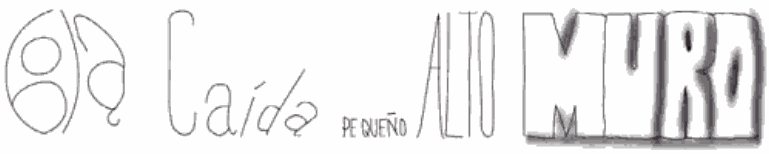

# La comunicación animal

## Introducción a la Lingüística.

Área de Lingüística, Fac. de Filología, UCM | 4/10/2013

Víctor Peinado | v.peinado@filol.ucm.es

--SLIDE--
### La comunicación animal

-  Es evidente que en el reino animal existen formas de comunicación más o menos desarrolladas.

-  Son muchos los seres vivos capaces de comunicarse (a veces, de maneras sofisticadas) con otros miembros de su propia especie.

-  ¿Es posible encontrar alguna criatura capaz de aprender a comunicarse con los seres humanos empleando el lenguaje?

-  ¿Posee el lenguaje humanos algunas propiedades que lo hacen especial si lo comparamos con otros mecanismos de comunicación? 

-  Analicemos el lenguaje humanos y las distintas formas de comunicación del reino animal comparando las características de cada uno de ellos.

--SLIDE--

### Señales comunicativas y señales informativas

-  En primer lugar, resulta preciso distinguir entre:
   
    - **señales comunicativas**
      
    - **señales informativas**

- Las primeras son intencionadas, las segundas no.

--SUBSLIDE--

-  P. ej. cuando nos fijamos en una persona hablando, podemos obtener información gracias a distintas señales que esta persona nos envía de forma no intencionada.
	
	-  habla con voz ronca &rarr; está resfriada.

	-  tiene un acento diferente al mío &rarr; es extranjera.

	-  mueve continuamente un pie &rarr; es una persona nerviosa.

	-  lleva un calcetín de cada color &rarr; es algo descuidada.
	
-  Por el mimo motivo, no pensamos que un mirlo esté comunicando nada por tener plumas de determinado color, pero sí se considera que envía señales comunicativas cuando grita al advertir la presencia de un gato.

-  La **intencionalidad** es la principal diferencia.

--SLIDE--

### Desplazamiento

-  Cuando llegas a casa tu gato te recibe con un *miau*. Lo más probable es que entendamos ese mensaje como relacionado con ese preciso instante. 

-  Si le preguntas qué tal le ha ido el día, te responderá con un mismo *miau*.

-  Parece que la comunicación animal está diseñada únicamente para el momento presente.

-  Por el contrario, el lenguaje humano posee la propiedad de **desplazamiento** por la que podemos hablar sobre acontecimientos pasados, futuros e incluso sobre cosas y lugares de cuya existencia no estamos seguros. 

--SUBSLIDE--

-  Por regla general, se considera que la comunicación animal no puede utilizarse de forma efectiva para referirnos a sucesos situados lejos en el tiempo o el espacio.

-  Video sobre [danza de abejas](http://www.youtube.com/watch?v=-7ijI-g4jHg).

-  En este caso, podríamos aceptar que el lenguaje de las abejas tiene una capacidad de desplazamiento limitada.

-  Lo que parece claro es que las abejas no pueden informar sobre la situación de flores *en el jardín que te comenté la semana pasada* ni hablar sobre *el néctar que encontraremos en el paraíso de las abejas*.

--SLIDE--

### Arbitrariedad

-  Lo normal es que no haya una conexión natural entre una forma lingüística y su significado. La conexión es **arbitraria**.

-  La forma lingüística no tiene una relación natural o icónica con el objeto o entidad que representa.

-  No hay nada en la palabra *perro* que denote *mamífero ladrador de cuatro patas*. De hecho en otras lenguas se utilizan otras formas para nombrar la misma realidad: *dog, chien, cane, Hund*. 

--SUBSLIDE--

 

-  Como hemos visto ya, en todas las lenguas hay palabras que tratan de imitar los sonidos de la naturaleza: *cucú, ronrorear, tartamudear...* 

-  Esos ejemplos son escasos en todas las lenguas del mundo.

--SUBSLIDE--

-  Por el contrario, en la mayoría de las señales que emplean los animales para comunicarse sí parece existir una conexión entre el mensaje que transmiten y la señal que emplean.

-  Da la impresión de que estas señales no son tan arbitrarias, ya que los animales cuentan con un conjunto limitado de señales.

-  Todos los tipos de comunicación animal tienden a producirse merced a un conjunto limitado y fijo de elementos vocales o gestuales. 

-  Estas señales se utilizan en situaciones específicas o momentos concretos: p. ej., delimitar el territorio, atraer a parejas en época de celo...

--SLIDE--

### Productividad

-  Para poder describir nuevos objetos y situaciones, los seres humanos creamos constantemente nuevas expresiones y enunciados, a través de los recursos ligüísticos de los que disponemos.

-  Esta propiedad se conoce con el nombre de **productividad**, creatividad o carácter abierto.

-  Esta productividad está directamente relacionada con el hecho de que el número potencial de enunciados de cualquier lengua humana es infitivo.

-  Por el contrario, los sistemas de comunicación que emplean otras especies carecen de esta cualidad.

--SUBSLIDE--

-  La comunicación animal se caracteriza por tener lo que se denomina **referencia fija**.

-  Las cigarras disponen de 4 señales diferentes para comunicarse con otros miembros de su especie y algunos cuentan con 36 señales vocales.

-  Las abejas obreras disponen de un conjunto sofisticado de señales para describir distancias en el plano horizontal, pero no en el vertical &rarr; las abejas carecen de una forma de indicar *arriba* y ademas son incapaces de crearlo.

--SUBSLIDE--

-  Gritos de advertencia de cercopitecos de cara negra:
	
	-  *chutter*: se acerca una serpiente

	-  *rraup*: se acerca un águila

	-  *rrr*: se acerca un león
	
-  Si un buen día apareciera una serpiente voladora, los cecopitecos serían incapaces de crear una nueva señal chutter-rraup.

--SLIDE--

### Transmisión cultural

-  Heredamos de nuestros padres determinados rasgos físicos, sin embargo no heredamos la lengua que hablamos.

-  Adquirimos una lengua en el contexto de una cultura determinada, en relación con otros hablantes y de una forma que nada tiene que ver con los genes familiares.

-  Un niño de origen chino que sea adoptado por padres españoles y criado en Madrid, manifestará determinadas características heredadas de sus padres biológicos, pero hablará castellano. 

-  Un gatito, sometido a las mismas experiencias, dirá *miau* a pesar de todo.

-  El proceso mediante el cual una lengua pasa de una generación a otra se denomina **transmisión cultural**.

--SUBSLIDE--

-  Los humanos adquirimos nuestra lengua materna como niños en el seno de una cultura concreta.

-  En el caso de la comunicación animal, los individuos nacen dotados de un juego de señales que se genera de forma instintiva.

-  En determinadas especies de pájaros parece existir una combinación entre instinto y aprendizaje para producir un canto correcto. 

-  Si estos pájaros pasan sus primeras semanas de vida sin oir a sus congéneres, producirán de manera instintiva un canto, pero serán anormales.

-  Un bebé humano que crezca aislado no produce ninguna lengua instintiva.

-  La transmisión cultural es crucial en el proceso de adquisición característico de las lenguas humanas.

--SLIDE--

### Dualidad

-  El lenguaje humano está organizado simultáneamente en dos niveles o capas. Esta propiedad se conoce con el nombre de **dualidad** o doble articulación.

-  En la producción del habla, podemos, desde un punto de vista físico, generar sonidos individuales [e] [r] [s].

-  Ninguna de estas formas discretas posee un significado por sí misma. 

--SUBSLIDE--

-  Sin embargo, cuando los emitimos de manera combinada y siguiendo un orden concreto, como en [ser] nos encontramos en un nivel diferente, dado que el significado de esa combinación difiere del de [res].

-  En el primer nivel tenemos sonidos diferentes, en el segundo tenemos significados diferentes.

-  Esta dualidad de niveles permite al lenguaje humano funcionar como un sistema económico: **a partir de un conjunto finito de unidades fónicas podemos generar un número extremadamente elevado de combinaciones con significados distintos**.

--SUBSLIDE--

-  Esta característica no la encontramos en el lenguaje animal.

-  Cada señal comunicativa parece consistir en una única forma fijada, que no puede descomponerse.

-  El *guau* que emite tu perro cuando llegas a casa no puede separarse en unidades más pequeñas que se puedan combinar para generar otras unidades.

-  El *chutter* y el *rraup* de los cercopitecos tampoco se puede descomponer .

--SLIDE--

### Características de las lenguas naturales (Hockett, 1960)

- Canal vocal-auditivo: las señales son emisiones vocales y son recibidas por vía auditiva.

- Transmisión difundida y recepción dirigida: la señal es una onda que se expande en todas direcciones; el receptor puede localizar al emisor por la dirección de la onda.

- Transitoriedad: las señales sonoras se desvanecen rápidamente.

- Desarrollo interlocutivo: un interlocutor puede tanto emitir como recibir mensajes.

- Retroalimentación: un emisor puede escucharse a sí mismo en el momento de emitir un mensaje.

--SUBSLIDE--

- Especialización: los órganos que intervienen en la producción del hablar están especializados. 

- Semanticidad: las señales son realidades perceptibles sensorialmente y además transmiten significado &rarr; significante vs significado

- Arbitrariedad o convencionalidad: las señales son independientes del objeto que designan.

- Discreticidad: las unidades básicas son separables. 

- Desplazamiento: es posible hacer referencia a acontecimientos pasados y futuros.

--SUBSLIDE--

- Dualidad o composicionalidad: dos niveles estructurales &rarr; nivel fonico vs nivel léxico.

- Productividad: el número de mensajes es infinito.

- Transmisión cultural: el lenguaje humano es producto de la evolución histórica y se transmite entre generaciones.

- Prevaricación: disimulación o falsificación, metáfora, ironía, mentira.

- Reflexibilidad: las lenguas se pueden utilizar para hablar de las lenguas mismas &rarr; función metalingüística.

--SLIDE--
	
### Referencias

	
- Wikipedia: [Las características de las lenguas naturales](http://es.wikipedia.org/wiki/Lengua\_natural\#Caracter.C3.ADsticas\_de\_las\_lenguas\_naturales).

- Bernárdez, E. *¿Qué son las lenguas?* Alianza Ensayo. 2004.

- Tusón Valls, J. *Introducción al lenguaje*. UOC. 2003.

- Yule, G. *El lenguaje*. Ediciones AKAI. 2007. 
	

