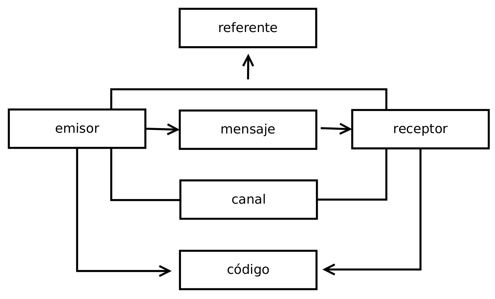
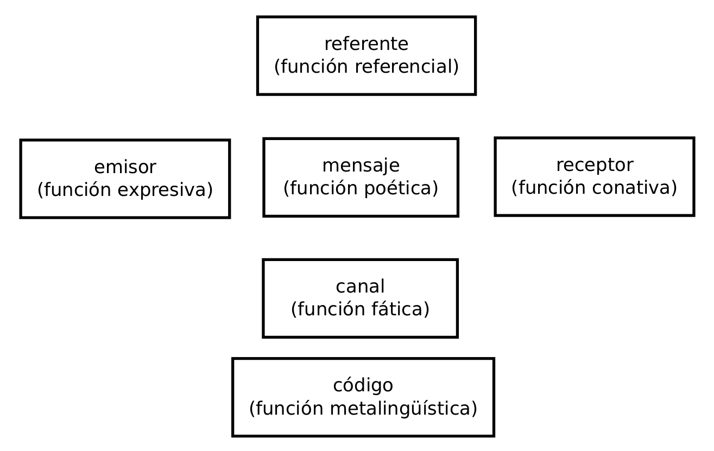

# El modelo de la Comunicación y las Señales Lingüísticas

## Introducción a la Lingüística.

Área de Lingüística, Fac. de Filología, UCM | 3/10/2013

Víctor Peinado | v.peinado@filol.ucm.es  

--SLIDE--
## El proceso de comunicación

La **comunicación** es un proceso para la transmisión de señales entre una fuente emisora y un destino o receptor. 

--SUBSLIDE--

## Elementos del proceso de comunicación

- **emisor** tiene intención de comunicar y... elabora un 

- **mensaje** conjunto de señales dirigido a un... 

- **receptor** recibe e interpreta el mensaje

- **referente** realidad física o mental, externa al emisor y receptor, a la que hace referencia el mensaje

- **canal** medio físico a través del cual viaja el mensaje

- **código** compartido por emisor y receptor que permite elaborar e interpretar las señales.

--SUBSLIDE--

*Estimados alumnos, diríjanse de manera ordenada a la cafetería para degustar distintos tipos de bollería industrial.*

- El emisor sería el bedel encargado de la megafonía.

- El mensaje sería el texto verbal que se ha emitido.

- El receptor serían los alumnos que escuchan el mensaje.

- El referente es la información sobre la activida de degustación que se ha preparado en la cafetería.

- El canal es la instalación de magafonía, el aire y el aparato auditivo de los receptores.

- El código es la lengua castellana, compartida tanto por el emisor como por los receptores.

--SUBSLIDE--

Los ingredientes imprescindibles de cualquier proceso de comunicación son seis:

--SLIDE--

## Funciones del lenguaje

- Roman Jakobson determinó los papeles asociados a los seis elementos del proceso de comunicación. 
  
- Los mensajes pueden ser caracterizados por cualquiera de estas funciones, dependiendo de la dominancia de uno de los elementos por encima de los demás.

--SUBSLIDE--

--SUBSLIDE--

- función **expresiva** (emisor): mensajes que manifiestan la actitud, la sensibilidad o el estado de ánimo.

    - *¡Por fin llueve!*, *Hoy me siento muy optimista*, interjecciónes como *¡ay!*, *¡vaya!*, etc.

- función **poética** (mensaje): mensajes que se centran en la forma y no en el contenido. 
  
    - La poesía, publicidad y eslóganes políticos.

--SUBSLIDE--

- función **conativa** o **coactiva** (receptor): mensajes dirigidos a que el receptor actúe o deje de hacerlo de un modo determinado. 
  
    - las formas verbales en imperativo u oraciones como *Ahora mismo estoy muy ocupado*.   

- función **referencial** o **informativa** (referente):  mensajes cuya principal finalidad es comunicar e informar sobre referentes claramente delimitados. 
  
    - *Este bolígrafo no escribe*, *Ahora estamos en clase*, las crónicas deportivas, los artículos científicos.

--SUBSLIDE--

- función **fática** o **de contacto** (canal): mensajes para verificar si el canal está uniendo a los interlocutores. 
  
    - *¿Me oyes?*, *Mmm, claro*.

- función **metalingüística** (código): mensajes sobre el propio código en los que utilizamos la lengua para hablar de la propia lengua. 
  
    - *¿Qué significa metalingüística?*, los diccionarios, las clases de lingüística.

--SLIDE--

## Tipos de señales

Uno de los requisitos en cualquier proceso de comunicación es que exista una señal entre el emisor y el receptor. 

- [señal] elemento material, cuya percepción nos informa de la existencia de otra realidad.  

\vspace{-1cm}

\begin{center} 
  \includegraphics[angle=270,width=1\textwidth]{img/senales.pdf} 
\end{center} 

--SLIDE--

## Tipos de señales}

- [indicios] (relación de contigüidad): existe un vínculo natural entre la señal y lo señalado, habitualmente es relación causa-efecto. Esta vinculación estricta justifica el poder informativo de la señal. Se interpretan a partir de la experiencia humana. P. ej., humo, charcos en la calle, fiebre.  

- [iconos] (relación de semejanza): la señal representa lo señalado de manera figurativa y funciona dentro de un determinado marco cultural. P. ej., iconos del ordenador, señales en las puertas del WC, señales de tráfico.  

- [símbolos] (relación convencional): existe un mero pacto arbitrario, el significado se ha establecido de forma convencional. Solo son efectivos si el grupo conoce las convenciones adoptadas. P. ej., colores del semáforo, símbolos químicos, la mayoría de las señales lingüísticas.  

--SLIDE--

## Los signos lingüísticos}
El hecho de que entre los signos no exista vinculación natural o figurativa permite expresar cualquier tipo de idea concreta o abstracta.

Ferdinand de Saussure incorporó la idea de **arbitrariedad} del signo lingüístico en su \textit{Curso de Lingüística General} (1916). Para Saussure el signo lingüístico es una entidad formada por dos elementos indisolubles:

- [significante] es la forma de la señal **manzana}, entendida no solo como secuencia de sonidos, sino como \textit{imagen acústica}.

- [significado] es el equivalente del concepto, la noción o idea de ``manzana''.

\begin{center} 
  \includegraphics[width=0.3\textwidth]{img/apple.jpg} 
\end{center} 

--SLIDE--

## Los signos lingüísticos dentro de un sistema}
Los signos lingüísticos no suelen aparecer aislados, sino que funcionan dentro de sistemas. 

- [sistema] es un tipo de estructura formado por dos o más entidades que mantienen entre sí algún tipo de relación, normalmente de oposición.

Relaciones sistemáticas de oposición:

	- A nivel de léxico: bonito/feo, bueno/malo, abrir/cerrar, nacer/morir 
	- A nivel de morfológico: niño/niña, doctor/doctora, amo/amas 
	- A nivel de fonológico: caja/baja, bar/mar, sabios/labios 

Las lenguas son sistemas ``económicos'' porque un simple cambio de unidad permite designar significados nuevos.

--SLIDE--

## Las lenguas como sistema}

Una lengua ideal sería un sistema de signos (arbitrarios o convencionales) en el que cada signo tuviera un único significado y referente.

Esta situación la encontramos en las lenguas artificiales y en el vocabulario científico o técnico. Pero las lenguas naturales, en su registro común, suele presentar ambigüedad.

	- sinonimia: ``carro'', ``coche'', ``automóvil''
	- polisemia: ``banco'' (oficina bancaria, conjunto de peces, asiento)

Las lenguas son sistemas efectivos y polivalentes, y en el uso ordinario existen suficientes mecanismos lingüísticos para aclarar con precisión los significados y eliminar la ambigüedad.

--SLIDE--

## Concatenación de señales lingüísticas}
	
Podemos combinar distintos signos lingüísticos concatenándolos para formar mensajes complejos. 

\begin{enumerate}
	- El sol se pone cada día.
	- El sol cada día se pone.
	- Cada día se pone el sol.
	- Cada día el sol se pone.
	- Se pone el sol cada día.
	- Se pone cada día el sol.
	
	- * El sol se cada día pone.
	- * Cada sol el pone se día.
\end{enumerate}

--SLIDE--

## Concatenación de señales lingüísticas}

	- Las frases anteriores se pueden descomponer en elementos (o sintagmas): [el sol], [se pone] y [cada día]. 
	- Las posibilidades combinatorias nos permiten cierta libertad pero nos obligan a mantener estos sintagmas unidos.
	- La concatenación de los signos lingüísticos está regulada por factores como el orden de aparición de los elementos, las concordancias, las relaciones entre núcleo y complementos, etc.
	- Sin embargo, existen estructuras sintáticas que en determinadas circunstancias pueden interpretarse de dos formas distintas (ambigüedad estructural).

--SLIDE--

## Ambigüedad sintática}
	
\begin{enumerate}
	- Ayer me encontré con tu padre corriendo.
	- El hijo del librero que vive en Manresa es muy joven.
	- Juan y María se han comprado un libro.
\end{enumerate}

\pause

\begin{enumerate}
	- Mientras corría ayer, me encontré con tu padre.
	- El librero que vive en Manresa tiene un hijo muy joven.
	- Juan se ha comprado un libro y María también.
\end{enumerate}

	- La ambigüedad sintática es poco frecuente en la práctica, porque el contexto permite aclarar con precisión. 
	- Posiblemente sea en la escritura donde debemos poner más empeño en evitar este tipo de construcciones.

--SLIDE--

%
%	- Ejercicios 5, 6 y 8 de Tusón Valls, J. \textit{Introducción al lenguaje}. UOC. 2003. p. 61-62.

--SLIDE--

## Referencias

    - Tusón Valls, J. *Introducción al lenguaje*. UOC. 2003.

    - Yule, G. *El lenguaje*. Ediciones AKAL. 2007. 

