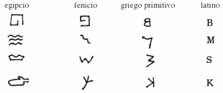
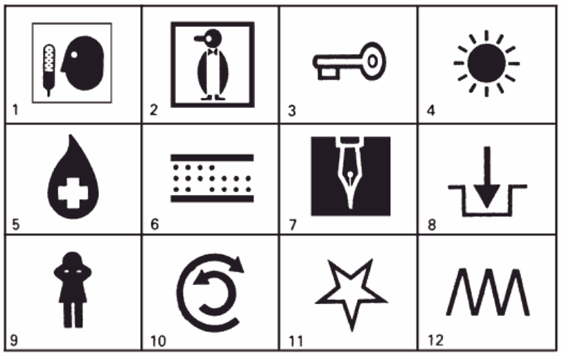

# El desarrollo de la Escritura

## Introducción a la Lingüística.

Área de Lingüística, Fac. de Filología, UCM | 3/10/2013

Víctor Peinado | v.peinado@filol.ucm.es

--SLIDE--

## La escritura en el mundo

- El lenguaje es la característica que nos hace humanos y la principal diferencia con respecto a otras especies animales.

- Todas las comunidades humanas, independientemente de su grado de desarrollo tecnológico, poseen lenguas.

- No todas las lenguas tienen escritura. Todavía hoy hay lenguas que solo tienen tradición oral.

- El lenguaje parece un procedimiento natural en los humanos, la escritura es un soporte artificial del lenguaje.

--SUBSLIDE--

- Los primeros intentos del ser humano de representar la información de manera visual se remontan a hace 20.000 años con las primeras pinturas rupestres.

- Los primeros vestigios de lo que podemos considerar escritura son las marcas cuneiformes que aparecen en tablillas de barro hace 5.000 años.

- Encontramos la primera escritura antigua relacionada directamente con nuestro sistema actual hace solo 3.000 años. 

--SLIDE--

## Pictogramas e ideogramas

- Se cree que las primeras pinturas rupestres pudieron servir para recordar acontecimientos significativos.

- No eran mensajes lingüísticos específicos, de hecho, se consideran tradición propia del arte pictórico.

- Solo cuando algunos de estos retratos pasan a representar imágenes concretas, podemos hablar de **pictogramas**.

- Lo que resulta fundamental en el uso de estos símbolos es que es que todo el mundo llegue a utilizar formas similares para respresentar significados parecidos.

--SUBSLIDE--

- Es decir, tiene que existir una **relación convencional** compartida por un conjunto de hablantes entre el símbolo y su interpretación.

- Con el tiempo, un pictograma puede acabar adoptando una forma simbólica y llegar a adoptar un significado más amplio, de naturaleza conceptual.

- Es entonces cuando podemos afirmar que estos símbolos forman parte de un sistema de escritura de ideas, es decir, **ideogramas**.

- En japonés, uno de los sistemas de escritura se base en ideogramas: los *kanji*.

- Las formas más parecidas a dibujos son pictogramas. Las formas derivadas, más abstractas, son ideogramas.

--SUBSLIDE--

### Ejemplos de pictogramas modernos

--SUBSLIDE--

- Tanto pictogramas como ideogramas tienen una característica común: no representan palabras o sonidos en ninguna lengua particular.

- Por esta razón, los pictogramas modernos de la página anterior representan el mismo significado convencional en sitios diferentes donde, de hecho, se hablan lenguas distintas.

- Cuando la relación entre el símbolo y la entidad o idea que representa llega a ser lo suficientemente abstracta se incrementan las probabilidades de que se esté utilizando para representar una palabra de una lengua determinada.

--SLIDE--

## Logogramas

- Es precisamente cuando los símbolos se utilizan para representar palabras de una lengua cuando los podemos considerar como ejemplos de escritura de palabras o **logogramas**.

- Entre los ejemplos de representaciones logográficas encontramos la escritura cuneiforme (con forma de cuña) de los antiguos sumerios.

- La forma del símbolo no ofrece ninguna pista sobre el tipo de entidad al que hace referencia. 

- En el actual chino, podemos encontrar una sistema de escritura moderno basado en logogramas (los *hànzi*): muchos símbolos se utilizan como representaciones de palabras. 

--SUBSLIDE--

## Logogramas

- La mayor ventaja es que dos hablantes de dialectos chinos diferentes, que tendrían graves dificultades para entenderse oralmente, puede comunicarse de manera escrita.

- Por contra, este tipo de sistema requiere memorizar una cantidad excesiva de símbolos de uso cotidiano (entre 2.500 y 50.000 caracteres).	

- Una manera de superar esta dificultad consiste en disponer de un método sistemático que permita pasar de estos símbolos que representan palabras (sistema logográfico) a símbolos que representan sonidos (un sistema fonográfico).	
		

--SLIDE--

## La escritura jeroglífica

- Una forma de utilizar símbolos ya existentes para representar los sonidos de una lengua consiste en utilizar una **escritura jeroglífica**.

- Mediante este sistema, el símbolo que denota determinada entidad pasa a convertirse en el símbolo que denota el sonido de la palabra.

- A partir de ese momento, ese símbolo se comienza a utilizar cada vez que dicho sonido aparezca en una palabra cualquiera.

--SLIDE--

## La escritura silábica

- Cuando un sistema de escritura hace uso de un conjunto de símbolos que representan la forma en la que se pronuncian las sílabas se le denomina **escritura silábica**.

- Hoy en día ya no se usan sistemas de escritura silábicos puros, pero en japonés moderno se puede escribir a partir de un conjunto de dos silabarios, es decir, símbolos que representa la fonética de las sílabas.

- Wikipedia: silabarios [hiragana](http://es.wikipedia.org/wiki/Hiragana) y [katakana](http://es.wikipedia.org/wiki/Katakana).

--SLIDE--

## La escritura alfabética

- Cuando se dispone de símbolos para representar sílabas que empiezan, por ejemplo, con el sonido [b] o [m], se está muy cerca de poder utilizar los símbolos para representar los sonidos simples de una lengua.

- Ésta es la base de la **escritura alfabética**.

- Un alfabeto consiste en un conjunto de símbolos escritos que representa, cada uno, un sonido único.

- El proceso que acabamos de esbozar es el que dio lugar a los sistemas de escritura de las lenguas semíticas: el árabe y el hebreo.

- Los alfabetos semíticos son **alfabetos consonánticos** ya que solo se representan los sonidos consonánticos y es el contexto que aporta los sonidos vocálicos.

--SUBSLIDE--

- Una variante primitiva del alfabeto semítico, que a su vez proviene del fenicio, es el origen de la mayoría de los alfabetos del mundo.

- Los griegos antiguos dieron un paso más en el proceso de alfabetización al utilizar símbolos adicionales para los sonidos vocálicos.

- El origen de las formas concretas de los alfabetos europeos actuales se encuentra en los jeroglíficos egipcios, como se muestra en:

--SUBSLIDE--

- De los griegos, el alfabeto pasó a Europea occidental gracias a los romanos y, con el paso del tiempo, fue adoptando distintas modificaciones para adaptarse a las lenguas a las que se fue aplicando.

- De hecho, denominamos **alfabeto latino** el sistema que utilizamos para escribir en español.

- Otra línea de evolución que se produjo a partir del alfabeto griego se desarrolló en Europa oriental, donde se hablaban lenguas eslavas. 

- El **alfabeto cirílico** es el sistema que se utiliza actualmente en Rusia.

--SLIDE--

## Referencias

- Tusón Valls, J. *Introducción al lenguaje*. UOC. 2003.

- Yule, G. *El lenguaje*. Ediciones AKAL. 2007. 

- Wikipedia: [Caracteres chinos o *hànzi*](http://es.wikipedia.org/wiki/Escritura_china). 

- Wikipedia: [Ideogramas japoneses o *kanji*](http://es.wikipedia.org/wiki/Kanji).

- Wikipedia: [Silabario japonés hiragana](http://es.wikipedia.org/wiki/Hiragana). 

- Wikipedia: [Silabario japonés katakana](http://es.wikipedia.org/wiki/Katakana). 
  
- Wikipedia: [Jeroglíficos egipcios](http://es.wikipedia.org/wiki/Jeroglífico).

- Wikipedia: [Alfabeto cirílico](http://es.wikipedia.org/wiki/Cirilico).
  
--SLIDE--

## Ejercicio

¿Qué posibles significados asignarías a los siguientes pictogramas?

