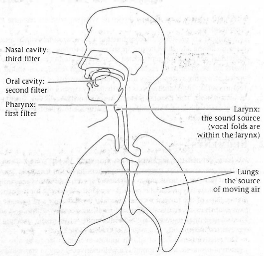
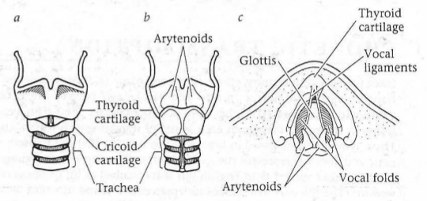
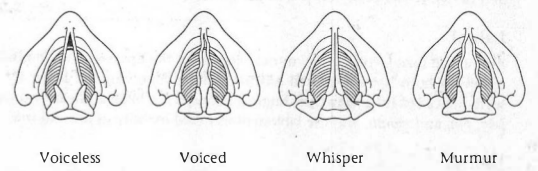
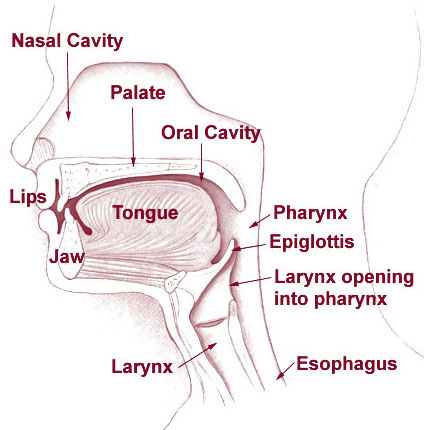
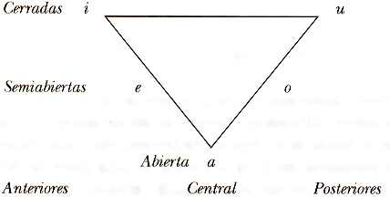
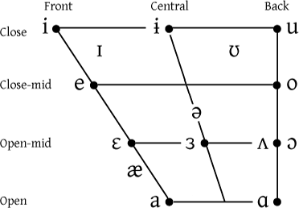
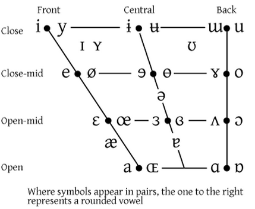
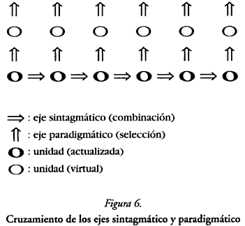

# Fonética

## Introducción a la Lingüística.

Área de Lingüística, Fac. de Filología, UCM | 14/11/2013

Víctor Peinado | v.peinado@filol.ucm.es

--SUBSLIDE--

### Fonética

[fo'netika]

### Phonetics

[fəʊˈne&#638;ɪks]

--SLIDE--

### El signo lingüístico

- Ferdinand de Saussure definió el signo lingüístico como una entidad formada por dos elementos indisolubles:

    - **significante** es la forma concreta y material de la señal *manzana*, entendida no solo como secuencia de sonidos, sino como *imagen acústica*.

    - **significado** es el concepto abstracto, sin consistencia material, la noción o idea de 'manzana'.

--SUBSLIDE--

 

- además, desde el pdv semántico existe un objeto extralingüístico representado por el signo: el **referente**.

--SUBSLIDE--

### Lenguaje, lengua y habla

- Saussure distinguió dos aspectos fundamentales del lenguaje:

    - **lengua**: modelo general y constante que está en la conciencia de todos los miembros de una colectividad lingüística. Es una abstracción que determina el proceso de comunicación humana. Es un fenómeno social. 

    - **habla**: realización concreta de la lengua en un momento y lugar determinados en cada uno de los miembros de una colectividad lingüística. Es un fenómeno individual. 

--SLIDE--

### Fonología y fonética

- **fonética** estudia el significante en el plano del habla. 
	
	- Estudia la sustancia de la expresión.
 
	- Estudia los elementos fónicos de una lengua desde el punto de vista de su producción, de su constitución acústica y desde su percepción.

- **fonología** estudia el significante en el plano de la lengua.
	
	- Estudia la forma de la expresión. 

	- Estudia los elementos fónicos de una lengua desde el punto de vista de su función en el sistema de la comunicación lingüística.

--SLIDE--

### Los apellidos de la fonética

- fonética general &rarr; todas las posibilidades físicas y fisiológicas de emitir sonidos aprovechables para la comunicación.
	
- fonética descriptiva &rarr; características de los sonidos de cada lengua particular.
	
	- fonética diacrónica &rarr; cambios en los sonidos a lo largo de la evolución de la lengua.
	
	- fonética sincrónica &rarr; descripción de sonidos en un momento determinado.

		- fonética articulatoria	
		- fonética acústica	
		- fonética perceptiva

--SLIDE--

### Fonética: tres áreas de descripción

- **fonética articulatoria** se ocupa de la clasificación estática de los sonidos en función de las partes del aparato fonador que intervienen en su producción.
	 
- **fonética acústica** estudia, de modo empírico y apoyándose de instrumenos de análisis apropiados, las propiedades físicas de los sonidos del habla, considerándolos como ondas sonoras.

- **fonética perceptiva** se orienta hacia el estudio de la audición del habla (cómo las ondas sonoras llegan hasta el oído y se transforman en impulsos nerviosos) y se interesa por la interpretación fonética de tales impulsos.

--SLIDE--

# La producción del sonido

--SUBSLIDE--

### Producción del sonido

- La voz humana es una corriente de aire proveniente de los pulmones que se transforma al atravesar el aparato fonador antes de convertirse en sonidos apropiados para la comunicación humana. 

- El aparato fonador es un conjunto de órganos que intervienen en la articulación del lenguaje. Distinguimos tres partes fundamentales en el aparato fonador:

	- Los órganos respiratorios (cavidades infraglóticas): pulmones, bronquios, tráquea.

	- El órgano fonador (cavidad laríngea o glótica): laringe, cuerdas vocales y resonadores nasal, bucal, faríngeo.

	- Los órganos de la articulación (cavidades supraglóticas): paladar, lengua, dientes, labios y glotis.

--SUBSLIDE--

### El sistema de producción de sonidos

--SUBSLIDE--

- La acción del velo del paladar genera una de las principales divisiones de los sonidos articulados:

	- **orales**, si el velo está adherido a la pared faríngea, y el aire pasa por la cavidad bucal.

	- **nasales**, si el velo cierra el paso a la cavidad bucal, y el aire pasa por la cavidad nasal.

	- **oronasales**, si el velo cierra parcialmente la cabidad bucal y el aire sale tanto por la boca como por la nariz.

- El paladar tiene dos zonas:

	- **paladar duro**, subdividido en prepaladar, mediopaladar y postpaladar.

	- **paladar blando** o velo del paladar, subdividido en dos zonas: prevelar y postvelar.

--SUBSLIDE--

### La laringe

--SUBSLIDE--

### Estados de la glotis

- Las cuerdas vocales se pueden colocar en distintas posiciones para producir cuatro tipos de sonidos diferentes:

--SUBSLIDE--

- Sonidos sordos (*voiceless*)

    - Las cuerdas vocales se mantienen separadas y el aire atraviesa la glotis.

    - Las cuerdas vocales no vibran.
    
    - Los sonidos iniciales de *farola*, *sing*, *Toledo*, *house* son sordos.

--SUBSLIDE--

- Sonidos sonoros (*voiced*)

    - Las cuerdas vocales se aproximan, aumenta la presión del aire y ésta provoca una vibración de las cuerdas.
   
    - Los sonidos iniciales de *vote* (en inglés), *vamos*, *zip*, *dedo*, *the* son sonoros.

--SUBSLIDE--

- Susurro (*whisper*)

    - Las cuerdas vocales se colocan de manera que la parte anterior están en contacto, mientras que la parte posterior se separan, permitiendo el paso del aire.

    - Los sonidos susurrados son también sordos.
    
    - Las cuerdas vocales no vibran. 

    - En todas las lenguas del mundo se pueden producir sonidos susurrados.
    
--SUBSLIDE--

- Sonorización aspirada (*murmur*)

    - En algunas lenguas del mundo (familia indoirania, familia bantú, algunas vocales en portugués), existe una cuarta posición de la glotis.

    - Las cuerdas vocales vibran pero se mantienen separadas, permitiendo una gran flujo de aire.
    
    - Como resultado, los sonidos son sonoros y parece, a la vez, aspirados.

--SLIDE--

# Clases de sonidos

--SUBSLIDE--

- Teniendo en cuenta las características fonéticas de los sonidos (diferencias articulatorias y acústicas, posibilidad de formar núcleos silábicos), podemos agruparlos en distintas clases.

    - Sonidos vocálicos.
    
    - Sonidos consonánticos.
    
    - Semiconsonantes/semivocales o *glides*.

--SUBSLIDE--

### Diferencias articulatorias

- Los **sonidos consonánticos**, ya sean sordos o sonoros, se producen cuando hay un cierre total o parcial del tracto vocálico.

- El paso del aire es interrumpido momentáneamente o costreñido.

- Los **sonidos vocálicos** son (generalmente) sonoros y se producen sin interrumpción ni cierre del paso del aire.

--SUBSLIDE--

### Diferencias acústicas

- Los **sonidos vocálicos** resuenan más que los **sonidos consonánticos** y son percibidas más claras y durante más tiempo.

    - Estas diferencias son fácilmente observables al pronunciar palabras como *más* o *pet*.

--SUBSLIDE--

### Núcleos silábicos

- La mayor sonoridad que encontramos en los **sonidos vocálicos** les permite formar parte del llamado **núcleo de la sílaba**.

- La sílaba se puede definir como un segmento fónico con un pico de sonoridad rodeado por otros segmentos con sonoridad menor.

- Solo las vocales y cierto tipo de consonantes con características especiales (y no en todas las lenguas) pueden formar parte del **núcleo silábico**.

--SUBSLIDE--

### Semiconsonantes/semivocales o *glides*

- Hay un tipo de sonido que presenta características de los sonidos consonánticos y los vocálicos: los ***glides***.

- La impresión auditiva que produce es la de sonidos vocálicos articulados rápidamente. 

- La **semiconsonantes**, en un primer momento, se articulan como una vocal pero se mueven rápidamente a otra articulación.

- Ejemplos de este tipo de sonidos los encontramos en palabras como *tiempo*, *cuánto*, *yet*, *wet*.

--SUBSLIDE--

- Aunque se articulan como vocales, las semiconsonantes funcionan como consonantes.

- No forman parte del núcleo silábico.

--SLIDE--

# Articulación de sonido

--SUBSLIDE--

### Los órganos de la articulación

--SUBSLIDE--

### Los órganos de la articulación

- La lengua tiene tres zonas bien diferenciadas:

	- El ápice o punta.

	- El dorso o parte superior, subdividido en predorso, mediodorso y postdorso.

	- La raíz, en el extremo posterior.

--SUBSLIDE--

- Otros órgamos de la articulación intervienen en la producción de sonidos:

	- Los incisivos superiores e inferiores cierran la cavidad bucal. 

	- Los alveolos son una zona de transición entre los incisivos superiores y el comienzo del paladar. 

	- Los labios poseen una gran movilidad.

--SLIDE--

# Puntos de artículación

--SUBSLIDE--

- Cada zona del tracto vocálico en la que el flujo del aire puede sufrir algún tipo de modificación para producir un sonido diferente se denomina **lugar** o **punto de articulación**.

- Vamos a ver ocho puntos distintos que encontramos en la articulación de los sonidos consonánticos, a saber:

    1. labial
    2. dental
    3. alveolar
    4. palato-alveolar y palatal
    5. velar
    6. uvular
    7. faringal
    8. glotal

--SUBSLIDE--

### Labial

- Cualquier sonido que se articule cerrando o aproximando los labios recibe el nombre de **labial**.

- Los sonidos en los que intervienen ambos labios se denominal **bilabiales**.

    - Encontramos sonidos bilabiales en los primeros sonidos de las palabras *mamá*, *perro*, *vaso*, *mom*, *pit*, *bush*.

- Los sonidos que involucran el labio inferior y los dientes superiores se llaman **labiodentales**.

    - Encontramos sonidos bilabiales en los primeros sonidos de las palabras *farola*, *fan*, *van* (en inglés).

--SUBSLIDE--

### Dental

- Los sonidos que se articulan colocando la punta de la lengua en contacto o cerca de los dientes reciben el nombre de **dentales**.

    - Encontramos sonidos dentales en las las palabras *truco*, *dedo*, *trick*, *dumb*.

- Si situamos la lengua entre los dientes, tenemos sonidos **interdentales**.

    - Encontramos sonidos interdentales en las las palabras *dedo*, *zapato* (en Español peninsular), *this*, *thing*.

--SUBSLIDE--

### Alveolar

- Los alveolos son las protuberancias que encontramos detrás de la cadena de dientes superiores. Los sonidos que se articulan colocando la punta de la lengua en ese área se denominan **alveolares**.

    - Encontramos sonidos dentales en las palabras *solo*, *noche*, *saint*, *zip*, *nap*, *trick*, *dumb*.

--SUBSLIDE--

### Palato-alveolar y palatal

- Justo detrás de los alveolos encontramos el inicio del paladar duro. Los sonidos que se articulan colocando o aproximando la lengua a esa área se denominan **palatales**.

    - Encontramos sonidos **palatales** en las palabras como *ñoño*, *chapata*, *yogurt*, *shoe*, *measure* *chip*, *judge*.

--SUBSLIDE--

### Velar

- La zona del final del paladar recibe el nombre de paladar blando o **velo del paladar**. Los sonidos que se articulan colocando o aproximando la lengua a esa zona se denominan **velares**.

    - Encontramos sonidos **velares** al pronunciar palabras como *camino*, *gallo*, *canguro*, *call*, *go*, *sing*.

--SUBSLIDE--

### Uvular

- El velo del paladar da paso a la úvula o *campanilla*. Los sonidos que se articulan colocando o aproximando la lengua a esa zona se denominan **uvulares**.

    - En español e inglés no existen sonidos **uvulares**. 
    
    - Podemos encontrar este tipo de sonidos al pronunciar en francés palabras como *Paris*, *garçon*, *republique*.

--SUBSLIDE--

### Faringal

- La zona de la garganta situada entre la úvula y la laringe se denomina *faringe*. 

- Los sonidos que se articulando colocando la langua de manera que el flujo del aire se mopdifica a su paso por esta zona se denominan **faringales**.

    - En español e inglés no existen sonidos **faringales**. 
    
    - Podemos encontrar este tipo de sonidos en varios dialectos del árabe.

--SUBSLIDE--

### Glotal

- Los sonidos que se producen utilizando las cuerdas vocales como principal punto de articulación se denominan **glotales**.
    
    - Este tipo de sonidos es típico de las lenguas semíticas y polinesias.

    - En inglés, encontramos sonidos glotales en las aspiradas de inicios de palabras como *heaven* o *hug*.

    - Existe también un sonido oculivo glotal (cierre momentáneo de las cuerdas vocales) cuando pronunciamos expresiones en inglés como *uh-oh!* o, en algunos dialectos americanos, *button* o *mountain*.
    
    
--SLIDE--

# Modos de artículación

--SUBSLIDE--

### Modos de artículación

- Algunos órganos involucrados en la articulación del sonido como los labios, la lengua, el velo del paladar y la glotis se pueden colocar de distintas maneras para producir distintos tipos de sonidos consonánticos. Estas distintas configuraciones reciben el nombre de  **modos de articulación**.

- Veamos en más detalle los distintos modos de articulación que encontramos en los sonidos consonánticos:

    1. oral-nasal
    2. oclusivo (*stops*)
    3. fricativo (*fricatives*)
    4. africadas (*affricates*)
    5. aspiradas (*aspirated*)
    6. líquidas (*liquids*)
    7. semiconsonantes/semivocales (*glides*)

--SUBSLIDE--

### Orales vs. nasales

- Hemos visto anteriormente que una de la distinciones más evidentes en el modo de articulación es entre sonidos orales y nasales.

	- **orales**, si el velo está adherido a la pared faríngea, y el aire pasa por la cavidad bucal.

	- **nasales**, si el velo cierra el paso a la cavidad bucal, y el aire pasa por la cavidad nasal.
	
- Podemos encontrar sonidos nasales tanto consonánticos como vocálicos.

    - En español, encontramos sonidos nasales en palabras como *ámbar*, *cantidad*, *niña*.
    
    - En inglés, encontramos sonidos nasales en las consonantes finales de palabras como *sum*, *sun*, *sung* y, en algunos dialectos americanos, en vocales como *bank*, *wind*.

--SUBSLIDE--

### Oclusivas

- Las consonantes oclusivas (*stops*) se caracterizan por una interrupción en el paso del aire en el tracto vocal, motivada por el cierre completo de los órganos articulatorios. 

    - En español tenemos tres **sonidos** o **fonos** orales que son también oclusivos sordos, que se oponen entre sí por el lugar de articulación: bilabial [p], dental [t], y velar [k]. 
    
    - Existen sus versiones sonoras, los sonidos orales oclusivos sonoros: [b], [d], [g]. 
    
    - Tenemos además cuatro sonidos nasales oclusivos sonoros, que se oponen también por el lugar de articulación: bilabial [m], alveolar [n], palatal [&#626;] y velar [&#331;]. 
    
--SUBSLIDE--

- En inglés tenemos cuatro sonidos orales oclusivos sordos, que se oponen entre sí por el lugar de articulación: bilabial [p], alveolar [t], velar [k] y glotal [&#660;]. 
    
- En los tres primeros puntos de articulación, existen sus versiones sonoras, los sonidos orales oclusivos sonoros: [b], [d], [g]. 
    
- Tenemos tres sonidos nasales oclusivos sonoros, que se oponen también por el lugar de articulación: bilabial [m], alveolar [n] y velar [&#331;]. 

--SUBSLIDE--

### Fricativas

- La articulación de las consonantes fricativas (*fricatives*) se caracteriza porque existe un estrechamiento o costricción del paso del aire por medio de la acción de dos órganos articulatorios.

- El velo del paladar se adhiere a la pared faríngea impidiendo la salida del aire por las fosas nasales.

    - En español tenemos hasta diez sonidos fricativos que se oponen entre sí por el lugar de articulación y la acción del velo del paladar: bilabial [&beta;], labiodental [f], dental [&eth;], interdental [&theta;], alveolar [s] y [z], palatal [&#669;], velar [&#611;] y [x], y glotal [h].
    
    - En las zonas de seseo, no existe el fonema [&theta;] y se sustituye por [s].

--SUBSLIDE--

- En inglés encontramos nueve sonidos fricativos que se oponen entre sí por el lugar de articulación y por la sonoridad: labiodental [f] y [v], interdental [&theta;] y [&eth;], alveolar [s] y [z], palatal [&#643;] y [&#658;], y glotal [h].
    

--SUBSLIDE--

### Africadas

- La articulación de las consonantes africadas se caracteriza por tener dos momentos: 

    1. uno oclusivo (con interrupción total del paso del aire),
    2. otro fricativo (con constricción). 
    
- Tanto oclusión como la fricación se realizan en el mismo lugar de articulación y por los mismos órganos articulatorios. 

- El velo del paladar se adhiere a la pared faríngea impidiendo la salida del aire por las fosas nasales.

--SUBSLIDE--

- El español y en inglés encontramos dos sonidos africados palatales que se oponen por la sonoridad: uno sordo [t&#643;] y otro sonoro [d&#658;].

- En español, los encontramos en expresiones como *champú*, *un llorica*, *el hierro*.

- En inglés, existen los mismos sonidos africados palatales que encontramos en palabras como *church* y *judge*.

--SUBSLIDE--

### Consonantes estridentes/sibilantes

- En páginas anteriores, habíamos dicho que los sonidos consonánticos pueden describirse atendiendo a diferencias acústicas y articulatorias. 

- Dentro de las consonantes fricativas y africadas, podemos distinguir además aquellas que son estridentes o sibilantes.

- Se definen como **sonidos estridentes** aquellos que, por el tipo de costricción del canal, se perciben de manera más intensa: [s], [z], [&#643;] y [&#658;] [t&#643;] y [d&#658;].

--SUBSLIDE--

### Aspiración

- Tanto en español como en inglés encontramos una consonante fricativa glotal que suena aspirada [h]. 

- En algunas variantes del español es común encontrar realizaciones aspiradas de sonidos estridentes en posición final de sílaba: 

    - *los niños*, *ponte el casco*: [s] &rarr; [h].

- La aspiración es un fenómeno por el cual después de articular un sonido se libera aire extra.

- Esta aspiración se transcribe fonéticamente como un [h] en superíndece: [&#688;].

    - En inglés, encontramos sonidos oclusivos aspirados en algunas realizaciones como *pat* [p&#688;], *tub* [p&#688;] y *kid* [p&#688;]. Esta aspiración no existe en las palabras *spat*, *stub* y *skid*.

--SUBSLIDE--

### Líquidas

- Existe un tipo de sonidos consonánticos especiales denominados **líquidas**. A su vez se dividen en:
 
    - **líquidas laterales**
    
    - **líquidas vibrantes**
    
--SUBSLIDE--

### Laterales

- Todas las variantes del sonido [l] se denominan **líquidas laterales**.

- Las laterales se caracteriza porque el aire sale a través de un estrechamiento producido por un lado o los dos de la lengua. 

- El velo del paladar permanece adherido a la pared faríngea. 

- Las cuerdas vocales vibran siempre: son sonoras.

    - En español existen básicamente dos sonidos laterales: una variante alveolar [l] y otra palatal [&lambda;].
	
    - En inglés existen dos variantes alveolares: una sonora [l] y una sorda [&#620;].

--SUBSLIDE--

### Realización de líquidas laterales

- En la realización de la lateral alveolar, el ápice y los rebordes de la lengua se adhieren a la zona alveolar y a las encías superiores, a excepción de una pequeña zona en la parte lateral, por donde se escapa el aire fonador. Ortográficamente, se representa siempre con la grafía *l*.
	
- En la realización de la lateral palatal, el ápice y los rebordes de la lengua se adhieren a la zona alveolar y a las encías superiores, dejando un canal por el que escapa el aire fonador.

- La realización sorda de la líquida alveolar [&#620;] aparecen en algunos contextos del inglés como en las palabras *please* y *clear*.

--SUBSLIDE--

### Yeismo

- En amplias zonas de España y América, la lateral palatal [&lambda;] ha desaparecido y se ha fusionado con la fricativa palatal [&#669;]. Este fenómeno se conoce con el nombre de **yeísmo**.

- En las zonas donde existe el yeísmo, la oposición [&lambda;] / [&#669;]/ no existe, y las palabras *pollo/poyo* son homófonos: suenan igual.

--SUBSLIDE--

### Vibrantes 

- La articulación de las consonantes **líquidas vibrantes** se caracteriza por poseer una o varias interrupciones breves durante la salida del aire, originadas por el cierre entre el ápice de la lengua y la zona alveolar o palata, o por la vibración de la úvula. 

- El velo del paladar permanece adherido a la pared faríngea. 

- Las cuerdas vocales vibran siempre: son sonoras.

- En las lenguas del mundo existen muchos tipos de vibrantes.

    - En español existen dos sonidos vibrantes: uno múltiple [r] y otro simple [&#638;].
	
    - En inglés podemos encontrar hasta cinco tipos diferentes: dos alveolares, una sonora [r] y otra sorda [r], post-alveolar [&#633;], retroflexa [&#638;] y el aleteo alveolar sonoro o *flap* [&#638;].

--SUBSLIDE--

### Vibrantes en español

- En la realización de la **vibrante simple** [&#638;] se forma una breve oclusión del ápice de la lengua contra los alvéolos. Ortográficamente, se representa con la grafía *r*.

- En la realización de la **vibrante múltiple** [r] se forma dos o más oclusiones muy breves del ápice de la lengua contra los alvéolos. Ortográficamente, se representa con la grafía *r* en posición inicial de palabra o en medio precedida de *n* o *l*, y con la grafía *rr* en posición intervocálica en el interior de la palabra. 

--SUBSLIDE--

### Semiconsonantes/semivocales

- Hemos visto anteriormente que las **semiconsonantes** o **semivocales** o *glides* son segmentos vocálicos no silábicos articulados rápidamente.

- En español y en inglés tenemos dos semiconsonantes: una palatal [j] y otra alveolar [w].

- Como veremos más adelante en fonética del español, estos *glides*, cuando aparecen como segundo elemento de un diptongo se suelen denominar semivocales.

--SLIDE--

# Sonidos vocálicos

--SUBSLIDE--

### Sonidos vocálicos

- Los **sonidos vocálicos** son sonoros y se producen sin interrumpción ni cierre del paso del aire.

- Los **sonidos vocálicos** resuenan más que los **sonidos consonánticos** y son percibidas más claras y durante más tiempo.

- La mayor sonoridad que encontramos en los **sonidos vocálicos** les permite formar parte del llamado **núcleo de la sílaba**.

--SUBSLIDE--

### Sonidos vocálicos en español

- En español tenemos cinco vocales y en total diez sonidos o alófonos vocálicos: cinco orales y cinco nasales. 

    - [i] y [&itilde;] para las grafías *i* o *y*

    - [e] y [&#7869;] para la grafía *e*

    - [a] y [&atilde;] para la grafía *a*

    - [o] y [&otilde;] para la grafía *o*

    - [u] y [&utilde;] para la grafía *u*
    
--SUBSLIDE--

- Estos fonemas pueden aparecer tanto en posición atóna como tónica, y en posición inicial, media y final de palabra.

- En español, un fonema vocálico se realizará como vocal nasal entre dos consonantes nasales (*mano*) y antes de consonante nasal *entrar*).

- En el resto de contextos, se realizará habitualmente como vocal oral: *pena*, *nota*.

--SLIDE--

### Clasificación articulatoria de las vocales en español

- Según el **modo de articulación**, distinguimos: 

    - vocales altas: cuando la lengua ocupa la posición más alta dentro de la cavidad bucal: [i], [u]

    - vocales medias: cuando la lengua ocupa una posición intermedia dentro de la cavidad bucal: [e], [o]
    
    - vocales bajas: cuando la lengua ocupa la posición más baja dentro de la cavidad bucal: [a]

--SUBSLIDE--

- Según el **lugar de articulación**, distinguimos: 

    - vocales anteriores (o palatales): cuando la lengua se sitúa en la parte anterior de la cavidad bucal, por debajo del paladar duro: [i], [e]

    - vocales centrales: cuando la lengua se sitúa en el centro de la cavidad bucal: [a]

    - vocales posteriores (o velares): cuando la lengua se sitúa en la parte posterior de la cavidad bucal: [o], [u]

--SUBSLIDE--

- Según la **acción del velo del paladar**, distinguimos: 

    - orales: el velo del paladar permanece adherido a la pared faríngea y el aire sale exclusivamente por la boca: [i], [e], [a], [o], [u]
    - nasales: el velo del paladar no permanece adherido a la pared faríngea y el aire sale simultáneamente por la boca y la nariz: [&itilde;], [&#7869;], [&atilde;], [&otilde;], [&utilde;]

- Como veremos en Fonología, los únicos rasgos articulatorios que caracterizan a un fonema vocálico en español son **el modo y el lugar de articulación**. La nasalidad no es un rasgo distintivo, sino una característica fonética.

--SUBSLIDE--

###Triángulo vocálico en español

- La combinación del modo y el lugar de articulación se representa por medio del triángulo articulatorio:
	
 
 
--SUBSLIDE--

### Clasificación articulatoria de las vocales en español

|         | anterior | central | posterior |
|---------|:--------:|:-------:|:---------:|
| cerrada |     i    |         |     u     |
| media   |     e    |         |     o     |
| abierta |          |    a    |           |

--SUBSLIDE--
### Vocales en inglés

 

--SUBSLIDE--
### Cuadro vocálico de las lenguas del mundo

 

--SLIDE--

# La sílaba

--SUBSLIDE--

###La sílaba

- La sílaba es cada uno de los sonidos articulados que constituyen un solo núcleo fónico entre dos depresiones sucesivas de la emisión de voz.

- La **sílaba** está formada por, al menos, un **núcleo vocálico** (V) y por algunas consonantes (C) que pueden aparecer opcionalmente.
	
- Estructuralmente, podemos distinguir los siguientes constituyentes de la sílaba:
	
     **ataque**: formado por una o más consonantes (C) que opcionalmente pueden preceder a la vocal.
	- **rima**: formada por la consabida vocal obligatoria (V) que constituye el **núcleo de la sílaba** y una o más consonantes (C) opcionales que forman la **coda**. 
	
	
--SUBSLIDE--

- El tipo más común de sílaba se suele representar como CV: *pi-so*, *ca-sa*, *de-do*.

- Estas sílabas de tipo CV tienen ataque y núcleo, pero no tienen coda. Se denominan **sílabas abiertas**. 

- Las sílabas que cuentan con coda se denominan **sílabas cerradas** o **trabadas**: *sol*, *pez*, *gas*.

- En español, podemos encontrar sílabas con estructura CV *be*, V *a*, VC *es*, CVC *sal*, VCC *ins*, CCVC *tras*, CCVCC *trans*. 

- En inglés, encontramos sílabas con estructura CCCVCC *strong* o *spring*. 

--SUBSLIDE--

### Diptongos y triptongos

- La existencia de dos vocales en una misma sílaba constituye lo que se conoce como **diptongo**, y si son tres vocales las que aparecen en la misma sílaba se produce un **triptongo**.

    - **núcleo silábico**: vocal de mayor abertura y energía articulatoria. 

    - **margen silábico**: está formado por el resto de vocales de la sílaba que aparecen antes (margen prenuclear) o después del núcleo (margen postnuclear).

- Algunos ejemplos en español: *soy*, *buen*, *buey*

--SUBSLIDE--

### Tipos de diptongos
	
- Los diptongos se forman por la secuencia de sonidos que se produce en una sílaba entre:

    - vocales altas con medias o baja: [i], [u] + [e], [o], [a]
    
        - *bien, salió, Asia, bueno, vacuo, cuatro*
                
    - vocales medias y baja con las altas: [e], [o], [a] + [i], [u]
    
        - *peine, hoy, hay, Europa, aula*
        
    - combinaciones de vocales altas: [i] + [u]
		
        - *viuda, cuidar*

--SUBSLIDE--

- Llamamos **diptongo creciente** a la secuencia de vocal alta + vocal media o baja. En este caso, el margen silábico está situado en posición prenuclear y recibe el nombre de **semiconsonate**: [j], [w]

- Llamamos **diptongo decreciente** a la secuencia de vocal media o baja + vocal alta. En este caso, el margen silábico está situado en posición postnuclear y recibe el nombre de **semivocal**: [i], [u]

--SUBSLIDE--

- Cuando el diptongo está constituido por una secuencia de vocales altas, como ambas tienen prácticamente la misma abertura, formará el núcleo silábico la vocal que posea mayor intensidad o mayor duración.

    - La palabra *viuda* tiene dos posibles pronunciaciones: ['bju&eth;a] y ['biu&eth;a]

- La elección de un fonema u otro como núcleo dependerá del hablante, de la situación comunicativa o del dialecto.

--SUBSLIDE--

### Triptongos

- Un **triptongo** consiste en una secuencia de tres vocales en la misma sílaba. 

- Como en los diptongos, el núcleo silábico está formado por la vocal más abierta. Las otras dos vocales serán **semiconsonante** o **semivocal** según esté situada antes o después del núcleo silábico.

    - Ejemplos en español: *sitiáis* [si'tjáis], *sitiéis* [si'tjeis], *buey* ['bwei], *Paraguay* [para'&#611;wái]

--SUBSLIDE--

### Hiato

- Cuando concurren en secuencia dos vocales, una de ellas alta y otra media o baja, y no forman diptongo por pertenecer a dos sílabas distintas, decimos que están en **hiato**. 

- Como es obvio, en un hiato, cada vocal es el núcleo de su sílaba.

    - Ejemplos en español: *hacia*/*hacía*, *rey*/*reí*, *hay*/*ahí*, *hoy*/*oí*

--SUBSLIDE--

- En las secuencias del tipo /eo/, /oe/, /ea/, /ae/, /oa/, /ao/ cada vocal forma parte de una sílaba distinta. Sin embargo, en el habla coloquial es frecuente pronunciarlas como si de un única sílaba se tratase. Este fenómeno se conoce con el nombre de **sinéreis**

    - Ejemplos de sinéresis en español: *cé-re-o*/*ce-reo*, *ca-os*/*caos*, *Be-a-triz*/*Bea-triz*

--SLIDE--

# Fenómenos suprasegmentales

--SUBSLIDE--
### Fenómenos suprasegmentales

- Todos los sonidos (fonos) tienen ciertas características o **propiedades suprasegmentales o prosódicas** independientemente del lugar y del modo de articulación:

    - altura
    
    - acento
    
    - longitud 

--SUBSLIDE--

### Altura: tono y entonación

- La **altura** es la propiedad auditiva de un sonido que nos permite situarlo en una escala que varía de tonos altos a tonos bajos.

- Todos los hablantes tenemos la habilidad de controlar la altura con la que pronunciamos un sonido: variando la cantidad de aire que pasa por la glotis y la tensión de las cuerdas vocales.

--SUBSLIDE--

### Tono

- En las **lenguas tonales**, la la altura con la que se pronuncian las palabras se utiliza para distinguir unos significados de otros. 

- En estos casos, la altura se denomina **tono**. 

- En chino mandarín, distinguimos significados empleando hasta cinco tonos diferentes:
    
    - *mā* (madre), *má* (cáñamo), *mǎ* (caballo), *mà* (regañar), *ma* (particula interrogativa.)

--SUBSLIDE--

### Entonación

- Cuando las variaciones en la altura no se utilizan para distinguir significados, como ocurre en la mayorías de las lenguas, se denomina **entonación**.

- La entonación es la función lingüísticamente significativa, socialmente representativa e indidualmente expresiva de la frecuencia del fundamental en el nivel de la oración.

- Distinguimos tres funciones distintas de la entonación:
	
	- nivel lingüístico
	- nivel sociolingüístico
	- nivel expresivo

--SUBSLIDE--

### Funciones de la entonación

- Desde el pdv lingüístico, la entonación se utiliza con distintas funciones: p. ej. aclarar si el enunciado está completo o no.

- Decimos que la entonación cumple una función lingüística, distintiva, significativa, cuando sirve para oponer un enunciado declarativo a uno interrogativo.

    - En los enunciados declarativos, la curva de entonación descende en su parte final.
    
        - *Aquí viene Pedro*, *John parked the car*.

    - En los enunciados interrogativos absolutos (aquellos que esperan como respuesta un *sí* o un *no*, la curva de entonación es ascendente.

        - *¿Viene Pedro?*, *Did John park the car?*

--SUBSLIDE--

- En los enunciados interrogativos pronominales (aquellas interrogativas formadas con elementos gramaticales como *qué, cuál, cómo, quién, cuánto, cuándo*), la entonación desciende en su parte final. 

    - *¿Cuándo viene Pedro?*, *When has John parked the car?* 

    - *¿Dónde vas?*, *Where are you going?*

- En las oraciones de relativo especificativas y explicativas, la entonación tiene una función delimitadora significativa:
	
    - *Los alumnos que viven lejos llegan tarde*.
    
    - *Los alumnos, que viven lejos, llegan tarde*. 

- Pero la entonación también tiene una función expresiva y sociolingüística.

--SUBSLIDE--

### Longitud

- En muchas lenguas, existen sonidos (tanto vocálicos como consonánticos), cuya articulación se mantiene durante más tiempo que otros sonidos.

- En IPA, la longitud se marca con el signo [&#720;]

- Y estas diferencias de **longitud** en los sonidos permite distinguir significados:

    - En italiano, los pares *fato* ['fat&#596;] (hado) / *fatto* ['fat&#720;&#596;] (hecho) y *casa* ['kasa] (casa) / *cassa* ['kas&#720;a] (caja)
    
    - En inglés también existen diferencias entre vocales breves y largas, pero no se utiliza de manera distintiva para diferenciar significados:
    
        - *bit* [bɪt] (poco) y *beat* [bi&#720;t] (vencer)

--SUBSLIDE--

### Acento

- El acento pone de relieve una unidad lingüística (sílaba, morfema, palabra) para diferenciarla de otras unidades del mismo nivel.

- Se manifiesta como un contraste entre unidades acentuadas y unidades inacentuadas.

  
--SUBSLIDE--

### Relaciones sintagmáticas y paradigmáticas
	
- Según la lingüística estructural, el carácter lineal del signo lingüístico permite describir dos tipos de análisis simultáneos. 

- En el eje horizontal, el **eje sintagmático** estudia la combinación de los diferentes elementos de la cadena hablada.
	
	 - los signos contrastan unos frente a otros.
	  
- En el eje vertical, el **eje paradigmático** estudia la selección de cada uno de los elementos entre todas las opciones que hubiesen podido ocupar una posición.
	
	- los signos se oponen unos a otros.
	
--SUBSLIDE--

### Relaciones sintagmáticas y paradigmáticas
	
 
 

--SUBSLIDE--

###Función contrastiva del acento
	
- En el eje sintagmático, el acento sirve para poner de relieve las sílabas tónicas (o acentuadas) frente a las sílabas átonas (o inacentuadas) en una misma secuencia de elementos.

- Y en general, el acento sirve para poner de relieve las palabras acentuadas (típicamente, sustantivos, adjetivos y verbos) frente a las no acentuadas (preposiciones, conjucciones, etc.)

--SUBSLIDE--

### Función distintiva del acento

- En el eje paradigmático, el acento sirve para distinguir unidades de significado diferente:
	
	- Palabras oxítonas o agudas: habi**tó**
	- Palabras paroxítonas o llanas: ha**bi**to
	- Palabras proparoxítonas o esdrújulas: **há**bito
	- Palabras superproparoxítonas o sobresdrújulas: **á**bremelo
	

--SUBSLIDE--

### Función culminativa del acento

- En una secuencia de palabras, el acento sirve para agrupar una serie de sílabas inacentuadas en torno a la sílaba central.

    - *Y por si la mayo**rí**a lo re**suel**ve...*
    
    - *Y con la ca**mi**sa de **cua**dros...*
    

--SUBSLIDE--

### Palabras acentuadas y inacentuadas

- Toda palabra aislada, sacada fuera de contexto, tiene una sílaba con mayor carga acentual.

- Sin embargo ésto puede no ocurrir cuando esa palabra se encuentra en la cadena hablada.

- En cadena hablada se perciben claramente las sílabas tónicas de determinadas palabras y las sílabas átonas del resto.

- En español, una palabra tónica tiene una única sílaba tónica o acentuada que se realiza con mayor energía articulatoria.

- En español solo hay un tipo de palabras con dos sílabas tónicas: los adverbios terminados en *-mente*: *miserablemente*, *solamente*

--SLIDE--

###Fenómenos fonéticos motivados por la combinación de sonidos

- Los sonidos no se producen aislados, sino en íntimo y sucesivo contacto los unos con los otros.

- Cuando hablamos procuramos obtener un resultado óptimo con el mínimo esfuerzo.

--SUBSLIDE--

### Asimilación

- **asimilación**: modificación que sufre un sonido al adoptar parte de los rasgos articulatorios de otro sonido.
	
	- en castellano, los sonidos nasales en posición postnuclear adoptan rasgos articulatorios de los sonidos bilabiales, labiodentales, palatales o velares.
	
	- en español y en inglés americano, las vocales que preceden sonidos nasales en posición postnuclear se nasalizan.

--SUBSLIDE--

- **Sonorización de consonantes sordas**: fenómeno de asimilación por el cual sonidos consonánticos inicialmente sordos se pronuncian sonorizados:

    - En inglés, el morfema de plural se pronuncia [s] o [z] dependiendo de la sonoridad del sonido anterior.
    
        - *cats* [k&aelig;ts], *pops* [p&#596;ps], *pads* [p&aelig;dz] y *boys* [b&#596;&#618;z]

    - En dialectos del sur de Italia, algunas consonantes se sonorizan en contacto con sonoras y entre vocales.
    
        - *ma cos'hai fatto?* se pronuncia como [m&#720;a '&#609;&#720;ozai 'v&#720;ad&#720;&#596;] en lugar de [ma 'k&#720;ozai 'fat&#720;&#596;]

        - *non c'è nessuno* se pronuncia como [n&otilde;n 'd&#658;&#603; n&#720;e's&#720;uno] en lugar de [n&otilde;n 't&#643;&#603; ne's&#720;uno]
    
--SUBSLIDE--

- **armonía vocálica**: fenómeno de asimilación a distancia que funciona a nivel morfológico. 
	
    - en turco o bantú, las vocales de la raíz determinan las vocales de los morfemas.
    
        - en turco, los pares de palabras *ev / evler* y *adam / adamlar*

--SUBSLIDE--

### Disimilación

- La **disimilación** es el proceso opuesto a la asimilación. Es mucho más raro.

- Consiste en la diferenciación artificial de dos sonidos de articulación similar con el objetivo de facilitar la articulación.

    - En ingés, encontramos ejemplos en secuencias de tres sonidos fricativos: *fifths* se pronuncia [f&#618;fts] en lugar de  [f&#618;&theta;ts].
    
    - En kirundi, una lengua hablada en Burundi, la marcar de las formas verbales en infinitivo puede ser:
    
        - [ku] cuando la raíz del verbo comienza con un sonido sonoro.
        - [&#609;u] cuando la raíz del verbo comienza por sonido sordo.
	
--SUBSLIDE--

### Elimilación

- La **elimilación** es el proceso por el que un segmento de la cadena fónica desaparece completamente.

    - En ingés, se manifiesta otra vez en palabras como *fifths* que en contextos coloquiales o de habla espontánea rápida se pronuncia [f&#618;s] en lugar de  [f&#618;&theta;ts].

    - En español, el caso más conocido es la eliminación de las dentales sonoras: *encantado* [&#7869;nk&atilde;n'tao], *estado* [es'tao], *partido* [par'tio], *Madrid* [ma'&delta;ri]

--SUBSLIDE--

### Otros fenómenos

- La **reducción de vocales** consiste en centralizar la articulación de las vocales en sílabas átonas. 

    - En inglés, las vocales atónas se tienden a reducir a [&#601;] e incluso desaparecen.  

- La **epéntesis** consiste en la inserción de un segmento extra para facilitar la articulación de segmentos complicados.

    - En español, es común introducir una *e* epentética en palabras como *stop* [es'top]. 
    
    - En japonés, es habitual introducir vocales en sílabas trabadas: *Madrid* [madu'ridu] 

- La **metátesis** consiste en reordenar segmentos fónicos.

    - En español, *croqueta* [ko'kreta] o *prescribir* [perskri'&beta;ir]. 

--SLIDE--

### Referencias

- Hidalgo, A.; Quilis, M. *Fonética y fonología españolas (2ª edición)*. Tirant lo Blanch. 2004.
- Hudson, G. *Introductory Linguistics*. Blackwell. 2006.
- O'Grady, W., Dobrovolsky, M., Katmaba, F. *Contemporary Linguistics. An Introduction*. Addison Wesley Longman. 1998.
- Quilis, A. *Principios de Fonología y Fonética Españolas (6ª edición)*. Arco Libros. 2005.
- Yule, G. *El Lenguaje (3ª edición)*. Ediciones Akal. 2007.
- Tusón Valls, J. *Introducción al lenguaje*. UOC. 2003.

--SUBSLIDE--

- Cuadro interactivo con el [Alfabeto Fonético Internacional](http://www.yorku.ca/earmstro/ipa/index.html) (IPA, *International Phonetic Alphabet*): 
	
- [Vídeos de producción de algunos sonidos](http://sail.usc.edu/span/teaching.php) en la web del *Speech Production and Articulation kNowledge Group @ USC*.

- Los [sonidos del español](http://www.uiowa.edu/~acadtech/phonetics/spanish/frameset.html), UIowa.
	

