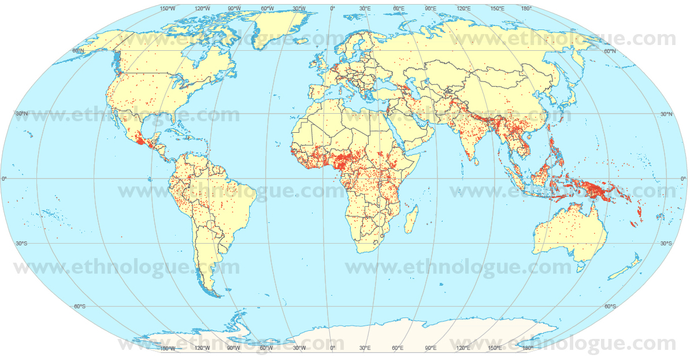

# Las Lenguas

## Introducción a la Lingüística.

Área de Lingüística, Fac. de Filología, UCM | 3/10/2013

Víctor Peinado | v.peinado@filol.ucm.es  

--SLIDE--
## ¿Cuántas lenguas hay?

- Es una de las primeras preguntas que siempre hacen los no lingüistas.

- Como nuestra lengua es algo que sentimos tan propio, las lenguas extranjeras siempre nos han llamado la atención.

- El mito de la torre de Babel y otros similares han tratado, desde la antigüedad de explicar por qué hay lenguas distintas.

- Los griegos antiguos llamaban *bárbaros* a los extranjeros que no sabían expresarse correctamente en su lengua: en realidad, *&beta;&alpha;&rho;&beta;&alpha;&rho;&omicron;&sigmaf;* simplemente significa «tartamudo».

- Hay chistes de todo tipo sobre lo raro o divertido que hablan los extranjeros.

--SUBSLIDE--

- Por si esto fuera poco, dentro de cada lengua existe mucha diversidad. A menudo se dice que determinadas personas «hablan mal», «se comen letras», «tienen acento» o «no se les entiende».

- Todo ello conduce siempre al mismo punto de partida: **la única lengua de verdad es la mía**.

- Suele existir una identificación entre grupo étnico y lengua. Esta identificación, como veremos más adelante, puede ser correcta, aunque no siempre lo es. Hay que ser cuidadosos.

- Aprender una lengua extranjera es una tarea ardua y difícil: es casi imposible dejar de hablar con acento extranjero.

- La diversidad lingüística es un misterio. Saber cuántas lenguas hay en el mundo no es un pregunta tonta.

- Lo malo no es la pregunta, sino la respuesta.

--SUBSLIDE--

- No sabemos cuántas lenguas hay y es imposible saberlo.

- Habitualmente se habla de entre 3.000 y 6.000 lenguas. 

- Los recuentos más amplios (véase el catálogo de [Ethnologue](http://www.ethnologue.com) llegan casi a 7.000, pero incluyen lenguas extintas.

- Estos números no nos dicen gran cosa. Nos dicen que hay muchas lenguas, pero no tantas como podría haber. 

- Somos 7.000.000.000 personas en el mundo, salimos a casi 1 millón de habitantes por lengua.

- Sin embargo, el reparto es desigual: hay lenguas (unas pocas) con muchos millones de hablantes y muchas lenguas (la gran mayoría) con pocos hablantes, algunas incluso con menos de un centenar.

--SUBSLIDE--

### Reparto de lenguas por continentes

-  Hay 194 estados reconocidos internacionalmente: nos toca a unas 33 lenguas por país.

-  Pero el reparto geográfico también es muy desigual y no entiende de fronteras.
		
    - América tiene el 15% de las lenguas.

	- África tiene el 30% de las lenguas.

	- Asia tiene el 32% de las lenguas.

	- Australia y los países del Pacífico poseen el 19% de las lenguas.

	- El 4% restante se reparte entre Europa y Oriente Medio.
	
--SUBSLIDE--

### Reparto de lenguas por países
	
-  El reparto de lenguas por países es todavía más curiosa:

    - España, con 46M habitantes, tiene 4 lenguas oficiales.
    
    - Camerún, con solo 17M habitantes y una extensión menor que España, tiene 286 lenguas.
    
    - En toda Europa hay 225 lenguas.
    
    - En India hay 360 lenguas, Nigeria tiene 450 y Papúa Nueva Guinea tiene ¡850 lenguas distintas!
	

--SUBSLIDE--

### Reparto geográfico de las lenguas

Cada punto representa el centro geográfico aproximado de una lengua.

 

*-*-*-*

--SUBSLIDE--

-  Si atendemos al número de hablantes, solo hay unas 600 lenguas que tengan más de 100.000 hablantes

-  100.000 hablantes es la cifra que se suele mencionar como el umbral mínimo a partir del cual se considera que una lengua no está en peligro de desaparición a medio plazo.

-  Y solo 250 lenguas tienen más de 1M hablantes, son las grandes lenguas del mundo: 
	
    -  chino mandarín, español, inglés, hindi, bengalí, portugués, ruso, árabe, japonés y francés son las 10 primeras por número de hablantes nativos.
	
-  Véase la [tabla de lenguas por número de hablantes](http://es.wikipedia.org/wiki/Anexo:Lenguas_por_número_de_hablantes).

--SUBSLIDE--

## ¿Cuántas lenguas hay?}
\begin{enumerate}
	-  ¿Qué es una lengua? (y un dialecto, y todo eso)
	-  ¿Por qué hay tantas? (o tan pocas)
	-  ¿De dónde han salido? ¿Cómo se relacionan unas con otras? (si es que se relacionan)
	-  ¿Qué sucede con las lenguas al pasar el tiempo? ¿Desaparecen?
	-  ¿Hay más lenguas ahora que en épocas anteriores o menos?
	-  ¿Hay lenguas mejores o peores, más o menos primitivas, más o menos perfectas, más o menos puras?
	-  ¿Cómo cambian las lenguas?
\end{enumerate}
--SLIDE--

## ¿Qué es una lengua?}

	-  Las lenguas que podemos observar varían enormemente.
	-  El español y el chino son muy distintas entre sí. 
	-  El español y el inglés son distintas también, pero las diferencias son menores.
	-  Aún menor es la diferencia que percibimos con el italiano o con el gallego. 
	-  Mi primo de Ciudad Real y mi suegra de Sevilla no hablan igual que yo, pero las diferencias, aunque existen, son mínimas.
	-  No hay dos personas que hablan igual. Una misma persona habla de manera diferente a lo largo de su vida, incluso en distintos momentos a lo largo de un mismo día.
	-  No hablamos igual que escribimos.

--SLIDE--

## ¿Qué es una lengua?}

	-  Si no sabemos definir de manera clara qué es una lengua difícilmente podremos contarlas. O los distintos intentos de catalogar las lenguas del mundo darán números dispares.
	-  La dificultad para enumerar las lenguas del mundo radica en que \textcolor{blue}{existe un continuo, una diferenciación gradual}, entre las distintas variedades de lengua que utiliza una misma persona a lo largo de un día (p. ej., cuando habla entre amigos y cuando declara ante un juez) y las diferencias radicales que existen entre el chino y el español.
	-  Sin embargo, por muy diferentes que sean dos lenguas, algo de común permanece. De manera que nunca confundimos dos lenguas humanas con cualquier mecanismo de comunicación animal.
	-  Las lenguas humanas, a pesar de sus diferencias, son básicamente distintas variantes de una misma cosa. Si las comparamos con el lenguaje de las abejas o los bonobos, las lenguas humanas se parecen bastante entre sí.

--SLIDE--

## ¿Cuántas lenguas hay en España?}

	-  En España hay cuatro lenguas oficiales: castellano, catalán, gallego y vasco.
	-  Sin embargo, \href{http://www.ethnologue.com/show_country.asp?name=ES}{Ethnologue enumera hasta 14 lenguas para España}.
	\pause
	
		-  castellano, catalán/valenciano/balear, gallego, vasco, aragonés, bable, caló, extremeño, chapurreau, gascón/aranés, y tres lenguas de señas (española, catalana y valenciana). 
	
	-  ¿En qué podemos basarnos para contar las lenguas? ¿En la capacidad para entendernos?

--SLIDE--

## ¿Cuántas lenguas hay en España?}

	-  Utilizar el criterio de la \textcolor{blue}{inteligibilidad} no siempre es sencillo.
	-  Los castellano-hablantes, por regla general, podemos entender sin mucha dificultad el gallego normativo, no así el gallego hablado en determinadas zonas rurales.
	-  Entendemos con menor frecuencia el catalán. 
	-  Nunca entendemos el vasco.
	-  A veces es más sencillo entender a un valenciano (hablando otra lengua) que a un gaditano (oficialmente, habla nuestra misma lengua).
	-  En la \textcolor{blue}{capacidad de comprensión también existe un continuo}.
	-  No hay duda de que los castellano-hablantes no comprenden a los hablantes de inglés, chino o !kung $\rightarrow$ son lenguas distintas.

--SLIDE--

## Lenguas de los países escandinavos}

	-  Si salimos de España, sucede lo mismo: ¿Cuántas lenguas hay en Escandinavia? 

	\begin{center} 
	  \includegraphics[scale=1]{img/scandinavia.jpg} 
	\end{center}
--SLIDE--

## Lenguas de los países escandinavos}

	-  Simplificando un poco, oficialmente, hay cuatro lenguas: danés, noruego, sueco y finés.
	-  El finés es de la famila ugro-fínica y resulta incomprensible para el resto. Nos olvidamos de él por el momento.
	-  Las otras tres lenguas son de la familia germánica: genéticamente están emparentadas y por razones históricas y culturales, han tenido contacto continuo durante siglos.
	-  El danés es difícil de comprender por el resto, salvo por los suecos del sur, que lo entiende bastante bien. 
	-  Suecos y noruegos, por lo general, se entienden aunque hablan oficialmente lenguas distintas. 
	-  Algunos noruegos del este comprenden mejor a los suecos del oeste que a algunas variedades del noruego.
	-  Hay un \textcolor{blue}{continuo} en la inteligibilidad de estas lenguas.

--SLIDE--

## Lenguas de la ex-Yugoslavia}

	-  ¿Cuál es la situación lingüística de los países de la ex-Yugoslavia? 

	\begin{center} 
	  \includegraphics[scale=0.35]{img/yugoslavia.png} 
	\end{center}
--SLIDE--

## Lenguas de la ex-Yugoslavia}

	-  Antes de la guerra se hablaban oficialmente tres lenguas:
	
		-  esloveno en el noroeste.
		-  macedonio en el sureste.
		-  serbocroata en el resto.
	

	-  El serbo-croata estaba formado por dos ¿variantes/dialectos? mutuamente inteligibles, aunque utilizaban alfabetos diferentes:

	
		-  los croatas utilizaban el alfabeto latino.
		-  los serbios utilizaban el alfabeto cirílico.
	

	-  Tras la guerra, se habla no de dos lenguas, sino de tres: 
	
		-  croata
		-  serbio
		-  bosnio
	
	-  ¿Acaso han nacido de un día para otro una, dos o tres lenguas nuevas? Lingüísticamente, tras la guerra nada ha cambiado. 
	-  La definición de \textcolor{blue}{lenguas distintas} casi nunca es una cuestión lingüística. 
	
--SLIDE--

## Situación del ebónico}

	-  A finales de los 1990s, hubo mucha polémica en EEUU acerca de si el ebónico era un dialecto del inglés o una lengua diferente.
	-  Ebónico es la denominación, políticamente correcta, para llamar al *black english} o *African American Vernacular English}: la variante del inglés que utilizan mayoritariamente los negros de EEUU.
	-  Las autoridades de la ciudad de Oakland, CA razonaron:
	
		-  los niños negros tienen peores resultados en la escuela porque no hablan inglés estándar, sino ebónico.
		-  en consecuencia, los niños negros no entienden a sus profesores y tiene dificultad para expresarse en inglés estándar.
		-  algo parecido les pasa a los niños latinos, chinos, indios, etc., pero a estos se les enseña inglés porque hablan una lengua distinta.
		-  Hay que tratar a los niños negros como si fuesen hablantes de lengua extranjera y formar a los profesores en ebónico.
	

--SLIDE--

## }
\begin{center}
\LARGE Lenguas, dialectos, hablas, jergas
\end{center}
--SLIDE--

## Lenguas, dialectos, hablas, jergas}

	-  Estos términos para los lingüistas no tienen ningún tipo de connotación. Se utilizan de manera neutra.
	-  Sin embargo, cotidianamente palabras como dialecto y jerga se suele utilizar de manera peyorativa.
	-  Socialmente están muy marcados y a menudo se exige a los lingüistas que expliquen las diferencias entre ellos.
	-  Es habitual encontrar opiniones en la prensa que defienden cosas como las siguientes:
	
		-  Las lenguas son superiores, tienen tradición escrita, merecedoras de una cultura rica y son símbolo identitario de un país.
		-  Los dialectos son cosas menores, patrimonio cultural, sí, pero de estar en casa. Cosa de canciones populares y bailes regionales.
	

--SLIDE--

## Lenguas, dialectos, hablas, jergas}

	-  Algunas escuelas lingüísticas han intentado eliminar este sentido peyorativo proponiendo otros términos.
	-  las \textcolor{blue}{variantes diatópicas} son las formas particulares que adopta una lengua en las diferentes regiones o áreas geográficas.
	-  las \textcolor{blue}{variantes diastráticas} son las diferencias sociales entre clases y estratos sociales, o entre grupos profefesionales.
	-  los \textcolor{blue}{lenguajes especiales} son las jergas, las formas de una lengua que adoptan grupos especiales.	
	-  Estas denominaciones, frecuentes en sociolingüística, no se utilizan en la vida cotidiana.

--SLIDE--

## Lenguaje}

	-  Utilizaremos este término para lo que es común a todas las lenguas humanas, incluso lo podemos ampliar a las formas de comunicación animal.
	-  Fundamentalmente, se trata de la capacidad que poseemos los seres humanos para hacer ciertas cosas por medio de señales sonoras o visuales.

--SLIDE--

## Lengua}

	-  Sigue siendo complicado definir qué es una lengua.
	-  No es posible dar una definición puramente lingüística.
	-  No todos los hispanohablantes hablamos igual, aunque a la hora de escribir nuestro estilo sí se parece más.
	-  Todos los hispanohablantes somos conscientes de una forma más o menos vaga de que compartimos algo: hablamos la misma lengua.
	-  Una lengua es un ente abstracto, un ideal al que los hablantes, supuestamente, aspiran llegar.
	-  Una lengua es un consenso social.
	-  Véase el vídeo \href{http://www.youtube.com/watch?v=sBiM3ELPjXs}{Moreno Cabrera: el español estándar}.

--SLIDE--

## Lengua estándar o norma culta}

	-  Normalmente, cuando pensamos en lengua nos referimos (casi siempre sin saberlo) a la \textcolor{blue}{lengua estándar}.
	-  La lengua estándar es lo que se aprende en las escuelas y se enseña a los extranjeros.
	-  Normalmente, la mayoría de los textos están escritos en estándar.
	-  Es la forma de la lengua que se utiliza para dar conferencias y clases, en debates políticos, etc.
	-  El castellano, el catalán, el inglés, el alemán\ldots todas las lenguas occidentales tienen una variante estándar que se utiliza en estos contexto anteriores.
	-  Hay bastante gente que, en el ámbito privado, puede usar otras formas de «lengua española»: p. ej., hay gente que en casa habla el «granadino cerrado», es decir, el dialecto o variante diatópica de Granada.
	-  En ello no hay nada de malo o incorrecto.

--SLIDE--

## Lengua estándar}

	-  El estándar nos permite dirigirnos a cualquier hispanohablante o a cualquier persona que haya aprendido español sin problemas graves de comunicación. 	
	-  El estándar no es la consagración del hablar bien.
	-  El estándar es simplemente un acuerdo social, más o menos tácito, que permite entenderse perfectamente a un conjunto de personas. 
	-  El vocabulario estándar no es de ningún sitio porque es de todas partes a la vez.
	-  Si una palabra que utilizamos cotidianamente no está en el estándar, significa que no la entienden todos los hispanohablantes.
	-  Que una palabra figure o no en el diccionario académico no significa nada. No es mejor ni peor. 
	-  El estándar es una norma social. Y como cualquier norma de conducta social, cambia con el paso del tiempo.

--SLIDE--

## Hablar bien o hablar mal}

	-  Es habitual escuchar cosas como «los leistas hablan mal», «decir treceavo para indicar el ordinal es incorrecto», «la expresión ``las tareas a realizar'' es un calco del francés y es incorrecta en castellano».
	-  \textcolor{blue}{La Lingüística describe, no prescribe}. 
	-  Si alguien dice cosas como «haiga» en lugar de «haya», «venistes» en lugar de «veniste», «ayer andó mucho» en lugar de «ayer anduvo mucho», la Lingüística describe estos fenómenos y trata de explicar las causas.
	-  La Lingüística no le dice a nadie cómo tiene que hablar.
	-  Por mucho que escuchemos quejas acerca de cómo «los jóvenes destrozan el idioma», «los SMSs matarán al español», las lenguas no se corrompen.
	-  No tenemos que entender los cambios a peor. Las lengua cambian, por eso no hablamos latín.

--SLIDE--

## Hablar bien o hablar mal}

	-  La lengua es de los hablantes, no de una institución artificial y anticuada encargada de «limpiar, fijar y dar esplendor».
	-  Los hablantes son los únicos que pueden establecer el estándar. 
	-  Lo que sí es «hablar bien/hablar mal» es saber o no saber adecuar la lengua a cada situación, a cada contexto y a cada interlocutor.
	-  Hablar bien es saber expresarse de una manera en una recepción formal y de otro modo bien distinto en una conversación entre amigos íntimos.

--SLIDE--

## Habla}

	-  Es un término ideal porque sirve para casi cualquier cosa. Y esta es su mayor pega, que es demasiado vago.
	-  En la lengua cotidiana, «habla» tiene connotaciones peyorativas: las «hablas locales» no llegan ni siquiera a la altura del dialecto.
	-  En lingüística suele ser un término comodín, pero existe un uso técnico que ya conocemos:
	-  Recordad que Ferdinand de Saussure distinguía el carácter social de la lengua (*langue}) frente al individual del habla (*parole})

--SLIDE--

## Dialecto}

	-  Para un lingüista, con el término \textcolor{blue}{dialecto} suele referirse a dos cosas:

\begin{enumerate}
	-  un término útil para hablar de la evolución de las lenguas
	
		-  latín, griego y sánscrito son dialectos indoeuropeos que provienen de una misma lengua: el indoeuropeo.
		-  español, catalán, francés son dialectos románicos que provienen de una misma lengua: el latín vulgar.
	
	-  un término para hablar de cualquier variante de una lengua ligada a un área geográfica o a un grupo social determinado. 
	
		-  ni mejor ni peor que el estándar.
	
\end{enumerate}

--SLIDE--

## Bilingüismo y diglosia}

	-  el \textcolor{blue}{bilingüismo} es la situación de convivencia de dos lenguas en una misma población o territorio donde ambas gozan del mismo estatus, prestigio y usos sociales. Es indiferente utilizar una u otra.
	
		-  es una situación ideal que no existe a nivel de sociedad.
		-  pueden existir casos a nivel individual, es decir, personas perfectamente bilingües que son capaces de cambiar de una lengua a otra sin esfuerzo.
	
	-  la \textcolor{blue}{diglosia} es la situación de convivencia de dos lenguas en el seno de una misma población o territorio, donde uno de los idiomas tiene un estatus superior —como lengua de cultura, de prestigio o de uso oficial— frente al otro, que es relegado a las situaciones socialmente inferiores de la oralidad, la vida familiar y el folklore.
	
		-  Esta es la situación más habitual en comunidades de hablantes multilingües.
	

--SLIDE--

## Normalización y Normativización}

	-  La \textcolor{blue}{normalización} es:
	
		-  el proceso por el que pasan las lenguas minorizadas con el objetivo de recuperar su estatus de lengua «normal», es decir, de lengua cuyo su uso oral y escrito sea natural y espontáneo en cualquiera de las situaciones que se pueden producir en la vida pública y personal de sus hablantes.
		-  el proceso sociocultural puesto en marcha por el poder político con la finalidad de restablecer el uso social de una lengua amenazada.
	
	-  Esto suele ir acompañado de un proceso previo de \textcolor{blue}{normativización}, es decir, un proceso de fijación del código lingüístico de la lengua para adecuarlo a las necesidades de normalización social. 
	
		-  para conseguir la normativización debe contarse o crearse con una ortografía, una gramática normativa y un diccionario normativo.
		-  La normativización consiste en la creación de un estándar.
	

--SLIDE--

## }
\begin{center}
\LARGE Clasificación genética: las familias lingüísticas
\end{center}
--SLIDE--

## ¿Por qué hay tantas lenguas en el mundo (o tan pocas)?}

	-  ¿De dónde han salido las lenguas actuales? ¿Cómo se relacionan unas con otras?
	-  Las lenguas que existen actualmente proceden de lenguas anteriores, y éstas de otras, y así sucesivamente.
	-  Todos hemos escuchado hablar alguna vez del «peligro de fragmentación del castellano, como sucedió con el latín».
	-  En el antiguo imperio romano había una única lengua, el latín. La falta de comunicación suficiente entre los hablantes de distintas regiones del imperio (unido a otros factores como las invasiones bárbaras, la influencia de lenguas nativas anteriores, etc.) provocó la desmembración del latín y la aparición de las lenguas romances.    
	-  En realidad, la situación era más compleja. Recuerden el continuo lingüístico, el estándar\ldots 

--SLIDE--

## Diversidad lingüística}

	-  El proceso de aparición de las lenguas romances es paralelo al que podemos encontrar en otras zonas. 
	-  Las lenguas germánicas proceden de un «proto-germánico» que en determinado momento se dividió en lenguas distintas.
	-  Las lenguas eslavas actuales proceden de un «proto-eslavo»\ldots
	-  Lo mismo ocurrió con las lenguas semíticas: árabe, hebreo, lenguas de Etiopía.
	-  Si seguimos viajando atrás en el tiempo, veremos cómo el latín, el proto-germánico, el proto-eslavo, el sánscrito\ldots aparecieron con la desmembración de una lengua anterior: el indoeuropeo.
	-  Si seguimos así podemos llegar a la siguiente conclusión: ¡hoy existen más lenguas que nunca!

--SLIDE--

## Evolución de la diversidad lingüística}

\begin{center} 
  \includegraphics[scale=0.5]{img/diversidad-ling.png} 
\end{center}

--SLIDE--

## Diversidad lingüística: aumento de población}

	-  No es ningún mérito que ahora haya más lenguas en el mundo que en épocas anteriores: nunca ha habido tanta población. 
	-  Acabamos de rebasar la cifra de 7.000M de habitantes. No rebasamos los 1.000M hasta principios del s. XIX. A principios del S. XX la población total era de 1.800M. 
	-  En los albores de la humanidad es posible que fuésemos menos de 1M en todo el globo.
	-  Es evidente que el número de lenguas ha ido creciendo a lo largo de los siglos y los milenios.
	-  A pesar del crecimiento exponencial de la población, no ha habido crecimiento exponencial del número de lenguas.
	-  De hecho, lo que ha ocurrido es que en un cortísimo espacio de tiempo:
	\begin{enumerate}
		-  han desaparecido centenares de lenguas: especialmente en América, Australia y Oceanía.
		-  algunas lenguas han aumentado mucho su número de hablantes.
	\end{enumerate} 

--SLIDE--

## Las familias lingüísticas}

	-  Si las lenguas de hoy en día son divisiones de lenguas anteriores (y éstas, a su vez, divisiones de lenguas previas\ldots), ¿podemos llegar a la lengua de Adán y Eva?
	-  ¿Existió alguna vez una lengua única de la que se fueron separando todas las demás?
	-  Es una pregunta muy debatida y resulta imposible dar una respuesta definitiva, pero vale la pena echar un vistazo a cómo se agrupan las 5.000 ó 7.000 lenguas del mundo.
	-  Un primera aproximación para comparar lenguas es prestando atención a las semejanzas, justificadas por su parentesco. Es lo que se conoce con el nombre de \textcolor{blue}{clasificación genética}.
	-  Una \textcolor{blue}{familia lingüística} es un conjunto de lenguas genéticamente emparentadas que proceden de un ancestro común.

--SLIDE--

## El reparto de lenguas por el mundo}

	-  Ya hemos visto que el reparto de lenguas por el mundo es desigual.
	-  La mayor diversidad lingüística se encuentra en África y en el Pacífico.
	-  A principios del s. XX, el ligüístia norteamericano Edward Sapir propuso la siguiente hipótesis:
	
		-  es de esperar que encontremos mayor diversidad lingüística en los emplazamientos más antiguos porque, lógicamente, ha habido más tiempo para la diversificación. 
	
	-  Esta hipótesis coincide la Genética: la diversidad genética es tanto mayor cuanto más antigua sea la población.
	\begin{enumerate} 
		-  Hay más diversidad lingüística en Inglaterra que en EEUU, en España que en Latinoamérica.
		-  En el norte de África, hay más diversidad lingüística entre los pueblos bereberes (más antiguos) que entre la población de origen árabe (que es posterior).
	\end{enumerate} 

--SLIDE--

## Origen africano}

	-  Si es cierta la correlación entre antigüedad y diversidad, África (el continente con mayor diversidad lingüística del mundo), tendrá también las lenguas más antiguas.
	-  Y si nos fijamos, dentro de África, en la zona geográfica con mayor concentración de lenguas distintas (actuales Camerún y Nigeria) haremos bien en poner el foco para tratar de buscar las lenguas más antiguas.
	-  Tradicionalmente, se suelen distinguir tres grandes familias lingüísticas africanas:
	
		-  khoisan: lenguas del sur y suroeste (actuales Angola, Namibia, Sudáfrica, etc.).
		-  afro-asiática: egipcio antiguo, árabe, hebreo, arameo, amhárico, etc.
		-  níger-kordofán: lenguas bantúes y sub-saharianas que no pertenecen a las dos lenguas anteriores.
	
	-  Dentro de cualquiera de estas familias, la diversidad es aterradora. Algunas parecen diverger tanto como el chino y el español.

--SLIDE--

## Familias lingüísticas de África}

\begin{center} 
  \includegraphics[scale=0.5]{img/lenguas-africa.png} 
\end{center}
--SLIDE--

## Familias lingüísticas de África}

\begin{center}
\begin{tabular}{ l l l l l l l }
   & \textbf{!kung} & \textbf{nama} & \textbf{hausa} & \textbf{maasai} & \textbf{zulú} & \textbf{swahili} \\
\hline
yo & mi & ti & ni & nanu & ami & mimi \\
tú & i & tsa & kai & inyi & akhu & ako \\
hablar & okx'ui & kx'ui & fada & iro & amb & amb \\
beber & k''a & kx'a & \ipa{\textesh\=a} & mat & phuza & nyw \\
ojo & \ipa{\textpipe ga} & mus & id\ipa{\=o} & \ipa{ongu} & so & cho \\
sol & \ipa{\textpipe am} & \ipa{\textpipe am} & rana & \ipa{olong} & \ipa{langa} & jua \\
\end{tabular}
\end{center}

--SLIDE--

## Las lenguas khoisan: hotentotes y bosquimanos}

	-  Las lenguas de la familia khoisan son las lenguas de los pueblos tradicionalmente conocidos como hotentotes y bosquimanos.
	-  Geográficamente se extienden por las actuales Angola, Namibia, centro de Sudáfrica, Botswana y Zimbabwe, y un pequeño reducto en la actual Tanzania.
	-  Todas tienen una peculiaridad prácticamente exclusiva: los clicks o chasquidos, unas consonantes muy particulares.
	
		-  \href{http://www.youtube.com/watch?v=pGUzL2DVblc&feature=related\#}{Trabalenguas en xhosa}.
		-  \href{http://www.youtube.com/watch?v=gytCi5a7AJg}{Cliks en xhosa}
	
	\pause
	-  Estos clicks, por muy extraños que parezcan, los usamos nosotros continuamente.
	
		-  [\ipa{\!o}] $\rightarrow$ click labial: es el sonido de un beso fuerte.
		-  [\ipa{//}] $\rightarrow$ click lateral: es el sonido para arrear a un caballo.
		-  [\ipa{!}] $\rightarrow$ click alveolar: es el sonido de descorchar una botella.
		-  [\ipa{|}] $\rightarrow$ click dental: es el sonido de un chasquido de disgusto.
	

--SLIDE--

## Los clicks de las lenguas khoisan}

	-  Más allá de la coincidencia superficial de los clicks, hay tanta diversidad entre las lenguas khoisan que sus hablantes no se entienden entre sí.
	-  Son lenguas habladas por pequeños grupos que han residido durante milenios en zonas colindantes.
	-  Es una familia lingüística bien reconocida que ha ocupado desde siempre el sur de África.
	-  Sus únicos familiares son otro par de lenguas de Tanzania, que también tiene clicks. 
	-  No sería extraño que la patria originaria estuviera precisamente en esa zona: los movimientos migratorios de los khoisan y los restos originarios del hombre moderno concuerdan con esta hipótesis.
	-  Los estudios genéticos y lingüísticos apuntan a la idea de que estos pueblos (y estas lenguas) están entre los descendients directos de los humanos modernos más antiguos.

--SLIDE--

## Tabla comparativa de distintas lenguas khoisan}

\begin{center}
\begin{tabular}{ l l l l l }
   & \textbf{\ipa{!kung}} & \textbf{\ipa{!xó\~o}} & \textbf{naron} & \textbf{nama} \\
\hline
yo & \ipa{mi} & \ipa{\textltailn'\textltailn} & \ipa{ti} & \ipa{ti} \\
tú & \ipa{i} & \ipa{\=ah} & \ipa{satSa} & \ipa{tsa} \\
hablar & \ipa{okx'ui} & \ipa{tana} & \ipa{!gava} & \ipa{kx'ui} \\
beber & \ipa{k''a} & \ipa{kx'\=ah\~a} & \ipa{k''a} & \ipa{kx'a} \\
ojo & \ipa{\textpipe ga} & \ipa{\textpipe 'u\~i} & \ipa{mùs} & \ipa{m\~us} \\
sol & \ipa{\textpipe am} & \ipa{\textpipe \textpipe 'an} & \ipa{\textpipe amSa} & \ipa{\textpipe am} \\
\end{tabular}
\end{center}

--SLIDE--

## Diversidad lingüísitca en otras zonas del mundo}

	-  Recapitulando, podemos demostrar desde un punto de vista genético y arqueológico que el lugar con la población más antigua es África.
	-  El lugar con mayor diversidad lingüística es África.
	-  Las lenguas de la familia khoisan están entre las más antiguas de África.
	-  Hasta ahora diversidad $\approx$ antigüedad. ¿Sirve esa ecucación para explicar la diversidad lingüística de otras zonas del mundo?
	-  Tras África, los asentamientos más antiguos del hombre modernos (hacia el 60.000 aC) son el sureste asiático y Papúa Nueva Guinea.
	-  La ocupación de Asia, Europa y América sería más reciente, y eso se refleja en la menor diversidad lingüística.  

--SLIDE--

## Migraciones humanas}
\begin{center} 
  \includegraphics[scale=0.35]{img/Migraciones_humanas.png} 
\end{center}--SLIDE--

## Lenguas de América}

	-  La ocupación de América es posterior al de otras zonas del mundo, sin embargo, la diversidad lingüística parece indicar que se ocupó en diversas oleadas.
	-  Si comenzamos por el final, los inuit (esquimales) fueron la última migración hace unos pocos milenios. Se encontraron todo el continene ocupado y, en consecuencia, decidieron quedarse en el extremo norte, desde Alaska hasta Groenlandia (familia esquimo-aleutiana).
	-  Un tiempo antes, hace 5.000 - 10.000 años, habían llegado por el mismo camino otros pueblos. Se encontraron las tierras del sur ocupadas, así que se extendieron por la franja noroccidental de los actuales EEUU y Canadá y en el centro-sur de EEUU (familia na-dene).
	-  Antes que ellos, otros pueblos fueron llegando a América y se encontraron un continente prácticamente vacío. Pudieron extenderse desde norteamérica hasta Tierra del Fuego con bastante rapidez (familia amerindia).
	

--SLIDE--

## Lenguas indoeuropeas}

	-  Dejando aparte la reciente expansión del francés, inglés, portugués, neerlandés u español existe un grupo de lenguas que ha ocupado un extenso territorio desde hace mucho tiempo: las \textcolor{blue}{lenguas indoeuropeas}.
	-  El parentesco de estas lenguas se estableció desde finales del s. XVIII. Véase el \href{http://upload.wikimedia.org/wikipedia/commons/4/4f/IndoEuropeanTree.svg}{árbol genealógico}.
	-  Al principio, se consideraban integrantes de esta familia las lenguas románicas («hijas del latín») el griego, las germánicas, las eslavas, las bálticas (lituano y letón), célticas, iranias e indias (como el sánscrito).
	-  Posteriormente, se han ido uniendo otras lenguas cuyo parentesco no resultaba tan evidente: albanés, armenio, lenguas desaparecidas de la península itálica (osco-umbro, etrusco) y los Balcanes (tracio, ilirio), lenguas de China (tocario) y de Anatolia (hitita). 

--SLIDE--

## Tabla comparativa de diversas lenguas indoeuropeas}
\begin{center}
\begin{footnotesize}
\begin{tabular}{ l l l l l l l l }
 & \textbf{yo} & \textbf{tú} & \textbf{¿quién?} & \textbf{agua} & \textbf{nombre} & \textbf{muerte} & \textbf{dos} \\
\hline
latín & ego & tu & quis & - & nomen & mortuus & duo \\
griego & ego & su & tis & hudor & onoma & ambrotos & duo \\
gótico & ik & \ipa{\th u} & hwas & wato & namo & \ipa{mor\th r} & twe \\
lituano & \ipa{aS} & tu & kas & vanduo & emmens & mirti & du \\
eslavo & azu & ty & kuto & voda & ime & mrto & duo \\
sánscrito & ahám & tuvám & kas & udakám & naman & mrtá & duv \\
tocario & - & twe & kuse & war & \ipa{\textltailn em} & - & wi \\
hitita & uk & - & kuis & watar & laman & merta & twi \\
\end{tabular}
\end{footnotesize}
\end{center}
--SLIDE--

## Los pueblos indoeuropeos}

	-  ¿De dónde y cuándo salió esta familia? Existen varias teorías.
	-  Lo que se conoce como la hipótesis estándar defiende que los indoeuropeos serían un pueblo de la edad de cobre dedicado al pastoreo que había domesticado el caballo.
	-  Habitaron las estepas del Cáucaso, el sur de Rusia y Ucrania entorno al año 3.000 aC. Desde ahí se fueron extendiendo:
	
		-  Primero se separaron los anatolios. 
		-  Después, hacia el suroeste, los griegos, tracios, ilirios, itálicos.
		-  Hacia el oeste, los celtas, con los germanos, bálticos y eslavos, que se dirigieron hacia el noroeste.
		-  Hacie el sureste, se fueron los indo-iranios y un poco hacia el noreste, los tocarios. 
	
	-  Así fueron extendiéndose y, tras mezclarse con pueblos aborígenes de los nuevos asentamientos, dieron lugar a las lenguas actuales.

--SLIDE--

## Agrupación de lenguas en el mundo}

A continuación se detalla una hipótesis atrevida sobre la agrupación de las lenguas del mundo, con «solo» 12 grandes familias.

	-  \textcolor{blue}{khoisán}: África meridional.
	-  \textcolor{blue}{níger-cordofán}: centro de África, de costa a costa. 
	-  \textcolor{blue}{nilo-sahariana}: sur de Sudán y centro-este de África.
	-  \textcolor{blue}{afro-asiática}: norte de África, Etiopía, península arábiga.
	-  \textcolor{blue}{euro-asiática}: casi toda Europa (excepto euskera y lenguas caucásicas), buena parte de Asia, Alaska y Groenlandia.
	-  \textcolor{blue}{kartvelia}: georgiano y lenguas del Cáucaso.

--SLIDE--

## Agrupación de lenguas en el mundo: hipótesis atrevida}

	-  \textcolor{blue}{áustrica}: lenguas de Indochina, Taiwán, Madagascar, Filipinas, Indonesia y Polinesia.
	-  \textcolor{blue}{dravídica}: mitad sur de India, norte de Sri Lanka y zona oeste de Pakistán.
	-  \textcolor{blue}{indo-pacífico}: Papúa Nueva Guinea y las lenguas extintas .
	-  \textcolor{blue}{australiana}: lenguas aborígenes de Australia.
	-  \textcolor{blue}{amerindia}: casi toda América, de norte a sur.
	-  \textcolor{blue}{dene-caucásica}: lenguas sino-tibetanas (variantes del Chino), lenguas del Caúcaso, lenguas na-dene de Norteamérica, lenguas del Yenisei\ldots y el euskera.

--SLIDE--

## Familias lingüísticas del mundo}
\begin{center} 
  \includegraphics[scale=0.25]{img/lenguas-mundo.png} 
\end{center}

--SLIDE--

## Tres escenarios para una primera lengua}

	-  Es imposible saber si alguna vez existió una única lengua. Pero podemos presentar tres escenarios distintos.

\begin{enumerate}
	-  El lenguaje surge cuando toda la humanidad moderna vive en África. Con el paso del tiempo, las poblaciones se mueven y se separan, y con ellas sus lenguas.
	-  Igual que el segundo escenario, pero con muchos contactos posteriores entre grupos, de manera que poblaciones que emigran vuelven al punto de origen y se mezclan con los «sus primos».
	-  El lengua va surgiendo como consecuencia de las necesidades de la población en movimiento y en constante adaptación. Las lenguas surgen sin relación unas con otras.
\end{enumerate}
	-  Los tres escenarios permitirían el mismo resultado final: la actual diversificación de lenguas.

--SLIDE--

## En busca de la «lengua madre»}

	-  Ha habido diferentes intentos de encontrar la lengua madre o el ancestro común mas antiguo.
	-  Las lenguas que conocemos actualmente no son demasiado antiguas: el chino, el sumerio, el hitita, no tienen más de 5.000 años.
	-  No tenemos registro de lenguas antiguas, Necesitamos recurrir a un método que nos permita reconstruir los restos de esas proto-lenguas.
	-  A partir de estudios comparativos y teniendo en cuenta la evolución y el cambio lingüístico reciente podemos reconstruir la base lingüística (no tanto palabras reales) de la que surgen las palabras de las lenguas actuales.
	-  Illich-Svitych trató de de encontrar los rastros de una antiquísima «lengua tatarabuela» a la que llamó nostrático.
	-  Greenberg a través de un método comparativo, multilateral ha propuesta una proto-lengua llamada euroasiático.

--SLIDE--

## }
\begin{center}
\LARGE Clasificación tipológica de las lenguas 
\end{center}
--SLIDE--

## Clasificación tipológica de las lenguas}

	-  La clasificación genética no es la única forma de comparar y relacionar las lenguas del mundo.
	-  Existe la posibilidad de agrupar las lenguas en base a determinadas características estructurales y sin antender a su parentesco. 
	-  Es lo que se conoce con el nombre de \textcolor{blue}{clasificación tipológica} y analiza las siguientes características estructurales de las lenguas:
	
		-  estructura verbal.
		-  sistema fonológico (sonidos vocálicos y consonánticos).
		-  estructura de la palabra.
		-  orden habitual de los elemenos de la oración.
	

--SLIDE--

## Estructura de la palabra: lenguas sintéticas vs. lenguas analíticas}

Atendiendo a la estructura habitual de las palabras, la clasificación tipológica suele dividir las lenguas del mundo bajo dos categorías distintas: 

	-  las \textcolor{blue}{lenguas sintéticas} se caracterizan porque sus palabras están constituidas por varios morfemas distintos. En estas lenguas existen mecanismos para crear significados complejos por medio de flexión y derivación.
	
	Son típicas lenguas sintéticas las indoeuropeas (latín, griego, romances, sánscrito, ruso, alemán), las lenguas dravídicas y algunas americanas (quechua, navajo, náhuatl).
	
	-  las \textcolor{blue}{lenguas analíticas} se caracterizan porque sus palabras son monomorfemáticas. Es decir, no tienen mecanismos de flexión ni derivación y las palabras complejas son resultado de procesos de composición. 
	
	Típicas lenguas analíticas son el chino y las lenguas aústricas.   
	

--SLIDE--

## Tipos de lenguas sintéticas}

Las lenguas sintéticas, a su vez, suelen dividirse en dos grandes grupos, dependiendo del mecanismo de creación de palabras más frecuente.

	-  las \textcolor{blue}{lenguas flexivas} son aquellas cuyas palabras suelen estar formadas por más de un morfema que, a su vez, es capaz de sintetizar información de distintas categorías. 
	
	Ejemplos típicos de lenguas flexivas son el latín, griego, ruso y todas las lenguas romances.
	
	-  las \textcolor{blue}{lenguas aglutinantes} son aquellas cuyas palabras suelen estar formadas por más de un morfema, cada uno de ellos aporta un tipo de significado diferente (léxivo, derivatibavo, gramatical). 

	Ejemplos típicos de lenguas aglutinantes son el turco, el finés y el euskera.

--SLIDE--

## Estructura de palabras en español}

Anque el español es mayoritariamente una lengua sintética de tipo flexivo, podemos encontrar ejemplos de palabras típicos de otros tipos de lenguas.

	-  \textit{cant-o} tiene dos constituyentes. El morfema \textit{cant-} aporta el significado léxico y el morfema \textit{-o} sintetiza información de distintas categorías: modo indicativo, tiempo presente, primera persona, número singular. Es un ejemplo típico de las \textcolor{blue}{lenguas flexivas}.

	-  \textit{granj-er-a-$\varnothing$} tiene cuatro constituyentes. El el morfema \textit{granj-} aporta el significado léxico («casa de labranza»), \textit{-er-} aporta el significado derivativo («persona o cosa relacionada con el lugar anterior»), \textit{-a-} aporta el significado gramatical relativo a género femenino y el morfema $\varnothing$ indica el número. Es un ejemplo típico de las \textcolor{blue}{lenguas aglutinantes}.

--SLIDE--

## Estructura de palabras en español}

	-  \textit{rompe-cabezas} tiene dos constituyentes. Dos elementos independientes se han unido para formar una palabra compuesta. Es un ejemplo típico de las \textcolor{blue}{lenguas analíticas}.

--SLIDE--

## Orden oracional}

	-  La clasificación tipológica también se aplica a la investigación del orden canónico de los elementos oracionales en las distintas lenguas.
	-  En muchas lenguas el orden de los elementos oracionales no es fijo, aunque siempre hay un orden no marcado.
	-  Podemos establecer los siguientes tipos de lenguas atendiendo al orden de aparición del sujeto (S), el verbo (V) y el objeto (O):
	
		-   lenguas SOV: euskera, latín y griego clásico, árabe, japonés, hindi, sánscrito, turco, alemán (con verbos compuestos), nóstrático
		-  lenguas SVO: castellano, inglés, francés, italiano, chino mandarín, griego moderno, swahili
		-  lenguas VSO: galés, tagalo 
		-  También hay lenguas con orden VOS (malgache, javnés, fiyiano) y OVS (interlingua, klingon).
	

--SLIDE--

## Orden oracional}

	-  Las lenguas SOV y SVO representan alrededor del 75\% de las lenguas del mundo. 
	-  Las lenguas SOV comparten las siguientes características:
	
		-  Tendencia a las postposiciones frente a las preposiciones.
		-  Las oraciones de relativo y los adjetivos suelen preceder al nombre que modifican. 
		-  En general, el orden habitual del elementos en el sintagma es modificador + núcleo.
	
	-  Por su parte, las lenguas SVO presentan las siguientes características:
	
		-  Tendencia a las preposiciones frente a las postposiciones.
		-  Las oraciones de relativo y los adjetivos se situán detrás del nombre al que modifican (antecedente).
		-  En general, el orden habitual del elementos en el sintagma es núcleo + modificador.
	

--SLIDE--
	

## }
\begin{center}
\LARGE El paso del tiempo y el cambio lingüístico 
\end{center}
--SLIDE--

## Desaparición de una lengua}

	-  Las lenguas pueden desaparecer. No tiene que pasar necesariamente, hay lenguas que existen (con muchos cambios, eso sí) dede hace miles de años.
	
		-  El chino es chino desde hace más de 4.000 años.
		-  El hindi actual es la continuación de antiguas lenguas indias.
		-  Castellano, gallego y catalán son continuación del latín, que a su vez es continuación del indoeuropeo, que es continuación de\ldots.
	
	-  Podemos entender «desaparición» de dos formas distintas:
	\begin{enumerate}
		-  la desaparición completa de una lengua: antes existía y ahora no.
		-  la desaparición aparente de una lengua, debido al paso del tiempo y al cambio lingüístico.
	\end{enumerate}

--SLIDE--

## Desaparición de una lengua}

	-  Existe constancia de la desaparición de lenguas en muchos países y en todas las épocas: 
	
		-  En la Isla de Man, en Reino Unido, hace menos de 100 años se hablaba el manx. Ya no quedan hablantes nativos. En 1777 murió el último hablante de cornuallés.
		-  En España desaparecieron el ibérico y todas las lenguas célticas que se hablaban antes de la llegada de los romanos.
		-  En Italia desaparecieron el osco, el etrusco y el venético.
		-  En Oriente medio se hablaron lenguas como el hitita y el sumerio. No se hablan desde hace miles de años, solo nos quedan textos escritos en tabillas de barro.
		-  En América y Australia la desaparición de lenguas fue de la mano de la desaparición de los pueblos indígenas que las hablaban.
		-  En otras ocasiones, por fortuna, las lenguas mueren simplemente porque sus hablantes deciden dejar de utilizarlas. 
	

--SLIDE--

## La muerte de lenguas en EEUU}

	-  Conocemos bastante bien la reciente y continuada desaparición de lengua indias en EEUU.
	-  Las poblaciones indias fueron reducidas en número, desplazadas de su lugar de origen y relegadas en reservas.
	-  Desde finales del x. XIX la política gubernamental intento la asimilación: los niños eran educados en internados, en inglés
	-  Se calcula que el 80\% de las lenguas de EEUU y Canadá desaparecerán en breve plazo.

\begin{center}
\begin{footnotesize}
\begin{tabular}{ l r r }
\textbf{lengua} & \textbf{hablantes} & \textbf{población} \\
\hline
powahatan & 0 & 3.500 \\
comanche & 854 & 6.000 \\
cheyenne & 1.721 & 5.000 \\
hopi & 5.265 & 6.500\\
apache & 15.333 & 20.000\\
sioux dakota & 16.000 & 100.000\\
cherokee & 23.000 & 300.000 \\
navajo & 150.000 & 220.000 \\
\end{tabular}
\end{footnotesize}
\end{center}

--SLIDE--

## La muerte de lenguas en EEUU}

	-  De las 159 lenguas indias de EEUU, solo 36 tienen más de 1.000 hablantes nativos.
	-  La inmensa mayoría de estas lenguas no se ha usado nunca en la escritura, o solo desde hace poco tiempo.
	-  Cuando hay suficiente número de hablantes, es posible tomar la decisión de utilizar la lengua de manera que pueda aprenderla la nueva generación: hablándola en casa, en la vida cotidiana y en la escuela.
	-  En EEUU hay otras lenguas minoritarias no indias que no corren ningún peligro: el *canjun french} de Luisiana o el *pennsylvania dutch} de los amish $\rightarrow$ dos poblaciones con una clara identidad étnico-cultural o religiosa.
	-  El desarraigo de los indios les ha hecho perder gran parte de su cultura tradicional.
	-  A pesar del actual proceso de revitalización de las culturas indias, la desventaja de la que parten las lenguas es evidente y su recuperación compleja.

--SLIDE-- 

## En todas partes mueren lenguas}

	-  No solo en los países de habla inglesa desaparecen lenguas.
	-  El 25\% de las lenguas indias de Latinoamérica están en peligro de extinción inmediata.
	-  Aunque la mayoría de estas lenguas no corre peligro desde el pdv demográfico, sí lo corre por motivos de prestigio social. 
	-  Con expeción del guaraní (lengua co-oficial en Paraguay), el resto de lenguas suelen ser despreciadas por ser «cosa de indios».

\begin{center}
\begin{footnotesize}
\begin{tabular}{ l r l }
\textbf{lengua} & \textbf{hablantes} & \textbf{país} \\
\hline
cayapa & 5.000 & Ecuador\\
yanomami & 15.000 & Venezuela, Brasil \\
mapuche & 400.000 & Chile\\
náhuatl & 1.380.000 & México \\
aymara & 2.200.000 & Bolivia, Perú, Chile\\
lenguas mayas & 3.000.000 & Guatemala, México, Belize \\
guaraní & 4.650.000 & Paraguay \\
quechua & 8.000.000 & Bolivia, Perú, Ecuador, Colombia\ldots \\
\end{tabular}
\end{footnotesize}
\end{center}

--SLIDE--

## Lenguas que resucitan}

	-  Pero las lenguas pueden resucitar.
	-  El hebreo dejó de ser una lengua hablada y quedó limitada a su uso en ritos religioso durante siglos. 
	-  Durante el s. XX, con la creación del estado de Israel, su uso se revitalizó y goza de muy buena salud.
	-  En España, el euskera nunca no dejó de tener hablantes aunque su uso quedó muy limitado a áreas rurales. 
	-  Como hemos visto anteriormente, los mecanismos de normativización y normalización lingüística suelen venir acompañados de la introdución de la lengua minoritaria en la escuela a todos los niveles.
	-  Para reforzar, impulsar, revitalizar o resucitar cualquier lengua hay que establecer incentivos para que la gente la use en todas las situaciones posibles.

--SLIDE--

## }
\begin{center}
\LARGE ¿Hay lenguas mejores y peores? ¿Más o menos primitivas? 
\end{center}
--SLIDE--

## }

	-  Los no lingüistas (y a veces, algunos lingüista también) hablan a menudo de «lenguas primitivas» y las clasifican en mejores y peores $\rightarrow$ volvemos a la distinción entre lengua y dialecto.
	-  Se suele hablar de «lenguas con gramática» y «lenguas sin gramática». Esto es un sinsentido, la gramática es un componente esencial del lenguaje humano.
	-  Este tipo de afirmaciones puede venir de la creencia falsa de que «tener gramática» consiste en «tener una variante estándar» o tener tradición literaria escrita.
	-  El origen de todas estas ideas está en la época colonial, cuando interesaba dejar bien clara la diferencia entre los pueblos civilizados europeos y los pobres e ignorantes salvajes.
	-  Todas las lenguas que existen, han existido o puedan existir en el futuro tienen gramática.
	-  No se conoce ningún pueblo que haya carecido de algo semejante a nuestra literatura, aunque no esté escrita. 

--SLIDE--

## Breve inmersión en las lenguas khoisan}

	-  Ya hemos visto que las lenguas khoisan están probablemente entre las lenguas más antiguas del mundo. 
	-  ¿Son lenguas primitivas o inferiores? ¿Comparadas con qué? Echemos un vistazo al vocabulario para ver qué significados son capaces de trasmitir.
	
		-  \ipa{[g\!ohx'ó\~o]}: mosca
		-  \ipa{[dts'kx'\=ala]}: olor a pradera quemada
	
	-  La característica principal de esta familia de lenguas es el uso de los sonidos clicks que aparecen en el 60\% de sus palabras.
	-  Estos clicks tienen en cierta medida semántica: hay cierta relación entre el sonido y ciertas ideas generales:  
	
		-  click alveolar lleva asociado significado de `algo abombado'.
		-  click lateral parece corresponder con la idea de `algo alargado y grueso'
		-  click dental es predominante la idea de algo `largo y flexible'.
		-  click palatal lleva asociado la idea de `algo espeso y denso'.
		-  click labial indica `conjunto de cosas individuales y juntas'.
	

--SLIDE--

## Breve inmersión en las lenguas khoisan}

	-  Los san tienen muchas palabras distintas para indicar cosas que nosotros entendemos como unitarias.
	
		-  llevar: llevar a un niño en la cadera \ipa{[|gâm]}; llevar apretado contra el pecho \ipa{[gàh'o]}; llevar colgado de un palo al hombro \ipa{[||gàlo]}; llevar apoyado contra el hombro \ipa{[!án]}; llevar sobre la cabeza \ipa{[!ú\~u //àm]}; llevar un contenedor de líquido \ipa{[//nùh\~a]}.
		-  beber: beber un líquido caliente \ipa{[sàm]}; beber un líquido frío \ipa{[qôm]}; arrodillarse para coger el agua \ipa{[//qàm]}; beber sorbiendo de un huevo de avestruz \ipa{[\!ogùmi]}; beber hasta quedar satisfecho \ipa{[d\=oh'o]}
		-  estar tumbado: horizontal; al acecho; sobre una esterilla; sobre la espalda; boca abajo; de costado para resistir mejor el hambre.
		-  caminar: de aquí para allá; como un enfermo; sobre las huellas de otra persona; sobre algo húmedo; sobre las puntas de los pies; en fila india; haciendo crugir las rodillas.
	
	-  Estos matices son un claro reflejo de sus necesidades de comunicación: son un pueblo cazador-recolector. 

--SLIDE--

## Breve inmersión en las lenguas khoisan}

	-  Los san que viven aún a la manera tradicional tienen pocos temas de conversación comparados con los nuestros, pero cuando les conviene son muy precisos.
	-  Primitivismo no, especialización sí, aunque sus campos de especialización nos parezcan poco tecnológicos.
	-  Si nos fijamos en la gramática, vemos que las lenguas khoisan tienen subordinación y voz pasiva.
	-  También distinguen singular y plural, no solo en los sustantivos sino también en los verbos.
	-  En castellano hay dos géneros (masculino y femenino) y dos números (singular y plural). Las lenguas san tienen cinco clases de sustantivos que pueden ser singulares o plurales. Todas estas formas tienen concordancia.
	-  No hay nada realmente primitivo, ni supuestamente inferior o menos complejo en las lenguas khoisan que en otras.

--SLIDE--

## El progreso lingüístico}

	-  Durante parte del s. XIX se creía en un proceso que conducía de lo simple a lo complejo.
	-  Se tomaba como lenguas cercanas a la perfección el latín, el griego y el sánscrito porque tenían casos, numerosísimas formas verbales.
	-  A más complicación, más perfección.
	-  Está claro que las culturas han ido evolucionando haciéndose cada vez más complejas. La cultura occidental es más compleja que la bosquimana. Pero eso no tiene nada que ver con las lenguas.
	-  Por mucho que busquemos, no encontraremos ninguna lengua (viva, muerta o moribunda, moderna o antigua) que no tengan cosas que no existen en otras lenguas.
	-  Todas las lenguas iguales a sus capacidades de uso.

--SLIDE--

## La complejidad estructural de las lenguas}

	-  La única forma de medir la complejidad estructural de las lenguas es teniendo en cuenta el esfuerzo mental implicado en el procesamiento es esas estructuras.
	-  En quechua es más sencillo formar el plural que en latín.
	
		-  En quechua basta con añadir -kuna al final de cualquier sustantivo.
		-  En latín depende de la declinación. *dominus} tiene plural *domini}, *rosa} tiene plural en *rosae}, *templum} tiene plural *templa}. 
	
	-  La construcción aglutinante (como el quechua) es cognitivamente menos costosa que la flexiva (como el latín).
	-  A menor morfología, menor complicación. Pero en las lenguas sin morfología, las complicaciones vienen del lado de la sintaxis.
	-  Una vez más, aunque seamos capaces de definir complejidad estructural, no tiene ningún significado en términos valorativos.
	-  Todas las lenguas tienen aspectos sencillos y aspectos complejos. 

--SLIDE--

## }
\begin{center}
\LARGE Lenguas pidgin y lenguas criollas 
\end{center}
--SLIDE--

## Contexto histórico}

	-  Durante la epoca colonial, comerciantes de esclavos europeos se reúnen en la costa de África occidental.
	-  Los esclavos proceden de distintas zonas y hablan lenguas distintas. No se pueden comunicar en sus lenguas nativas.
	-  Los esclavistas hablan distintas lenguas también. Utilizan como lengua de intercambio el inglés o el portugués. La mayoría como lengua aprendida, así que la conocen mínimamente. Los hablantes nativos son gente de escasa educación. 
	-  Los esclavos son «almacenados» todos juntos. Para evitar motines, se procura separar a los proceden de la misma tribu.
	-  No hay lengua común, pero el ser humano es incapaz de vivir sin comunicarse, aunque sea de forma elemental.
		
			-  Los negreros necesitan dar órdenes, discutir de negocios.
			-  Los esclavos necesitan comunicarse entre ellos y entender a los negreros.
		

--SLIDE--

## Los pidgin}

	-  En una situación como la descrita, basta con tener un «pedacito de lengua»: el vocabulario imprescindible para tratar los temas necesarios, una gramática mínima que sea fácil de aprender, una pronunciación simplificada.
	-  La palabra *pidgin} (hispanizada como piyin) proviene de la pronunciación china de *business}.  
	-  Los pidgin son «medias lenguas» y no sirven para mucho, solo para «hablar de negocios».
	-  En situaciones en las que resulta imprescindible encontrar una lengua para negociar se suelen recurrir a estos esqueletos lingüístico de escaso vocabulario.
	-  No solo surgieron pidgin en el escenario de la trata de esclavos. Hubo pidgin en el Mediterráneo medieval (la lingua franca), en el Ártico (el russenorsk), en la frontera ruso-china, entre comerciantes ingleses y empleados cantoneses, en las islas del Pacífico, entre colonos y balleneros con los indios de Norteamérica.

--SLIDE--

## Los pidgin}

	-  Se aprenden fácilmente y sirven para salir del paso y solucionar las necesidades de comunicación más cotidianas.
	-  ¿Cómo son estos pidgin? 
	
		-  No existe apenas morfología, las palabras van unas detrás de las otras sin marcar ningún tipo de concordancia.
		-  Tampoco hay muchas reglas sintácticas. La comprensión depende mucho del interés que pongan los interlocutores.
		-  Suelen constar de una mezcla de sintaxis simplificada y vocabulario de la lengua europea, con vocabularios de otras lenguas africanas.
	
	-  Pasa el tiempo, comienza la travesía hacia América y el Caribe y, a bordo, solo existe el pidgin.
	-  Llegan a las plantaciones, se mezclan unos esclavos con otros y solo existe el pidgin.
	-  Con el paso del tiempo, este pidgin va enriqueciendo su vocabulario con palabras de las lenguas de los señores.

--SLIDE--

## Criollización de los pidgin}

	-  Pasa el tiempo y nacen niños, inmersos en una comunidad sin lengua propia.
	-  Los niños se crían rodeados de lenguas africanas distintas. Escuchan el pidgin que se utiliza como lengua común y también la lengua europea de los señores.
	-  ¿Qué lengua podrían hablar estos niños?
	
		-  Están poco expuestos a las lenguas europeas como para convertirse en nativos de inglés, español o portugués.
		-  Las lenguas africanas se hablaban a escondidas, tampoco pueden llegar a aprenderlas adecuadamente.
		-  La única posibilidad es el pidgin pero, como hemos visto, este pidgin no soluciona todas las necesidades de comunicación.
	
	-  Ese pidgin que escuchan a los adultos es bastante más rico que el que se originó en África. Los niños van añadiendo poco a poco nuevo vocabulario de aquí de allá y crean reglas sintácticas que se adaptan a sus necesidades.  

--SLIDE--

## Criollización de los pidgin}

	-  En un plazo relativamente corto aquel pidgin se ha convertido en una lengua completa a todos los efectos: un criollo.
	-  Si hace falta una palabra nueva se toma prestada o se inventa (como hace cualquier lengua).
	-  Este proceso de criollización está bien estudiado. En cuestión de dos generaciones apareció la lengua criolla de la Guayana Holandesa (hoy Surinam). 
	
		-  Las plantaciones estaban en manos de los ingleses. 
		-  Los primeros esclavos crearon un pidgin básico. 
		-  Sus hijos, una generación después, crearon un criollo con base en inglés: el sranan tongo (*surinam tongue}).
	

--SLIDE--

## Pidgin y criollos en el mundo}

	-  No todos los pidgin ni todos los criollos tienen como base el inglés. 
	-  En la isla de Anobón, en Guinea Ecuatorial, se habla la fa d'Ambó: un criollo con base en portugués.
	-  El chabacano es un criollo de base española hablado todavía en el sur de Filipinas.
	-  En las Antillas Holandesas la lengua oficial es el papiamento: un criollo de base portuguesa relexificado a español.
	-  Esta relexificación es muy habitual, cuando las plantaciones cambiaban de manos.
	\begin{enumerate}
		-  De la frase originaria en español: *Quiero ir a comer, ¿vienes tú también?}
		-  Se genera un pidgin del estilo: *mi querer comer ¿tú venir también?}
		-  Y se relexifica al inglés: *me want go eat, you come too?}
		-  La pronunciación se simplifica: *mi wan go it, yu kam tu?}
	\end{enumerate}

--SLIDE--

## Características de los criollos}

	-  El orden de los elementos oracionales tiende a fijarse. El oyente agradecerá no tener que preocuparse por el orden de palabras.
	
		-  El papiamento prefiere el orden SVO. Cuando hay que poner algo en relieve, el papiamento utiliza construcciones extrapuestas.
		-  *El castellano lo hablo bien} sería en papiamento *ta casteyano mi ta papia bene} «es castellano lo que hablo bien».
	
	-  La persona no se expresa en el verbo, sino con un pronombre que aparece obligatoriamente.
	
		-  español: *vengo, vienes, viene, venimos, venís, vienen}
		-  papiamento: *mi ta beni, bo ta beni, e ta beni, nos ta beni, bos ta beni, nan ta beni}
		%-  inglés: *I come, you come, he comes, we come, you come, they comer}
		-  neerlandés: *ik koom, jij koomt, hij koomt, wij koomen, jullie koomt, zij komen}
		-  africaans: *ek koom, jy koom, hy koom, ons koom, jul koom, sy koom}
		-  chino: *wo lai, ni lai, ta lai, women lai, nimen lai, tamen lai}
	

--SLIDE--

## Características de los criollos}

	-  Los tiempos se limitan en número y, a veces, se transforman en aspectos (en lugar de indicar el tiempo en el que transcurre la acción se indica la forma en la que sucede). 
	-  Estas variaciones de tiempo se expresan como partículas o verbos auxilires. 
	
		-  presente: *mi ta beni}
		-  pasado: *mi a beni}
		-  futuro: *mi bo beni}
	
	-  Los modos verbales (indicativo, subjuntivo) desaparecen. Esos matices se indican con partículas.

--SLIDE--

## Características de los criollos}

	-  Las diferencias entre géneros desaparecen, salvo que sea imprescindible marcar la distinción.
	
		-  En papiamento, *muchacho} y *muchacha} se dice *mucha}.
		-  *mucha bonita} puede ser «chico guapo» o «chica guapa». Para dejar clara la diferencia, se puede decir *mucha homber bonita} o *mucha muhé bonita}.
	
	-  La distinción singular-plural es más importante, aunque en muchos casos podemos no indicarla. En papiamento se indica a través de la terminación -nan. 
	
		-  papiamento: *homber} es «hombre», *hombernan} es «hombres». 
		-  chino: *ren} es «persona», *renmen} es «personas». 
	
	-  Nota final: ni siquiera las lenguas criollas, surgidas en condiciones dramáticas, resultan primitivas ni tan distintas de las lenguas «normales».
	-  Sabiendo esto, es difícil justificar la afirmación de que existan lenguas de primera, de segunda o de tercera.

--SLIDE--

## Resumen}

	-  No sabemos cuántas lenguas hay en el mundo: se estima que existen entre 3.000 - 7.000.
	-  El reparto geográfico de las lenguas (por continentes y por países) es desigual: las zonas con mayor diversidad lingüística se sitúan en África, el sureste asiático y Centroamérica.
	-  El reparto por número de hablantes también es desigual: unas pocas lenguas tienen muchos hablantes, mientras que la mayoría de lenguas tienen muy pocos.
	-  Las lenguas no entienden de fronteras.
	-  Existe un continuo, una diferenciación gradual entre unas lenguas y otras.

--SLIDE--

## Resumen}

	-  La inteligibilidad no es siempre un criterio válido para marcar los límites entre lenguas $\rightarrow$ en la capacidad de comprensión también existe un continuo.
	-  Desde el pdv lingüístico no hay una definición clara para lengua y dialecto: ambos son términos neutros.
	-  En el habla coloquial, dialecto suele tener connotaciones peyorativas.
	-  No todos hablamos igual, pero todos los hispanohablants compartimos una variante del español: el estándar.
	-  Todas las lenguas tienen una variante estándar: un modelo al que los hablantes aspiran pero que nadie habla.
	-  Es la variante que se utiliza al escribir y se enseña en las escuelas.

--SLIDE--

## Resumen}

	-  Hablar bien o mal nada tien que ver utilizar una variante de la lengua u otra, sino más bien con se capaces de adaptar nuestra lengua al contexto y a nuestro interlocutor.
	-  Bilingüismo es la situacón de convivencia de dos lenguas en un mismo territorio donde ambas gozan del mismo estatus, prestigio y usos: es una situación ideal, pocas veces conseguida.
	-  Diglosia es la situacón de convivencia de dos lenguas en un mismo territorio donde una lengua tiene un estatus superior (como lengua de cultura o prestigio) y la otra tiene usos limitados en el entorno familiar.

--SLIDE--

## Resumen}

	-  Aunque todas las lenguas son iguales en sus capacidades, no todas las lenguas tienen el mismo prestigio ni fuerza económica.
	-  Normalización es el proceso por que el que pasan las lenguas minorizadas para recuperar su estatus y prestigio social.
	-  Normativización es el paso previo mediante el cual queda fijado un código lingüístico adecuado para la normalización: creación de una variante estándar.

--SLIDE--

## Resumen}

	-  La clasificación genética nos permite analizar las lenguas del mundo atendiendo a las semejanzas que encontramos entre ellas y que se justifican por razones de parentesco.
	-  Una familia lingüística es un conjunto de lenguas emparentadas que proceden de un ancestro común.
	-  Si estudiamos las migraciones del mundo, observaremos más diversidad lingüística (y genética) en aquellos territorios que fueron poblados por el hombre moderno con anterioridad $\rightarrow$ a mayor antigüedad, mayor diversidad lingüística (y genética).
	-  Entre las lenguas más antiguas del mundo están las de la familia khoisan. Estos pueblos coinciden también con las poblaciones más antiguas del continente africano.
	-  Una de las familias lingüísticas mejor estudiadas es la indoeuropea.

--SLIDE--

## Resumen}

	-  La clasificación tipológica nos permite analizar las lenguas del mundo atendiendo a las características estructurales.
	-  Si analizamos la estructura de las palabras, podemos distinguir lenguas sintéticas (que a su vez pueden ser flexivas o aglutinantes) y analíticas.
	-  Si analizamos el orden de elementos oracionales, podemos ditinguir lenguas SVO y SOV, entre otras, cada una con características diferentes.
	-  Con el paso del tiempo, las lenguas pueden desaparecer, ya sea desaparecer del todo o fragmentándose en nuevas lenguas.
	-  Desde el pdv de la comunicación, no existen lenguas mejores que otras, ni más avanzadas o primitivas que otras.

--SLIDE--

## Resumen}

	-  Las lenguas pidgin son «medias lenguas» que surgen cuando gente de diverso origen y sin lengua común necesita un medio para comunicarse.
	-  Las pidgin mejor estudiadas mezclan una base de le origen europeo con vocabulario de origen africano y sintaxis simplificada.
	-  Las lenguas criollas son la evolución de las lenguas pidgin y su transformación en lenguas completas, cuando una nueva generación necesita completar sus necesidades de comunicación.
	-  Las lenguas criollas suelen tener características simplificadas con respecto a sus lenguas de origen, pero no son tan distintas a cualquier otra lengua «normal».

--SLIDE--

## Referencias}

   -  Bernárdez, E. \textit{¿Qué son las lenguas?} Alianza Ensayo. 2004.
   -  Tusón Valls, J. \textit{Introducción al lenguaje}. UOC. 2003.
   %-  \href{http://en.wikipedia.org/wiki/African\_American\_Vernacular\_English}{Wikipedia: African American Vernacular English}
   -  \href{http://medina-psicologia.ugr.es/cienciacognitiva/?p=329}{¿Son más eficaces unas lenguas que otras?}
   -  \href{http://www.ethnologue.com/show_country.asp?name=ES}{Ethnologue: Lenguas de España}
   -  \href{http://es.wikipedia.org/wiki/Anexo:Lenguas_por_n\%C3\%BAmero_de_hablantes}{Wikipedia: Lenguas por número de hablantes}
   -  \href{http://es.wikipedia.org/wiki/Anexo:Pa\%C3\%ADses_del_mundo}{Wikipedia: Países del mundo}
   -  \href{http://www.youtube.com/watch?v=c9_9K-9wI9U}{Vídeo: Significados trasnochados en Cifras y Letras}
   -  \href{http://www.youtube.com/watch?v=sBiM3ELPjXs}{Video de Moreno Cabrera: el español estándar}
   -  \href{http://www.jarique.com/lengua_normativizacion1.htm}{Ejemplos de normativización y normalización lingüística en España}

