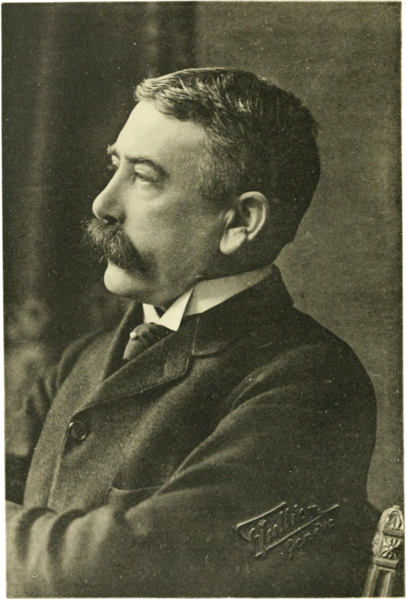

<!-- portada                                                                   -->

# Lengua y Lingüística

## Introducción a la Lingüística.

Área de Lingüística, Fac. de Filología, UCM | 4/10/2013

Víctor Peinado | v.peinado@filol.ucm.es  

--SLIDE--
### La lingüística: objeto de estudio

- La Lingüística es la ciencia que se encarga del estudio de las lenguas.

- Es difícil establecer el número de lenguas que existen en el mundo pero se suele hablar de entre 3.000 y 7.000.

- Los estudios lingüísticos se suelen dividir en subdisciplinas según qué lenguas o qué partes de la lengua se consideran.

--SUBSLIDE--

### Estudios lingüísticos 

- centrados en una lengua o conjunto de lenguas:
  
    - estudios hispánicos
    
    - estudios germánicos, 
    
    - estudios indoeuropeos
    
    - filología románica, 
    
    - filología eslava...

--SUBSLIDE--

### Estudios lingüísticos 

- centrados en una subdisciplina o en las conexciones entre lingüística y otras disciplinas: 
  
    - fonética y fonología
    
    - morfología
    
    - lexicología y lexicografía
      
    - sintaxis
      
    - semántica
      
    - pragmática
      
    - dialectología
      
    - sociolingüística, 
    
    - neurolingüística
      
    - lingüística computacional...

--SLIDE--

### Subdisciplinas lingüísticas

- la **fonética** y **fonología** se ocupan de los sonidos.

- lo que tradicionalmente se conoce como **gramática**, engloba:
	
	- la **morfología** se ocupa de los componentes y la forma de las palabras.

	- la **sintaxis** se ocupa de la estructura de la oración.
	
- la **lexicología** y la **lexicografía** se ocupan del vocabulario de una lengua y de la elaboración de diccionarios.

- la **semántica** se ocupa del significado de las palabras, los sintagmas y las oraciones.

- la **pragmática** se ocupa de los significados del lenguaje en uso.

--SLIDE--

### Métodos de investigación en Lingüística

- Las lenguas están vivas: cambian, evolucionan a lo largo del tiempo y, en ocasiones, mueren y desaparecen.

- Teniendo en cuenta esto, podemos establecer dos tipos de estudios lingüísticos:
	
	- **sincrónico** o **descriptivo**: describe la lengua en un momento concreto de su evolución, ya sea el estado presente o un momento concreto del pasado.

	- **diacrónico** o **histórico**: describe la evolución de la lengua a lo largo del tiempo.

--SUBSLIDE--
	
- Las lenguas se pueden agrupar en familias lingüísticas y esto permite dos tipos de estudios:

    - **comparativo**: estudia una familia de lenguas atendiendo a su parentesco.

    - **tipológico**: estudia un conjunto de lenguas sin atender a su parentesco, sino a sus características estructurales.

--SLIDE--

### Lingüística General

- Resume y generaliza conocimientos obtenidos del estudio de lenguas particulares.

- Trata de formular leyes que rigen una lengua o su evolución.

- Busca fenómenos comunes a todas las lenguas: los llamados **universales lingüísticos**.

--SLIDE--

### Universales lingüísticos

- A pesar de la gran cantidad y variedad de lenguas que existen en el mundo hay dos factores que llaman poderosamente la atención:

	1. cualquier lengua puede traducirse a otra y viceversa.

	2. cualquier recién nacido, independientemente de su origen y adscripción étnica, aprende la lengua de su comunidad.

- Estos dos argumentos permiten hipotizar la existencia de algunos elementos y rasgos comunes, un conjunto de propiedades compartidas por las diferentes lenguas del mundo que marcan los límites de nuestra facultad comunicativa: los **universales lingüísticos**.

--SLIDE--

### Tipos de universales lingüísticos

1. los **universales de tipo general**, que se corresponden con las características del lenguaje propuestas por Hockett.

	- semanticidad

	- arbitrariedad

	- desplazamiento

	- dualidad

	- productividad

	- disimulación

	- reflexividad.

2. los **universales de tipo estructural** que afectan a diferentes niveles de estudio lingüístico.

--SUBSLIDE--

### Universales lingüísticos

- Nivel fonético-fonológico: 
	
	- En todas las lenguas el sonido es articulado: la emisión del sonido pasa por articulaciones precisas y la intervención de órganos del aparato fonatorio. 

	- Todas las lenguas tienen sonidos vocálicos y consonánticos.
	

--SUBSLIDE--

- Nivel morfo-sintáctico: 
	
	- Todas las lenguas tienen pronombres personales y deícticos.

	- Todas las lenguas diferencian entre nombres y verbos.

	- Todas las lenguas presentan construcciones basadas en núcleo + complemento.

	- Todas las lenguas tienen oraciones enunciativas e interrogativas, construcciones afirmativas y negativas. 
	
	- Todas las lenguas tienen marcas temporales.
	 

--SUBSLIDE--
 
- Nivel semántico: 
	
	- Todas las lenguas tienen nombres comunes y nombres propios, palabras con referentes concretos y abstractos.

	- Todas las lenguas tienen palabras polisémicas, sinónimos, términos de parentesco, términos de color, etc.
	

--SLIDE--

### Relaciones de la lingüística con otras ciencias

- la lingüística forma parte de lo que se conoce como ciencias sociales. 

- psicología, sociología, antropología, historia y filosofía. 

- existe una relación estrecha con los estudios de literatura &harr; filología

- Pero también existe una relación estrecha con la física (acústica)

- y, recientemente, relación con ciencias exactas como las matemáticas

- la biología y la medicina

- y también con la informática y la teoría de la comunicación...

--SLIDE--

### Lenguaje, lengua, habla

- Hasta ahora hemos hablado principalmente de **lenguaje** y lo podemos definir como la capacidad humana de comunicarse y hacerse entender con ayuda de un conjunto de señales.
	
- A partir de aquí, distintos lingüistas han establecido una clara distinción entre la vertiente social y el carácter personal del lenguaje.
	
	P. ej., Ferdinand de Saussure distingue:
	
	- lengua (*langue*) es un sistema de signos y reglas compartido por una comunidad de hablantes.

	- habla (*parole*) es el acto de comunicación concreto formado a partir del conocimiento de la lengua.
	
	
- Otros autores hablan incluso de **idiolecto** para referirse a la lengua del individuo.

--SUBSLIDE--

### Ferdinand de Saussure

[Wikipedia: Ferdinand de Saussure](http://en.wikipedia.org/wiki/Ferdinand_de_Saussure)

--SLIDE--

### Lengua

- La función fundamental de la lengua es comunicar (función comunicativa).

- La lengua es un fenómeno social/nacional.

- La lengua es un instrumento del pensamiento: permite generalizar y transmitir ideas.

- La lengua es un almacén de las experiencias de una comunidad, de transmisión de tradiciones y creación de cultura: es un medio de progreso de la humanidad.

- La lengua se puede utilizar para ejercer influencia sobre la gente.

--SLIDE--

### Referencias

- Bernárdez, E. *¿Qué son las lenguas?* Alianza Ensayo. 2004.

- Pinker, S. *The language Instinct*. Monrow. 1994.

- Tusón Valls, J. *Introducción al lenguaje*. UOC. 2003.

- Yule, G. *El lenguaje*. Ediciones AKAL. 2007. 

