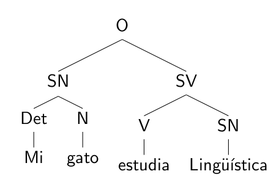
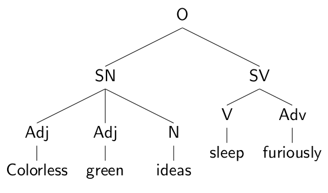
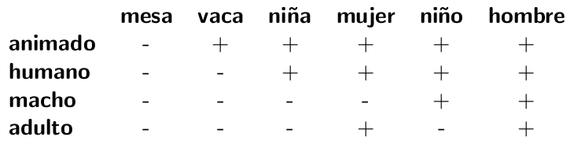
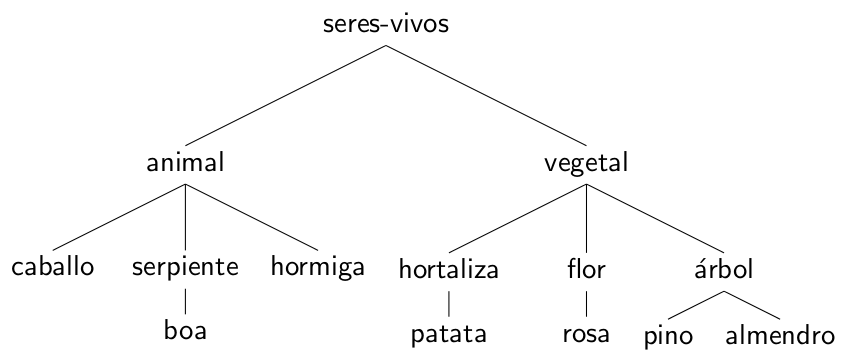
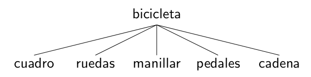

# Semántica

** Introducción a la Lingüística.

Área de Lingüística, Fac. de Filología, UCM | 10/01/2014

Víctor Peinado | v.peinado@filol.ucm.es

--SLIDE--

###  Semántica

- La **Semántica** se centra en el estudio del significado de las palabras, los sintagmas y las oraciones.

- La **semántica léxica** se ocupa del significado de las palabras y la **semántica combinatoria** estudia el significado de estructuras más complejas.

- El análisis semántico estudia el significado convencional de las palabras y no tanto en lo que los hablantes pretenden que una palabra signifique en un momento determinado.

- Este planteamiento hace hincapié en lo subjetivo y general, evitando lo subjetivo y lo local.

- La semántica lingüística trata del significado convencional que conlleva el uso de palabras y oraciones en una determinada lengua.

--SLIDE--

###  Significado conceptual vs significado asociativo

- En lingüística, cuando investigamos el significado de las palabras, lo que nos interesa principalmente es caracterizar el **significado conceptual** por encima del significado estilístico o **significado asociativo** de las palabras.

- El significado conceptual cubre aquellos componentes básicos esenciales del significado que conlleva el uso literal de una palabra. 

- Dentro de este significado conceptual de *aguja* podríamos incluir componentes como «fino, afilado, acero, instrumento». 

- Sin embargo, como podemos notar, existen otros conceptos asociados o connotaciones que se evocan cuando pensamos en *aguja. El concepto «doloroso» no forma parte del significado conceptual y, en principio, no es el objeto de estudio de la Semántica.

--SLIDE--

###  Rasgos semánticos

- Oraciones como las siguientes están bien formadas desde el punto de vista sintáctico:

	
--SUBSLIDE--

			
- Respetan las reglas gramaticales.

- Sin embargo, son sentidas por los hablantes como semánticamente anómalas.
	

--SUBSLIDE--
	
- ¿Qué es lo que hace que la oración *El niño se comió la hamburguesa* sea perfectamente aceptable desde el punto de vista semántico?

- ¿Cuál es el origen del rechazo que sentimos por *La hamburguesa se comió al niño*?

- La respuesta está relacionada con los componentes del **significado conceptual** del nombre *hamburguesa*, que difieren de los del nombre *niño*, especialmente cuando ambos sustantivos funcionan como sujetos del verbo *comer*.

- Los tipos de nombre que pueden funciona como sujeto de *comer* deben denotar entidades que sean capaces de «comer». Y el nombre *hamburguesa* no contiene esta propiedad.
	
--SUBSLIDE--
	
- Podemos generalizar este tipo de observaciones y determinar qué tipo de componentes deberían contener los nombres para poder funcionar como sujeto de un verbo como *comer*.

- Podemos utilizar un rasgo general como «ser animado» y utilizarlo para describir los componentes semánticos de las palabras como un rasgo positivo (+) o negativo (-).

- Así, podemos describir las palabras con los rasgos `+animado` (= denota una entidad animada) o `-animado` (denota una entidad no animada).

- Este procedimiento permite analizar el significado a partir de **rasgos semánticos**.
	

--SLIDE--

- Podemos describir los rasgos distintivos cruciales de un conjunto de palabras en castellano a partir de un conjunto básico de **rasgos semánticos**, p. ej.:
	
	

- A partir de un análisis de rasgos como este, podemos describir una parte básica del significado de la palabra *niño* como `+animado +humano +macho -adulto`.
	

--SUBSLIDE--

- También podemos utilizar una matriz de rasgos semánticos como la anterior para especificar los rasgos que deben caracterizar a un determinado sujeto. 

- De modo que podemos incorporar estos rasgos semánticos al análisis sintáctico:
		
    *El/la (N `+humano`) está leyendo el periódico*.
		
- Este enfoque nos permite predecir qué tipo de nombres harían esta oración semánticamente aceptable. Ejemplos como *perro, manzana, coche* serían inaceptables porque todos ellos contienen el rasgo `-humano`.

- Este planteamiento implica una visión de las palabras como meros «contenedores» de componentes de significado y no está exento de problemas. Hay muchas palabras difíciles de describir en base a los componentes de su significado: (*consejo, amenaza, libertad...*).
	
--SLIDE--

### Papeles semánticos

- En lugar de pensar en las palabras como en «contenedores semánticos» podermos centrarnos en los **papeles semánticos** que cumplen dentro de una oración.

- Si pensamos en una oración sencilla que describe un evento simple (*El niño lanzó la pelota*) podemos identificar un verbo que describe una una acción (*lanzar*).

- Atendiendo a los sintagmas nominales presentes en la oración podemos identificar un número reducido de papeles semánticos.

--SUBSLIDE--

### Papeles semánticos: agente, tema, instrumento

- En una oración como *El niño lanzó la pelota* podemos identificar a *el niño* como la «entidad que realiza la acción física». Dicho papel se conoce con el nombre de **agente**.

- Del mismo modo, podemos identificar el papel que juega *la pelota* como «entidad que está implicada o afectada por la acción». Este papel se denomina **tema**.

    - En las oraciones atributivas (*la pelota era roja*), llamamos **tema** a las entidades descritas en la oración.

- Si un **agente** utiliza cualquier otra entidad para realizar una acción, esa otra entidad cumple el papel de **intrumento**: *Comer con una cuchara*.

--SUBSLIDE--

### Papeles semánticos: agente, tema, instrumento

- Aunque los **agentes** son habitualmente humanos, también pueden ser:
	
	 - fuerzas de la naturaleza (*El viento arrastró la pelota*).
	 - máquinas (*El coche atropelló al gato*).
	 - o animales (*El gato agarró la pelota*).
	  
- El **tema** de una oración puede ser también humano: *El anciano levantó a su nieto*.

- Una misma entidad física puede aparecer en dos papeles semánticos diferentes, como en las oraciones reflexivas: *El niño se miró en el espejo*.

--SUBSLIDE--

### Papeles semánticos: experimentador, ubicación, origen, destino

- Cuando un sintagma nominal designa una entidad que tiene o experimenta un sentimiento, una percepción o un estado (y no está realizando ninguna acción física), decimos que está cumpliendo el papel de **experimentador**: *¿Has oído ese ruido?*

- Otros papeles semánticos sirven para designar lugares en los que tiene lugar un evento.

    - Los sintagmas que designan dónde se encuentra una entidad (*encima de la mesa, en tu habitación*) desempeñan el papel semántico denominado **ubicación**.

    - Otros sintagmas que hacen referencia a lugares como *de casa al trabajo* pueden ser identificados con los papeles semánticos de **origen** y **destino**.

--SUBSLIDE--

### Papeles semánticos

- Todos esos papeles semánticos quedan ilustrados en el siguiente texto de ejemplo:

    *
    **María/experimentador** vio **un mosquito/tema** en la **pared/ubicación**. 

    **(Ella)/agente** cogió **una revista/tema** de **la mesa/origen** y aplastó **el bicho/tema** con **la revista/instrumento**. 

    **(Ella)/agente** devolvió **la revista/tema** a **la mesa/destino**. «Ya está», dijo **María/agente**.
    *
    
--SLIDE--

### Relaciones léxicas

- Además de analizar las palabras como si fuesen contenedores de significado (**significado conceptual**) o cumpliendo **papeles semánticos**, podemos observar las relaciones que se establecen entre ellas.

- En el habla común solemos dar significado a las palabras a partir de estas relaciones. 

- De hecho, es habitual definir una palabra como *ocultar* diciendo que «es lo mismo que *esconder*», o decimos que *superficial* es «lo contrario que *profundo*».

- Este enfoque permite definir una palabra no en virtud de los rasgos que la componen sino a partir de las relaciones que se establecen con otras palabras y se conoce con el nombre de **análisis de las relaciones léxicas**.

--SLIDE--

###  Sinonimia

- Llamamos **sinónimos** a dos o más formas con significados muy relacionados que, a menudo aunque no siempre, pueden intercambiarse en una oración: *ancho-amplio*, *esconder-ocultar*, *respuesta-contestación*, *mechero-encendedor*, *cercano-próximo*.

- La idea de «palabras que tienen el mismo significado» que utilizamos coloquialmente al hablar de la sinonimia no es necesariamente «significado exactamente igual». 

- En muchas ocasiones una palabra es apropiada para una determinada oración pero cuando la intercambiamos por su sinónimo la frase resulta anómala a oídos de un hablante nativo.

--SUBSLIDE--

- Las palabras sinónimas suelen diferenciarse en términos de registro: dos palabras sinónimas tienen usos bien diferenciados en registros formales e informales:
	
	*Mi padre adquirió un vehículo espacioso* / *Mi papá compró un coche grande*.
	

--SLIDE--

###  Antonimia

- Llamamos **antónimos** a dos o más palabras con significados opuestos: *rápido-lento*, *grande-pequeño*, *verdadero-falso*, *rico-pobre*, *viejo-joven*, *macho-hembra*, *vivo-muerto*.

- Los **antónimos graduables** como el par *rápido-lento* se pueden utilizar en construcciones comparativas del estilo *más lento que, menos rápido que*. 
	
    - La negación de uno de los miembros del par graduable no implica que se cumpla necesariamente su antónimo.
	
	*Este galgo no es rápido* &ne; *Este galgo es lento*

--SUBSLIDE--
	
- Los **antónimos no graduables** o **pares complementarios** no se utilizan en construcciones comparativas y la negación de uno de ellos sí implica la afirmación de su antónimo.

    \**Eres más hembra que yo.*
    
    *El enunciado no es verdadero* = *El enunciado es falso*

--SLIDE--

###  Antonimia

- Aunque a simple vista pueda funcionar para los pocos **antónimos no graduables** de una lengua, es importante no definir los pares de antónimos como «una palabra que significa el negativo de la otra».

- En el par *atar-desatar*, *desatar* no significa «no atar», sino más bien «hacer lo contrario de atar».

- Lo mismo se aplica para pares como *entrar-salir*, *subir-bajar*, *vestir-desvestir*, *envolver-desenvolver*, *alargar-acortar*.
	

--SLIDE--

###  Inclusión: hiponimia e hiperonimia

- Llamamos **hipónimo** a un término específico cuyo significado está incluido en el de otro más general y amplio: *amapola-flor*, *coche-vehículo*, *canario-pájaro*

- Los términos más específicos (**hipónimos**) están incluidos en los términos más generales (**hiperónimos**).

- El concepto de inclusión utilizado en esta definición está vinculado a la idea de que cualquier *coche* es «un tipo de» *vehículo* y cualquier *canario* es «un tipo de» *pájaro*.

- Cuando hablamos de términos hipónimos e hiperónimos, estamos organizando las palabras en algún tipo de organización jerárquica, con los términos más generales arriba y los más específicos abajo.

--SUBSLIDE--

- De hecho, podríamos organizar el siguiente conjunto de palabras en forma de jerarquía: *animal, boa, almendro, patata, hormiga, flor, caballo, pino, vegetal, serpiente, árbol, hortaliza*.

--SUBSLIDE--

- Según el diagrama anterior, podemos identificar a *caballo* o *serpiente* como hipónimos de *animal* y, a su vez, *animal* como hiperónimo de *caballo, serpiente* y *hormiga*.

- Dos términos como *caballo* y *serpiente* son co-hipónimos porque comparten un mismo hiperónimo.

- La relación de hiponimia recoge la idea de «es un tipo de», como cuando definimos *boa* como «un tipo de *serpiente*»: toda *boa* es miembro de la categoría *serpiente*, que es más amplia. 

- No solo podemos organizar en base a estas relaciones palabras que designen entidades, seres vivos o cosas. Los verbos también puede organizarse atendiendo a estas relaciones de generalización y especificación: *cortar, pinchar, disparar, apuñalar* son términos co-hipónimos que comparte el hiperónimo *herir*. 
	
--SLIDE--

### Inclusión: meronimia y holonimia
	
- Las relaciones de inclusión no se limitan a relaciones marcadas por «ser un tipo de», podemos encontrar relaciones del tipo parte-todo, como en el par *dedo-mano*.

- Así pues, denominamos **merónimo** al elemento de una relación de tipo parte-todo que hace referencia a la parte incluida en el todo (*dedo*).

- Y por otro lado, denominamos **holónimo** al elemento de una relación de tipo parte-todo que hace referencia al todo (*mano*). 
	
--SUBSLIDE--

- En las relaciones meronímicas se produce el mismo efecto de inversión de perspectiva que se da en las relaciones de hiponimia: cuando se contempla desde el punto de vista del significado, es el merónimo el que incluye al significado del holónimo; cuando se considera el todo como una entidad, son las partes las que se hallan subordinadas al conjunto.
	
--SUBSLIDE--

- Sin embargo, las relaciones de meronimia son más complejas de establecer que las de hiponimia. 

- Si analizamos el significado de *pie* y sus merónimos *empeine, planta, dedos, talón, tobillo*, podemos ver que todos los merónimos representan partes constitutivas del pie pero no todas ellas tienen el mismo tipo de cohesión con respecto al conjunto. 

    - Podemos decir *un pie sin dedos*, pero no *un pie sin planta*.

- Esta diferencia parece indicar que concebimos algunas partes como **partes unidas** y otras como **partes integradas**.

- Si analizamos el *cuerpo humano*, podemos establecer algunos de merónimos *cabeza, tronco, extremidades* como **partes segmentales** dispuestas en modo secuencial. Y podemos establecer otras **partes sistémicas** que no se pueden aislar y delimitar fácilmente, como *venas, arterias, nervios*.
	
--SUBSLIDE--

- La hiponimia es una relación transitiva: una *boa* es un tipo de *serpiente* y un tipo de *animal* y un tipo de *ser vivo*. 

- Sin embargo, la meronimia no siempre lo es. P. ej., en una *camisa*, el puño es una parte esencial de la *manga*, y la *manga* es una parte esencial de la *camisa* En este caso sí exite una relacion de meronimia transitiva: *camisa > manga > puño*.

- Por otro lado, las *casas* tienen *puertas*, y las *puertas* tienen *pomos*, pero los *pomos* no constituyen una parte constitutiva de las *casas* de la misma manera que el *puño* lo es de la *camisa*.
	
--SUBSLIDE--

- Por último, otro elemento que contribuye a la complejidad de estas relaciones parte-todo es el grado de opcionalidad de los merónimos. 

- *cuadro* y *ruedas* sí parecen ser partes esenciales de lo que entendemos por una *bicicleta*, pero no ocurre lo mismo con los *frenos* o los *guardabarros* que, dependiendo del tipo de bici, pueden ser opcionales.
	

	
	
--SLIDE--

###  Prototipos

- Una categoría como *pájaro* puede contener diversos hipónimos válidos: *canario, paloma, gorrión, loro, flamenco, pingüino, avestruz...* son todos tipos de *pájaros*.

- Sin embargo, no todos estos co-hipónimos pueden ser considerados por igual a la hora de buscar un representante prototípico para la clase *pájaro*. De hecho, para la mayoría de nosotros, el mejor representante de la categoría *pájaro* sería un gorrión y no un pingüino o una avestruz.

--SUBSLIDE--

--SUBSLIDE--

- El concepto de **prototipo** permite explicar el significado de algunas palabras no a partir de los rasgos que la componen («tiene alas», «tiene pico»), sino a partir de su parecido con el ejemplo más evidente.

- La mayoría de los hablantes nativos del castellano preferimos como representantes de la categoría *pájaro* a ejemplares de *petirrojo* o *pichón* y no tanto a *avestruz* o *pingüino*, por el mero hecho de que los primeros están mucho más cercanos al prototipo.

--SUBSLIDE--

- Ocurre lo mismo con otras categorías: reconocemos más rápidamente una *silla* o *mesa* como representantes de la categoría *mueble* que *taburete* o *banco*. Al pensar en la categoría *herramienta*, *martillo* está más cerca del prototipo que *llave allen*.

- Es evidente que existe algún modelo general para el proceso de categorización implicado en la noción de prototipo que interviene en nuestra forma de interpretar el significado de las palabras.

--SLIDE--

###  Homofonía, homonimia, polisemia

- Llamamos **homófonos** a dos o más palabras que difieren en su ortografía pero se pronuncian del mismo modo: *vaca-baca*, *hola-ola*, *asta-hasta*, *atajo-hatajo*. 

- Llamamos **homónimos** a palabras no relacionadas semánticamente que tienen la misma forma escrita. 

    Provienen de palabras distintas que, con el paso del tiempo, han evolucionado hasta tener la misma forma: *banco* «asiento» y «entidad financiera», *aterrar* «asustar» y «cubrir con tierra», *apostar* «poner en un sitio» y «jugar dinero».

- Llamamos **polisemia** al fenómeno que se da en algunas palabras que presentan múltiples significados distintos, todos ellos relacionados semánticamente por extensión: *pie, correr, cuello*.

--SUBSLIDE--

- La distinción entre homonimia y polisemia no siempre está clara. 

- En los diccionarios, habitualmente, los homónimos aparecen en entradas diferentes (véase [aterrar](http://lema.rae.es/drae/?val=aterrar)) mientras que en las palabras polisémicas todas las acepciones aparecen bajo la misma entrada (véase [correr](http://lema.rae.es/drae/?val=correr)).

- Por último, hay palabras homófonas que pueden ser, a su vez, polisémicas. 

    Las palabras *fallo* «resolución, sentencia» y *fallo* «acción y efecto de fallar» son homónimas. 
    
    Pero el segundo caso de *fallo* es además polisémico y puede entenderse como «acción y efecto de fallar», «punto débil» y «falta de un sitio correspondiente». 

--SLIDE--

### Metonimia

- Como hemos visto antes, la relación que encontramos en la polisemia estaba basada en la similitud. 

- La **metonimia** es la relación que se establece entre dos palabras por su conexión en la realidad. Está basada en relaciones de tres tipos:
	
	- relación continente-contenido: *botella-vino* o *lata-cerveza*.
	- relación todo-parte: *coche-ruedas*, *casa-techo*. 
	- relación representante-símbolo: *rey-corona*, *el Presidente-Moncloa*. 

--SUBSLIDE--
	
- La mayoría de los ejemplos de metonimia son fáciles de interpretar y no nos sorprende escuchar *La Casa Blanca ha tomado una decisión sobre Pionyang*.

- Sin embargo, algunos casos de metonimia solo se resuelven si el interlocutor infiere lo que el hablante está pensando: 

    *Prefiero el cable* (frente a la TV por satélite).
    
    *No se oyen los vientos* (en una orquesta).

--SLIDE--

###  Colocaciones

- Hay otro aspecto de nuestros conocimiento sobre las palabras que no tienen ninguna relación con los factores que hemos visto hasta ahora: qué palabras tienden a aparecer junto a otras. 

- Una de las formas en las que parece que organizamos nuestro conocimiento es precisamente su **colocación**, la frecuencia con la que aparecen juntas o la frecuencia de co-ocurrencia.

    - *sal-pimienta, marido-mujer, aguja-hilo, martillo-clavo, cuchillo-tenedor, pan-vino, mantequilla-pan...*

- Es posible que parte del conocimiento que tienen los hablantes de una lengua sea, no solo lo que significan las palabras, sino cuáles son las colocaciones típicas.

--SLIDE--

# Semántica Léxica

--SLIDE--

### Significado, referencia y ámbito referencial

- Cada vez que pronunciamos una palabra (p. ej. *manzana*) existen tres elementos distintos:

    - la expresión de la palabra (**significante**).
    - el concepto con el que se asocia (**significado**).
    - el objeto/entidad/realidad con la que se asocia (**referencia**).

- Las referencias son muchas y cambian de un uso a otro. Podemos usar la misma palabra para referirnos, en momentos distintos, a manzanas distintas.

- El significado, sin embargo, es constante: la idea de manzana es siempre la misma. 

- Las propiedades de significado y referencia son distintas: la manzana referida se puede pelar y comer; la idea de manzana no.

--SUBSLIDE--

- Podemos pensar en el valor semántico de una palabra como el conjunto de objetos o situaciones a los que se puede referir. 

- En el caso de la palabra *manzana*, conocer el valor de esa palabra consiste en conocer la clase de objetos a los que podemos referirnos con esa palabra. Esa clase recibe el nombre de **ámbito referencial**.

- Ámbito referencial y significado se refieren a lo mismo: el primero en términos extensionales (enumeración de los elementos pertenecientes a esa clase); el segundo en términos intensionales (las propiedades que comparten los elementos de esa clase, la idea o representación mental que tenemos).

--SLIDE--

### Componentes semánticos o semas

- Normalmente, presentamos los significados como entidades conceptuales compuestas de otras entidades.

- Podemos entender la idea de *mesa* como compuesta por otras ideas como *mueble*, *con patas*, *con un tablero*...

- Estos conceptos en los que podemos despiezar los significados reciben el nombre de **semas** o **componentes semánticos**.

--SLIDE--

### Implicaciones y semas
	
- Decir que un significante se compone de fonemas es sencillo de entender: el significante es más largo que los fonemas y podemos trocear físicamente el significante en sílabas o sonidos. 

- Decir que el significado se compone de semas es más complejo: no podemos decir que el significado es una unidad más amplia que podemos despiezar en trozos de significado.

- El significante *perro* es más complejo que los fonemas /p/, /e/, /r/, /o/, pero es difícil interpretar que el significado de *perro* es más complejo que el sema *animal*.

- Lo que sí parece ocurrir es que unas cosas evocan otras. La idea de que *animal* es componente de la idea de *perro* en la medida que ésta evoca aquella. Cuando se activa una, se activa (en menor medida) la otra.

- Puesto que se trata de unidades lógicas, podemos decir que una implica a la otra: la idea de *perro* implica la idea de *animal*.
	
--SLIDE--

### Campos semánticos

- Las palabras y sus significados no forman una lista en la que cada elemento se limita a ser distinto de los demás, sin más.

- Los significados pueden parecerse, diferenciarse, coincidir parcialmente...

- Todos percibimos un aire de familia en las palabras *húmedo, encharcado, empapado, rociado, impregnado, regado...* mientras que en la 
serie *alcalde, chincheta, verde, bujía* no vemos ningún tipo de asociación.

- Llamamos **campos semánticos* a los significados que tienen en común, al menos, un sema genérico.

- La serie *húmedo, encharcado, empapado* forman un campo semántico, como también lo forma la serie *perro, gato, vaca*. En estos casos, estos significados comparten un sema común que es genérico. 

--SUBSLIDE--

- Pensemos por un momento en la serie *bautismo, abad, monasterio, judaísmo, templo, confesional, corán*. Todas estas palabras tienen significados relacionados con la idea de `religión'.

- Sin embargo, no forman parte de un campo semántico porque *religión* no es una propiedad compartida por los significados. *templo* y *corán* no son especies o tipos de *religión*.

- Por el contrario, sí formarían un campo semántico la serie *cristianismo, judaísmo, islam, taoísmo, budismo* ya que todos los significados son un tipo de `religión'.

- Los significados que componen un campo deben ser especificaciones de una idea común: *perro* y *gato* son concreciones de la idea *animal*.

--SLIDE--

### Relaciones semánticas

- El interés en comprender la estructura de los campos semánticos radica en que nos permite establecer relaciones semánticas.

- Dos palabras pueden establecer una relación semántica si sus significados coinciden en el sema genérico, es decir, si pertenecen a un mismo campo semántico.

- Las relaciones semánticas son asociaciaciones que los hablantes hacemos con los significados de las palabras:
	
	- Antonimia: palabras que parecen ser una negación de la otra, significados contrarios o contradictorios. 
	- Sinonimia: coincidencia de dos expresiones distintas con un mismo significado.
	- Hiperonimia: relación de inclusión.
	

--SLIDE--

# Semántica Combinatoria

--SLIDE--

### La semántica combinatoria o composicional

- La semántica léxica se ocupa del contenido de las expresiones más simples: las palabras. 

- En la semántica léxica aprendemos lo que es el significado, la referencia y la manera en la que el contexto condiciona el uso de las palabras.

- La semántica combinatoria se ocupa del significado de las combinaciones de palabras en expresiones más complejas: grupos sintagmáticos y enunciados.
		
- En la semántica combinatoria aprenderemos en qué consisten las proposiciones, los argumentos, las funciones y las anomalías semánticas, que solo se hacen visibles en estructuras lingüísticas más complejas.
	

--SLIDE--

### Oraciones y proposiciones
	
- Los términos oración y proposición bailan en la literatura lingüística con otros como frase o enunciado.

- La **oración** es un tipo de enunciado con una estructura sintáctica regida por un verbo.

- Una **proposición** es una entidad conceptual portadora de un valor de verdad. 

- Un nombre común como *lámpara* provoca una representación mental con el tipo o formato de una clase lógica. 

- De la misma manera, la proposición es el tipo o formato del significado de una oración.

- Asociamos oración y proposición porque: 

    1. típicamente, expresamos proposiciones con oraciones; y, 
    2. las oraciones contienen una estructura idónea para tener explícitos todos los elementos de la proposición. 

	
--SLIDE--

### Oraciones y proposiciones

- Sabemos que expresamos una proposición cuando decimos algo que puede ser verdadero o falso.
		
- No expresan proposiciones, no estamos diciendo nada verdadero o falso, en los siguientes enunciados:

    *Verde*.
    
    *El vecino*.
		
- Por el contrario, sí expresamos proposiciones en los siguientes ejemplos:

    *Juan sabe francés*.

    *(-¿Quién llegó?) - El vecino*.
    
    *Y, desde entonces, paz en todo el imperio*.
	

--SLIDE--

### Intensión y extensión: proposiciones y hechos

	
- El objeto lógico más familiar que podemos manejar es la clase: formamos una clase cuando agrupamos objetos que se parecen en algo.

- Los objetos agrupados forman la extensión de la clase. Mientras que la propiedad en la que se parecen forma la intensión de la clase.

- Podemos entender la intensión como una abstracción que comprime la extensión. Pero hay otra diferencia: la intensión es una especie de virtualidad, y la extensión un fenómeno real y actual.

- La intensión es tan abstracta y virtual que queda dentro de lo imaginable: podemos concebir la intesión de la clase `unicornio' o `centauro' tan fácilmente como la de `mesa' aunque no exista una muestra extensional de esas clases. 
	

--SUBSLIDE--

- El que conoce el significado de *reloj* sabe decir si un determinado objeto pertenece o no pertenece a la clase *reloj*.

- De la misma manera, el que conoce el significado de *Juan creció mucho en poco tiempo* sabe decir si un determinado acontecimiento manifiesta la idea expresada en esa oración.

- Conocer el significado de una oración supone conocer la clase de hechos o eventos a los que se puede referir esa oración. 

- La clase de hechos a los que se puede referir una oración constituye el valor extensional de esa oración.

- La intensión correspondiente es la proposición: la idea o pensamiento completo que tienen en común todos esos hechos.
	

--SLIDE--

### Anomalías gramaticales y anomalías semánticas}
	
- Las anomalías semánticas son distintas de las anomalías sintácticas y de las anomalías discursivas.
		
- Una secuencia agramatical es aquella que no respeta las relaciones gramaticales propias de su lengua. Cuando una secuencia es agramatical en español, podemos decir que no es español. Y ocurre así en cualquier contexto. 

		\**El restauranta son buenos aquí.*
		 
	- Las anomalías discursivas consisten en frases que no se atienen al principio de relevancia. Solo podemos decir que son adecuadas o inadecuadas dependiendo de las circunstancias de la emisión.
		
		*¿Dónde vas? Manzanas traigo.*
		
		*He comprado el pan.*
	

--SUBSLIDE--

### Anomalías semánticas
	
- Las anomalías semánticas se parecen a las sintácticas en que su anomalía no depende del contexto, sin embargo, no podemos decir que no pertenezcan a su lengua.
		
    *Green colorless ideas sleep furiously*.
		
- Se usa la lengua para decir algo ininteligible. No estamos diciendo que no sea inglés, ni tan siquiera que representen mensajes inútiles. Las anomalías semánticas constituyen la base de la poesía.
		
- La anomalía semántica parece vincularse a la imposibilidad de una frase para recibir una interpretación verdadera en algún contexto. 
		
- *Estamos en Asturias*, emitido ahora mismo en clase, es un enunciado falso. Pero no es anómalo, porque no nos resulta difícil imaginar situaciones en las que sea verdadero.
	

--SUBSLIDE--

- Las anomalías semánticas pueden ser producidas en tres casos:
	
	1. Un predicado produce anomalía si es universalmente insatisfecho: *La mesa es redonda con vértices}*.
	
	2. Un sujeto produce anomalía cuando es instancia o ejemplar de una clase necesariamente vacía: *Las mesas redondas con vértices son más fáciles de limpiar*.
	
	3. La relación entre sujeto y predicado produce la anomalía si uno y otro son verdaderos por separado pero juntos nunca pueden ser verdaderos:
	
	    *La mesa redonda tiene vértices*
		
		*labios de coral, cabellos de oro, manos de mármol*.

--SLIDE--

### Referencias

- del Teso Martín, E. *Compendio y Ejercicios de Semántica I*. Arco Libros. 2002.
- del Teso Martín, E. *Compendio y Ejercicios de Semántica II*. Arco Libros. 2007.
- Hudson, G. *Introductory Linguistics*. Blackwell. 2006.
- O'Grady, W., Archivald, J., Aronoff, M., Rees-Miller, J. *Contemporary Linguistics. An Introduction (5th Edition)*. Bedford/St. Martin's. 2005.
- Tusón, J. *Lingüística : una introducción al estudio del lenguaje, con textos comentados y ejercicios}. Barcanova. 1995.
- Yule, G. *The Study of Language (4th Edition)*. Cambridge University Press. 2010.
- Interfaz web de [WordNet](http://wordnetweb.princeton.edu/perl/webwn).

