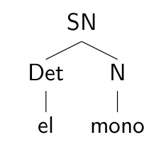
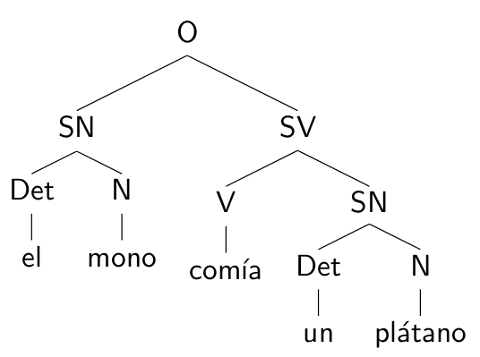
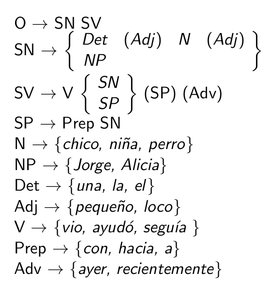
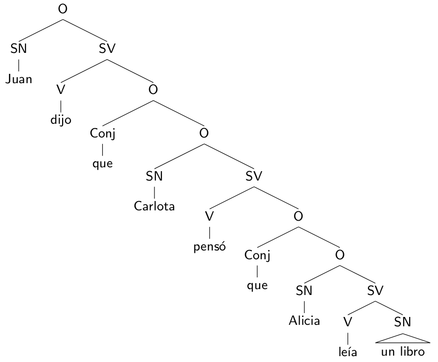
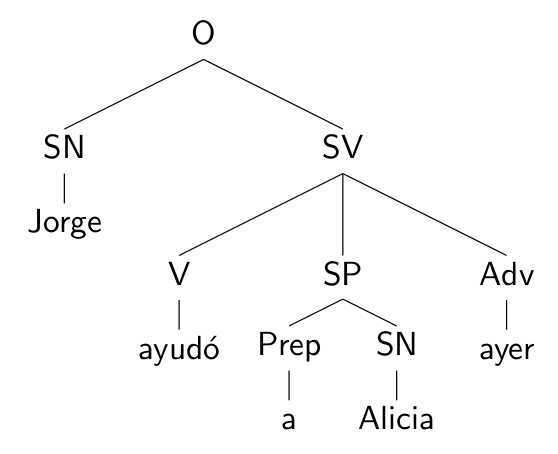
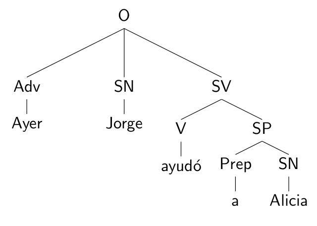
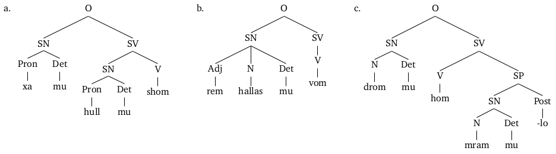

# Sintaxis

## Introducción a la Lingüística.

Área de Lingüística, Fac. de Filología, UCM | 9-10/01/2014

Víctor Peinado | v.peinado@filol.ucm.es

--SLIDE--

### ¿Qué es la sintaxis?

- En las últimas clases, repasamos las categorías gramaticales generales empleadas para describir la estructura de sintagmas
y oraciones.

- Cuando estudiamos la estructura y la combinación de los componentes de la oración, estamos estudiando la **sintaxis**.

- Hemos visto cómo la sintaxis trata de producir un análisis preciso de una secuencia de elementos de la oración, o el análisis de una combinación ordenada de elementos.

- A continuación vamos a ver algunos estudios que plantean nuevos enfoques que den cuenta de las combinaciones en la estructura de las oraciones.

--SLIDE--

### Diagramas de árbol

- En clases anteriores mencionamos como podíamos describir la estructura de las oraciones como si fueran una secuencia plana y linea del constituyentes. 

    [ el/Det mono/N ]/SN
    
- Es posible poner en relieve la organización jerárquica mostrando la misma información en forma de árbol.

--SUBSLIDE--

- Este tipo de representación nos permite proporcionar toda la información gramatical y muestra explícitamente el hecho de que existen **distintos niveles de análisis**.

--SLIDE--

# Gramática Generativa

--SLIDE--

### La Gramática Generativa

- El lingüista estadounidense Noam Chomsky, a partir de los años 1950s, propuso dar un enfoque matemático a la descripción gramatical: la **gramática generativa**.

> Consideraré que el lenguaje es un conjunto (finito o infinito) de oraciones.
> 

- La gramática generativa está formada por un conjunto explícito de reglas que especifican qué combinaciones de elementos básicos conforman las oraciones bien formadas de una lengua.

--SUBSLIDE--

- En la expresión algebraica *3x + 2y* podemos asignar a las variables *x* e *y* diferentes valores.

- A partir de esa sencilla expresión, asignando distintos valores, podemos *a priori* generar un nuevo conjunto infinito de
resultados.

- Si el conjunto de todas las oraciones bien formadas de una lengua conforma un conjunto comparable, entonces debe de
existir un conjunto de reglas explícitas, que produzcan estas oraciones.

- Este conjunto de reglas explícitas se conoce con el nombre de **gramática generativa**.

--SLIDE--

### Propiedades de la gramática generativa

1. La gramática deberá generar **todas** las estructuras sintácticas bien formadas de la lengua, y **solo** las que están bien formadas.

2. La gramática deberá tener un **número finito de reglas** que deberán ser capaces de generar un **número infinito de oraciones** bien formadas &rarr; **productividad del lenguaje**.

3. Las reglas de la gramática deberán cumplir la propiedad de la **recursión** y permitir ser aplicadas más de una vez al generar una estructura.

4. La gramática deberá ser capaz de mostrar tanto la **estructura superficial** como la **estructura profunda**.

--SLIDE--

### Recursión

- La recursión es la propiedad de definir algo en términos de sí mismo.

- Sea cual sea la regla que genera el componente *que cazó el gato* en la oración *Ese es el perro que cazó el gato*, la gramática generativa deberá permitir aplicar dicha regla de nuevo tantas veces sea necesario para generar cualquier estructura similar a *Ese es el perro que cazó el gato que se comió el ratón*.

- La gramática generativa deberá considerar la posibilidad de que una oración pueda contener otra oración dentro de ella, o de que un sintagma determinado pueda estar formado por otro sintagma.

--SUBSLIDE--

- Esta característica es la que nos permite, a partir de un número finito de reglas, un número (potencialmente) infinito de oraciones válidas.

> Para entender a recursividad, primero hay que entender la recursividad.

--SLIDE--

### Estructura superficial y estructura profunda

- La gramática deberá dar cuenta de cómo dos oraciones superficialmente distintas pueden estar estrechamente relacionadas.

- En inglés, las oraciones *John fed the dog* y *The dog was fed by John* son dos oraciones superficialmente distintas. 

    - Según la gramática tradicional, la primera es una oración activa y la segunda es pasiva.
    
    - Difieren en su **estructura superficial**, en la forma sintáctica en la que se realizan.

--SUBSLIDE--
    
- Sin embargo, ambas oraciones están estrechamente relacionadas y pueden considerarse idénticas si atendemos a su **estructura profunda**.

    - La estructura profunda es un nivel abstracto de organización en el que representamos la interpretación estructural de los elementos.

--SLIDE--

### Ambigüedad estructural

- La gramática deberá dar cuenta también de cómo dos oraciones superficialmente parecidas son, en realidad, diferentes.

- Pensemos en dos oraciones con estructuras profundas distintas:

    - *Ana tenía un paraguas y, con él, golpeó a un hombre*.
    - *El hombre tenía un paraguas y Ana golpeó al hombre*.
    
- Estos dos hechos diferentes pueden expresase con la misma estructura superficial: *Ana golpeó a un hombre con un paraguas*. 

- Esta oración es **estructuralmente ambigua**.

--SUBSLIDE--

- Los sintagmas también pueden ser estructuralmente ambiguos.

- *hombres y mujeres mayores* puede interpretarse como:

    - *hombres mayores y mujeres mayores*, u 
    
    - *hombres, de cualquier edad, y mujeres mayores*.

--SLIDE--

# Formalización de gramáticas

--SLIDE--

### Símbolos utilizados en la descripción sintáctica

- Ya hemos visto en clases anteriores los nombres o etiquetas de los constituyentes y las categorías sintácticas:

    - O: oración
    - SN: sintagma nominal, SV: sintagma verbal, SP: sintagma preposicional
    - N: nombre, NP: nombre propio, Pro: pronombre
    - V: verbo, Aux: verbo auxiliar
    - Det: determinante
    - Adj: adjetivo, Adv: adverbio
    - Prep: preposición, Post: postposición 
    - Conj: conjunción

--SUBSLIDE--

### Estructura de las reglas generativas

- Las **reglas generativas** se componen de dos partes:

    - una **parte izquierda**, situada antes de la flecha, en la que indicamos qué elemento estructural queremos definir.
     
    - una **parte derecha**, situada después de la flecha, en la que indicamos la definición del elemento estructural que aparece en la parte izquierda.

- La **flecha &rarr;** que divide las partes izquierda y derecha de la regla se interpreta como *consta de*, *es equivalente a* o *se reescribe como*. 

--SUBSLIDE--

- La siguiente regla generativa se interpreta como *un sintagma nominal consta de un determinante y un nombre*:

    SN &rarr; Det N
    
- La siguiente regla generativa se interpreta como *un sintagma verbal es equivalente a un verbo y un sintagma nominal*:

    SV &rarr; V SN

- *Un sintagma preposicional se reescribe como una preposición seguida de un sintagma nominal*:

    SP &rarr; Prep SN

--SUBSLIDE--

### Elementos opcionales

- Cualquier cosa encerrada entre **paréntesis ()** se entenderá como un componente opcional.

- Podemos completar una de las reglas anteriores diciendo que un *SN consta obligatoriamente de un determinante y un nombre y, que opcionalmente, puede contener un adjetivo*:

    SN &rarr; Det N (Adj)
    
- O *un SV está formado por una forma verbal obligatoria, y SN y SP opcionales*:

    SV &rarr; V (SN) (SP)
	
--SUBSLIDE--

### Conjunto de opciones múltiples

- Las **llaves {}** indican un conjunto de opciones posibles, de las que solo se puede elegir una.

- Por ejemplo, en español, un SN puede presentar varias estructuras distintas.

    - un determinante y un nombre, con un adjetivo opcional
    
        SN &rarr; Det N (Adj)

    - un pronombre
    
        SN &rarr; Pro

    - un nombre propio
    
        SN &rarr; NP

- Estas tres opciones pueden formalizarse en una única regla.

    SN &rarr; {Det N (Adj), Pro, NP}

--SUBSLIDE--

- Las llaves se suelen utilizar para especificar el vocabulario disponible en la gramática. 

- Para definir, por ejemplo, qué tipos de determinantes contempla nuestra gramática podemos especificar reglas como:

    Det &rarr; {the, a, an, this, these, that, those}

- Ídem para los verbos, o las preposiciones:

    V &rarr; {eat, eats, love, loves, run, runs...}

    Prep &rarr; {at, in, before, after, for...}

--SLIDE--

### Ejemplo de gramática

--SUBSLIDE--

### Oraciones gramaticales y agramaticales

1. *El chico seguía a la niña*.
2. *El chico ayudó a la niña*.
3. *El perro vio una niña*.
4. *Alicia ayudó a Jorge recientemente*.
5. *Jorge vio un perro ayer*.
6. *Un pequeño perro seguía a Alicia*.
7. *El pequeño chico vio a Jorge con un perro loco recientemente*.
8. \**Chico la Alicia vio*.
9. \**Ayudó una chica*.
10. \**Pequeño perro con chica*.

--SLIDE--

### Más sobre la recursión

- Los ejemplos de reglas que hemos visto hasta ahora no tienen recursión.

- En ninguna de las reglas de nuestra gramática anterior hemos definido un constituyente en términos de sí mismo.

- Necesitamos una regla que pueda aplicarse tantas veces como sea necesario para permitir generar oraciones dentro de oraciones.

    - *Alicia leía un libro*.
    - *Carlota pensó que Alicia leía un libro*.
    - *Juan dijo que Carlota pensó que Alicia leía un libro*.

--SUBSLIDE--

--SUBSLIDE--

- Nuestra gramática deberá permitir también generar sintagmas dentro de sintagmas:

    - *la silla está en la habitación*
    - *la silla está en la habitación junto a la ventana*
    - *la silla está en la habitación junto a la ventana detrás de la mesa*

--SUBSLIDE--

- Para recoger estas nuevas estructuras necesitamos añadir algunas reglas a nuestra gramática.

- Tenemos que ampliar vocabulario:

    V &rarr; {*dijo, pensó*}
    
    Conj &rarr; *que*
    
    NP &rarr; {*Carlota, Juan*}
    
- Y lo que es más importante, necesitamos introducir un par de reglas recursivas:

    SV &rarr; V O
    
    O &rarr; Conj O
    

--SLIDE--

### Tipos de reglas

- **Reglas estructurales** que generan estructuras. 

    O &rarr; SN SV

    SN &rarr; Det N (Adj)
  
- **Reglas léxicas** que especifican el vocabulario, indicando qué palabras se pueden utilizar para sustituir cada constituyente.

    N &rarr; {chico, chica, perro... } 

    V &rarr; {ha visto, ayudó, come... } 

    Conj &rarr; *que*

--SUBSLIDE--

- La siguiente regla:

    SV &rarr; V {SN, SP} (SP) (Adv)
    
- nos permiten generar SVs en los que el Adv, de aparecer, ocupa la última posición del sintagma: *Jorge ayudó a Alicia ayer*.

- Pero no podríamos reconocer oraciones válidas equivalentes como *Ayer Jorge ayudó a Alicia*.

- Para solventar este problema, podemos crear un conjunto de **reglas transformacionales** que nos permitan mover constituyentes y desplazar ramas del árbol.

--SUBSLIDE--

--SUBSLIDE--

--SUBSLIDE--

- La necesidad de este tipo de reglas transformacionales se argumenta fácilmente a partir de los ejemplos en inglés en los que manejamos *phrasal verbs* o verbos con partículas asociadas.

    *John picked up the phone*.

    *John picked the phone up*.
    
- Para dar cuenta de estos ejemplos, podemos crear reglas con un símbolo &rArr; y estructura especiales:

    V Part SN &rArr; V SN Part

--SUBSLIDE--

- Una estrategia parecida se suele utilizar para tratar las oraciones en inglés que utilizan verbos modales o auxiliares. 

- Oraciones declarativas como *You can/could/may/will/should go to the hotel* pueden formalizarse como:

    O &rarr; SN (Aux) SV
    
    Aux &rarr; {*can, could, may, will, should*}
    
- Mediante una regla transformacional podemos dar cuenta también de estas oraciones en su forma interrogativa: *can/could/may/will/should you go to the hotel?*

    SN Aux SV &rArr; Aux SN SV?

    
--SLIDE--

### Otros enfoques de la gramática generativa

- 60 años después, la Gramática generativa sigue causando discusiones y escepticismo.

- Para algunos lingüistas, las únicas cuestiones relevantes que debería cubrir una gramática son de tipo sintáctico: es decir, cómo describir la estructura independientemente del significado.

- Para otros, el significado es un componente básico, hasta el punto de que abandonan la idea de estructura profunda en favor de una representación semántica.

--SLIDE--

### Ejercicio: Gramática del gaélico escocés.

- ¿Cuáles de las siguientes oraciones en gaélico escocés son gramaticales y cuáles agramaticales? 

    - *Calum chunnaic an gille*.
    - *Bhuail an beag cu Tearlach*
    - *Bhuail an gille mor an cu*.
    - *Chunnaic Tearlach an gille*
    - *Ban an cu an duine beag*
    - *Fhuair Mairi an cu ban*
    
- Elabora diagramas de árbol para las oraciones que estén bien formadas.
    
--SUBSLIDE--

- Gramática del gaélico escocés.

    O &rarr; V SN SN

    SN &rarr; {Det N (Adj), NP}
    
    Det &rarr; *an*
    
    N &rarr; {*cu, duine, gille*}
    
    NP &rarr; {*Tearlach, Mairi, Calum*}

    Adj &rarr; {*ban, beag, mor*}

    V &rarr; {*chunnaic, bhuail, fhuair*}
    
--SLIDE--

### Ejercicio: Gramática del efé.

- A partir de la siguientes reglas, escribe cuatro oraciones bien formadas en efé y elabora los diagramas de árbol con el análisis sintáctico correspondiente.

    O &rarr; SN SV

    SN &rarr; N (Det)

    SV &rarr; V SN

    Det &rarr; *ye*

    N &rarr; {*oge, ika, amu*}

    V &rarr; {*xa, vo*}
        

--SLIDE--

### Ejercicio: Gramática de una lengua hipotética.

- A continuación se muestran ejemplos de oraciones correctas en una lengua desconocida hablada por los habitantes de
una galaxia muy lejana. 

- Atendiendo a estos ejemplos, propón:

    1. una gramática generativa que permita reconocer dichas oraciones.

    2. al menos otra oración correcta en esta lengua.

--SLIDE--

### Referencias

- Hudson, G. *Introductory Linguistics*. Blackwell. 2006.
- O'Grady, W., Dobrovolsky, M., Katmaba, F. *Contemporary Linguistics. An Introduction*. Addison Wesley Longman. 1998.
- O'Grady, W., Archivald, J., Aronoff, M., Rees-Miller, J. *Contemporary Linguistics. An Introduction (5th Edition)*. Bedford/St. Martin's. 2005.
- Yule, G. *The Study of Language (4th Edition)*. Cambridge University Press. 2010.

