## Interaction Design for Multilingual Information Access beyond Document Retrieval

 

Advisors: Julio Gonzalo and Fernando López-Ostenero

 

Doctoral Consortium, ETSI Informática, UNED | 13/06/2016

Víctor Peinado | victor@lsi.uned.es | @vitojph

## Motivation

- As the number of Internet users grows, more non-English speakers have access to the Web.

- The language gap is the first barrier and MLIA technology can facilitate accessing, querying and retrieving information from multiple sources and across languages.

- Searching for information is an eminently interactive process, but advances achieved in automatic IR have not yet been proved successful with real users.

- How can we properly assist people to find and use information expressed in unknown languages?

## Main Goal

To study and understand how the change from a monolingual to a multilingual environment modifies people’s performance, behavior and satisfaction when searching for information.

Interactive document retrieval is not a complete task:

- how many documents chosen by the user are relevant for the query?
- we cannot confirm that users were actually able to fulfill the initial information need

## Beyond document retrieval

**Interactive Question Answering**

- brief passages vs. full documents

- pre-specifying the expected type of answer can help users?

- automatic highlighting of the possible target answers is useful?

**Interactive Image Search**

- are users willing to translate into unknown languages?

- competence in target language determines the success of the task?

- actual usage of CL facilities vs. users' perception of usefulness

The conclusions of these analyses will allow us to propose mechanisms, tools and good practices to better assist users when searching for information in unknown languages.

## Hypothesis

- In monolingual information access tasks user’s intelligence compensates for system’s lacks.

- A user can easily learn how to use information retrieval's interactive functionalities.

- In a CL environment, the user cannot adapt herself to a new language.

- Unable to search in unknown languages unless CL functionalities are provided by the system.

- In interactive CL information access tasks, the **cross-language facilities are the key factor** to explain people’s performance, behavior and experience.

## Methodology

Conduct interactive QA experiments in a controlled CL scenario to provide evidence about the difficulties of searching answers.

Test the usefulness of different access methods and search functionalities:

- passages vs. documents.

- automatic highlighting of potential expected answers.

Conduct interactive search experiments in a naturally multilingual images database: Flickr.

- User-centered experiments in laboratory conditions aimed to test how CL technologies could enhance access

- Explore the user interaction resulting from this.

## Methodology

Propose an image search task as a game.

- Design a transaction log to capture every single detail of the multilingual
image search process.

- Build a multilingual search interface for Flickr, supporting the collection of a medium size search log of multilingual image searches.

- Apply transaction log analysis to understand the complete multilingual search processes from a user’s perspective.

## Objectives partially achieved

- Passages preferred over documents, but documents are more effective  (López-Ostenero et al., 2005; Peinado et al., 2006; López Ostenero et al., 2008).

- Specifying the expected type of answer before launching the query is helpful (López-Ostenero et al., 2005).

- Automatic highlighting of the possible target answers is useful (Peinado et al., 2006).

- Users tend to avoid translating their queries and search for images tagged in unknown languages: (Artiles et al., 2009).

## Objectives partially achieved

- User with active competence in the target language perform 18% better than users with no competence (Peinado et al., 2009a,b)

- Users with passive competence need more interactions (Peinado et al., 2009a,b).

- Usage of CL facilities is low but higher than RF and is perceived as useful (Artiles et al., 2009; Peinado et al., 2009a,b).

- Usage of RF is remarkably low but successful users use it more often (Artiles et al., 2009; Peinado et al., 2009a,b).

- Re-usable resources: the [iCLEF search log](https://github.com/vitojph/iclef) (Peinado et al., 2008, 2009a,b).

## Work in progress

  

### Users’ Perceptions, Search Behavior and Search Effectiveness in Interactive Multilingual Search

## Outline

1. [Experimental Design: FlickLing and iCLEF](#13)

2. [Method of Analysis](#21)

3. [Performance](#24)

4. [Effort](#28)

5. [Usage of CL Facilities](#31)

6. [Users' Perceptions](#32)

7. [Conclusions](#33)

## Experimental Design

- FlickLing: a multilingual search interface for Flickr (Peinado et al., 2008) is the multilingual search interface provided by iCLEF organizers.

- Designed to collect a large search log of multilingual image searches

- Two interfaces to perform monolingual and multilingual searches over the Flickr database, retrieving images annotated in different languages.

- Proposed as a competitive game.

## Monolingual interface

 

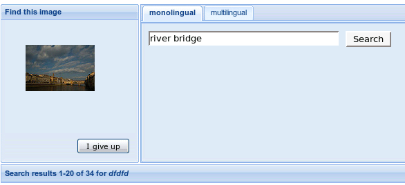

## Cross-language interface

 

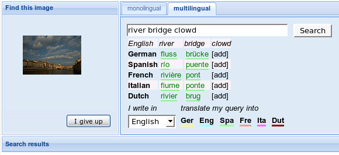

## Customized dictionary

 

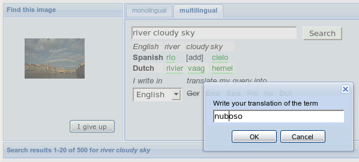

## Ranking of results

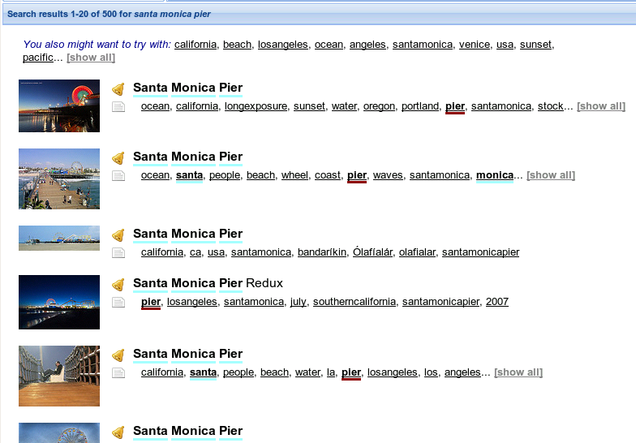

## RF functionalities

 

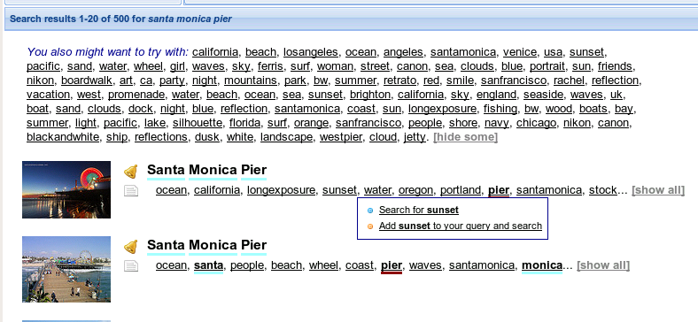

## Search sessions

- Users were given raw images as target: images were chosen randomly from the pool.

- Users could launch monolingual and multilingual searches, manipulating the automatic translations or refining their queries.

- When a user found the target image, she obtained 25 points.

- At any time, users could stop searching and quit. Then, the system offered some hints (everey hint accepted penalized the score). 

- The session finished when the user either found an image or gave up.

- The game could last as long as it has to but, internally, the experiment was considered as finished after 15 sessions.

## Questionnaires

**Post-image questionnaire** about the easiness or difficulty of the task, depending on the outcome of the search session.

**After 15 sessions questionnaire** with extensive details about:

- user's background.

- how clear, easy, familiar, interesting and relevant the task had been.

- the most challenging aspects of the task.

- usefulness of the interface’s facilities.

- any other missing functionalities.

- strategies used to find the correct translations.

## Method of Analysis

- The logs collected and released during the iCLEF 2008 and 2009 campaigns contained more than 2M lines.

- The logs were annonymized and cleansed.

- We restrict the analysis to the **4,571 individual sessions** carried out by users who were able to complete at least 15 search sessions.

## 3 independent variables

**User profile**, according to the users' language skills wrt the language of the target image.

- 2008: 1,885 active, 437 passive and 690 none sessions.
- 2009: 18 passive and 1,571 none sessions.

**Difficulty** of the target image, considering the avg success rate.

- 2008: 1,521 easy and 1,461 difficult sessions
- 2009: 948 easy and 641 difficult sessions

**Number of search session** [1:15]

## 5 dependent variables

- **Result** of the search session :-) or :-(

- **Hints** requested [0:5]

- **Score**: points obtained in the search session [0:25]

- **Total number of interactions** (queries launched, ranking pages explored, usage of RF facilities)

- **Usage of CL facilities** (personal dictionary)

## Performance per user profile 

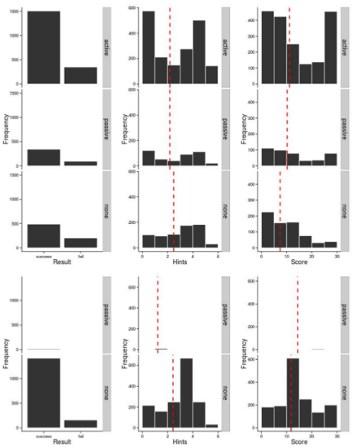

## Performance per image difficulty

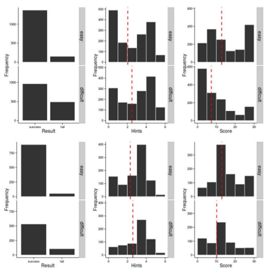

## Performance across time (2008) 

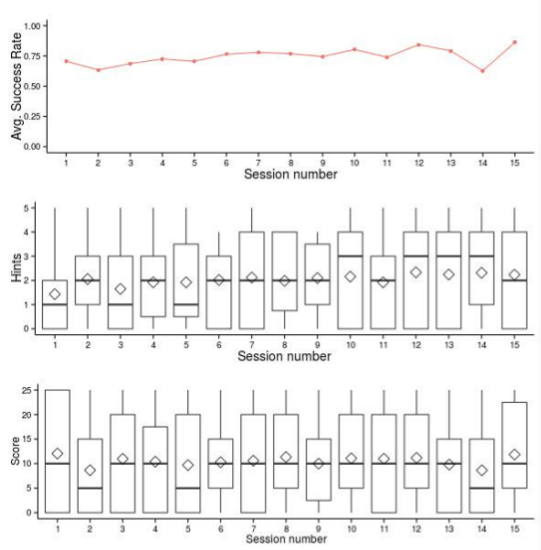

## Performance across time (2009) 

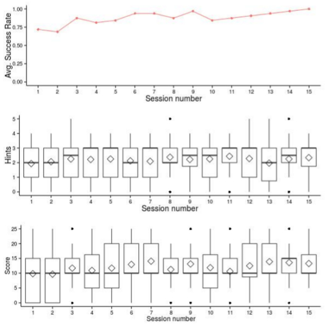

## Effort per user profile

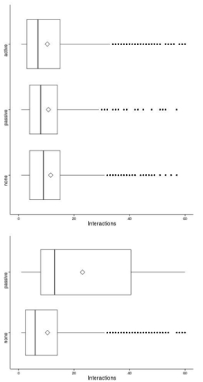

## Effort per image difficulty

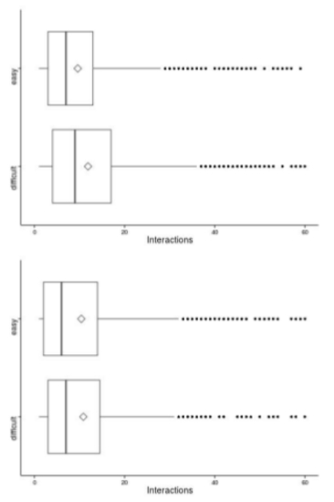

The lack of language skills seems to be directly related to:

- the usage of the multilingual search mode
- the total number of interactions performed.

## Interactions decrease thru time

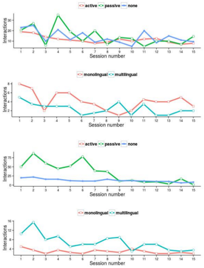

## CL thru time

Only 40% of users employed either the multilingual RF or their personal dictionary, but they don't decrease. 

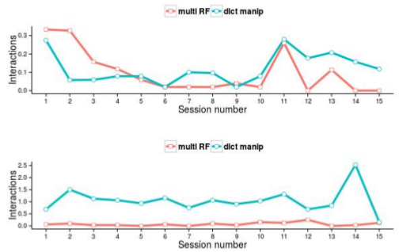

 

More than 75% of subjects found useful or very useful the automatic translation of the queries and the possibility
of maintaining a personal dictionary.

## Users' Perceptions

The language barrier is perceived as the most challenging difficulty (even in a visual task).

In general terms, it's an easy task but...

- it's difficult to describe the image, and;
- it's hard to translate the query terms.

Users quit because...

- too many images to deal with.
- it's difficult to describe the image.

## Conclusions

- Performance of users with passive competence in the target language is similar to users’ with active competence, but at the expense of employing more effort.

- Users with no competence in the target language obtain poorer results.

- The difficulty of the target image is correlated with the number of hints requested (and the score obtained), and the number of interactions performed.

- The difficulty of the image determines the total number of interactions performed, while the language skills are correlated with the usage of cross-language functionalities.

## Conclusions

- Subjects show some kind of learning effect: they maintained stable success rates and fewer interactions we needed as subjects were
acquiring experience with the task and the search interface.

- The language barrier is perceived as the most challenging aspect of the task.

- Users resist to use multilingual search assistance, even when they find out they have to search in unfamiliar languages.

- CL facilities are scarcely used but they are the only functionality whose usage does not decrease across time, they are used more frequently than standard RF features.

- CL facilities are highly appreciated by users.

## Any Questions?

 

 

Thank you! :-)

 

victor@lsi.uned.es | [\@vitojph](https://twitter.com/vitojph)

