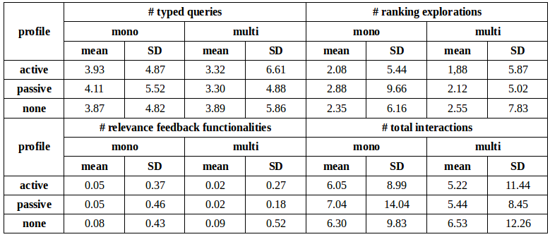

## Interaction Design for Multilingual Information Access beyond Document Retrieval

 
 

ETSI Informática, UNED | 9/06/2014

Víctor Peinado | victor@lsi.uned.es | @vitojph  

--SLIDE--
### Outline

1. Motivation

2. Goals

3. Hypothesis

4. Methodology

5. Achievements

6. [Latest Analyses](./7)

--SLIDE--
### Motivation

- As the number of Internet users grows, more non-English speakers have access to the Web.

- The language gap is the first barrier and MLIA technology can facilitate accessing, querying and retrieving information from multiple sources and across languages.

- Searching for information is an eminently interactive process, but advances achieved in automatic IR have not yet been proved successful with real users.

- How can we properly assist people to find and use information expressed in unknown languages?

--SLIDE--
### Goals

 

- To study and understand how the change from a monolingual to a multilingual environment modifies people’s performance, behavior and satisfaction when searching for information.

--SUBSLIDE--
### Interactive document retrieval is not a complete task

 

- how many documents chosen by the user are relevant for the query? but;

- we cannot confirm that users were actually able to fulfill the initial information need

--SUBSLIDE--
### Beyond document retrieval

 

- **interactive question answering**

  - brief passages vs. full documents
  - pre-specifying the expected type of answer can help users?
  - automatic highlighting of the possible target answers is useful?

--SUBSLIDE--

- **interactive image search**

  - are users willing to translate into unknown languages?
  - competence in target language determines the success of the task?
  - actual usage of CL facilities vs. subjects’ perception of usefulness

--SUBSLIDE--

 

The conclusions of these analyses will allow us to propose mechanisms, tools and good practices to better assist users when searching for information in unknown languages.

--SLIDE--
### Hypothesis

- In monolingual information access tasks user’s intelligence compensates for system’s lacks.

- A user can easily learn how to use information retrieval’s interactive functionalities.

- In a CL environment, the user cannot adapt herself to a new language.

- Unable to search in unknown languages unless CL functionalities are provided by the system.

--SUBSLIDE--

### Hypothesis

 

- in interactive cross-lingual information access tasks, the **cross-language facilities are the key factor** to explain people’s performance, behavior and experience.

--SLIDE--
### Methodology

- Conduct interactive QA experiments in a controlled CL scenario to provide evidence about the difficulties of searching answers.

- Test the usefulness of different access methods and search functionalities:

  - passages vs. documents.
  - automatic highlighting of potential expected answers.

--SUBSLIDE--

- Conduct interactive search experiments in a naturally multilingual images database: Flickr.

  - User-centered experiments in laboratory conditions aimed to test how CL technologies could enhance access

  - Explore the user interaction resulting from this.

--SUBSLIDE--

- Propose an image search task as a game.

  - Design a transaction log to capture every single detail of the multilingual
image search process.

  - Build a multilingual search interface for Flickr, supporting the collection of a medium size search log of multilingual image searches.

  - Apply transaction log analysis to understan the complete multilingual search processes from a user’s perspective.

--SLIDE--
### Achievements

- Passages preferred over documents, but documents are more effective  (López-Ostenero et al., 2005; Peinado et al., 2006; López Ostenero et al., 2008).

- Specifying the expected type of answer before launching the query is helpful (López-Ostenero et al., 2005).

- Automatic highlighting of the possible target answers is useful (Peinado et al., 2006).

--SUBSLIDE--

- Users tend to avoid translating their queries and search for images tagged in unknown languages: (Artiles et al., 2009).

- User with active competence in the target language perform 18% better than users with no competence (Peinado et al., 2009a,b)

- Users with passive competence need more interactions (Peinado et al., 2009a,b).

--SUBSLIDE--

- Usage of CL facilities is low but higher than RF and is perceived as useful (Artiles et al., 2009; Peinado et al., 2009a,b).

- Usage of RF is remarkably low but successful users use it more often (Artiles et al., 2009; Peinado et al., 2009a,b).

- Re-usable resources: the [iCLEF search log](https://github.com/vitojph/iclef) (Peinado et al., 2008, 2009a,b).

--SLIDE--

### Users’ Perceptions, Search Behavior and Search Effectiveness in Interactive Multilingual Search

--SLIDE--

### FlickLing and iCLEF

- FlickLing: a multilingual search interface for Flickr (Peinado et al., 2008) is the multilingual search interface provided by iCLEF organizers.

- Designed to collect a large search log of multilingual image searches

- Two interfaces to perform monolingual and multilingual searches over the Flickr database, retrieving images annotated in different languages.

- Proposed as a competitive game.

--SUBSLIDE--

### Monolingual interface

 

--SUBSLIDE--

### Cross-language interface

 

--SUBSLIDE--

### Customized dictionary

 

--SUBSLIDE--

### Ranking of results for the query *santa monica pier*

--SUBSLIDE--

### RF functionalities

 

--SLIDE--

### Search sessions

 

- Users were given raw images as target: images were chosen randomly from the pool.

- Users could launch monolingual and multilingual searches, manipulating the automatic translations or refining their queries.

- When a user found the target image, she obtained 25 points.

--SUBSLIDE--

- At any time, users could stop searching and quit.

  - Then, the system offered some hints.
  - If the hint was accepted, the score was penalized for 5 points.

- The session finished when the user either found an image or gave up.

- The game could last as long as it has to but, internally, the experiment was considered as finished after 15 sessions.

--SLIDE--
### Questionnaires

1. post-image questionnaire about the easiness or difficulty of the task, depending on the outcome of the search session

2. after 15 search sessions, extensive details about:
   - user's background and previous experience searching information in foreign languages
   - how clear, easy, familiar, interesting and relevant the task had been
   - the most challenging aspects of the task
   - usefulness of the interface’s facilities
   - any other missing functionalities
   - strategies used to find the correct translations

--SLIDE--
### Method of Analysis

- The logs collected and released during the iCLEF 2008 and 2009 campaigns contained more than 2M lines.

- Some users:
   - registered and tried out just a few searches.
   - were caught cheating.
   - were wrongly captured in the logs and considered invalid.

- We restrict the analysis to the **3,025 individual search sessions** carried out by subjects who were able to complete at least 15 search sessions.

--SUBSLIDE--
### Two independent variables

 

- **user profile**: active (N=1,882) / passive (N=442) / none (N=701)
  - according to the users' language skills wrt the language of the target image.

 

- **difficulty** of the target image: easy (N=1521)/ difficult (N=1461)
  - *easy* images are those with higher avg success rate (threshold = 79%)

 

- Both are within-subjects variables used for repeated measures

--SUBSLIDE--
### 5 independent variables

 

- **result** of the search session :-) or :-(

- **score**: points obtained in the search session [0:25]

- **hints** requested [0:5]

- **# interactions**: subject's total effort in performing the task (queries launched, ranking pages explored, usage of RF facilities

- **# ranking pages explored**: depth search strategy vs width search

--SLIDE--

### Results

--SUBSLIDE--
### Performance per user profile

--SUBSLIDE--
### Performance thru time

--SLIDE--
### Effort

 

- We have used the total number of interactions as a metric of subjects' effort.

  - **active**: mean=11.27, SD=13.66
  - **passive**: mean=12.48, SD=16.07
  - **none**: mean=12.83, SD=14.98

 

- These differences are only significant in the active-none comparison (p < .04).

--SUBSLIDE--
### Effort

- the lack of language skills seems to be directly related to:
  - the usage of the multilingual search mode
  - the total number of interactions performed.

--SUBSLIDE--
### Effort thru time

- decreasing tendency in the number of interactions performed as the users were completing search sessions

--SUBSLIDE--
### Effort wrt difficulty of the target image

--SLIDE--
### CL Interactive Search Facilities

- Usage of the cross-language facilities is very low.
  - only 40% of subjects used either the multilingual RF or their personal dictionary.

- dictionary manipulation (adding new translations, promoting convenient options and removing bad ones):

  - **active**: mean=0.06, SD=0.45
  - **passive**: mean=0.06, SD=0.43
  - **none**: mean=0.17, SD=0.79

--SUBSLIDE--
### RF thru time

- CL facilities are the only interaction that do not show the decreasing pattern
- personal dictionary turned out to be more useful as subjects were completing search sessions.

--SLIDE--

### Users' Perceptions

--SUBSLIDE--

### Successful sessions

 

--SUBSLIDE--

### Unsuccessful sessions

 

--SUBSLIDE--

### Most challenging aspects of the task

--SUBSLIDE--

### Selecting the best translations

--SUBSLIDE--

### Most useful interface’s facilities

--SUBSLIDE--

### Missed any other facilities?

--SLIDE--
### Conclusions

- performance of users with passive competence in the target language is similar to users’ with active competence, but at the expense of employing more cognitive effort.

- users with no competence in the target language obtain poorer results.

- the language barrier is perceived as the most challenging aspect of the task.

--SUBSLIDE--

- subjects resist to use multilingual search assistance, even when they find out they have to search in unfamiliar languages.

- CL facilities are scarcely used but they are the only functionality whose usage does not decrease across time, they are used more frequently than standard RF features.

- they are highly appreciated by users.

--SLIDE--

### Questions?

 
 

Thank you!
