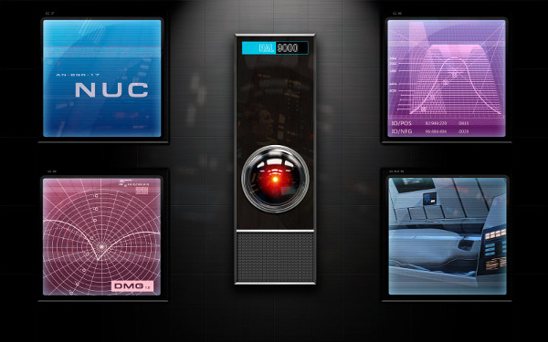

## Los ordenadores son tontos

### ¿Cómo podemos ayudar lingüistas y filólogos?

## El sueño de la Ci-Fi

La inteligencia artificial

## Mi historia 

- Yo quería que mi coche hablara y que me entendiera, como hacía Kitt.

## Mi historia 

- Ahora me gustaría que mi móvil me entendiera.

Y si habla con la voz de Scarlett Johansson, ¡mejor! :-)

## ¿Qué es la Lingüística Computacional?

### O el Procesamiento del Lenguaje Natural

- Área multidisciplinar que combina **Lingüística Computacional** e **Inteligencia Artificial**.

- Nace como disciplina en los años 1940s y 1950s con un objetivo claro: construir sistemas de traducción automática.

- Está relacionado con el desarrollo de herramientas y soluciones que permitan interaccionar de manera eficaz con ordenadores (o máquinas) de manera natural a través del habla.

- PLN está íntimamente relacionado con otras disciplinas como Ingeniería, Psicología, Lógica, Estadística, Interacción Hombre-Máquina, Ciencias Cognitivas.

## Aclaraciones finales

[Procesamiento del Lenguaje Natural (PLN)](https://es.wikipedia.org/wiki/Procesamiento_de_lenguajes_naturales) $\not =$ [Programación neurolingüística (PNL)](https://es.wikipedia.org/wiki/Programaci%C3%B3n_neuroling%C3%BC%C3%ADstica)

[Natural Language Processing (NLP)](https://en.wikipedia.org/wiki/Natural_language_processing) $\not =$ [Neuro-Linguistic Programming (NLP)](https://en.wikipedia.org/wiki/Neuro-linguistic_programming)

Para evitar problemas, busquen por [\#NLProc](https://twitter.com/hashtag/nlproc?src=hash) :-)

Presentación inspirada por [The Stupidity of Computers](https://nplusonemag.com/issue-13/essays/stupidity-of-computers/) de [\@AuerbachKeller](https://twitter.com/AuerbachKeller)

## ¡Muchas Gracias!

¿Preguntas? 

v.peinado@filol.ucm.es

[\@vitojph](https://twitter.com/vitojph)

