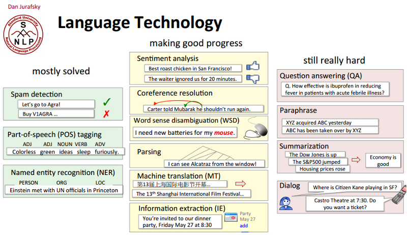

## Índice

- ¿Qué es el Procesamiento de Lenguaje Natural (PLN)?

- Habilidades y competencias del NLPer ideal

- Grupos de Procesamiento del Lenguaje en España

- Grupos de Procesamiento del Lenguaje en Europa

- Grupos de Procesamiento del Lenguaje en EEUU

- MOOCs y cursos online

- Otros cursos presenciales y formación fuera de la universidad

- Otras lecturas

## ¿Qué es el PLN?

- Lingüística Computacional o Procesamiento del Lenguaje Natural (PLN): #NLProc

- Área multidisciplinar que combina **Lingüística**, **Informática**, **Estadística/Análisis de datos** e **Inteligencia Artificial**.

    - PLN está íntimamente relacionado con otras disciplinas como Ingeniería, Psicología, Lógica, Estadística, Interacción Hombre-Máquina, Ciencias Cognitivas.

- Nace como disciplina en los años 1950s con un objetivo inicial claro: construir sistemas de traducción automática.

- [Amalgama de problemas, técnicas, ideas y soluciones](http://nlpers.blogspot.com.es/2012/12/teaching-intro-grad-nlp.html) para procesar automáticamente el lenguaje natural.

## ¿Qué es el PLN?

Es la disciplina relacionada con el desarrollo de herramientas y soluciones que permitan:

- procesar automáticamente lenguaje natural.

- comprender el lenguaje natural.

- interaccionar de manera eficaz con ordenadores (o máquinas) de manera natural a través del habla.

## Tareas del PLN

- Análisis morfo-sintáctico (*PoS tagging*, *parsing*).

- Reconocimiento de entidades (*named entities recognition*).

- Desambiguación semántica (*word sense disambiguation*).

- Traducción automática (*machine translation*).

- Extracción de información (*information extraction*).

## Tareas del PLN

- Reconocimiento del habla (*automatic speech recognition*).

- Recuperación de información (*information retrieval*).

- Resumen automático (*automatic summarization*).

- Búsqueda de respuestas (*question answering*)

- Análisis de opiniones (*sentimen analysis*)

- Generación del lenguaje natural (*natural language generation*) y comprensión del lenguaje natural (*natural language understanding*).

## Progresos en PLN

- En 1950s y al inicio de la Guerra Fría, el objetivo era los sistemas de **traducción automática**.

- En la decada de los 1960s, aparecen **sistemas expertos** que asistían en la toma de decisiones: sistemas de diálogo que trataban de imitar conversaciones humanas, creación de ontologías para capturar conocimiento del mundo.

- Hasta los 1980s, la mayor parte de los sistemas de PLN estaban basados en conocimiento y manejaban complejas reglas diseñadas a mano. Influencia de la Lingüística Generativa de Chomsky.

## Progresos en PLN

- A partir de esa década, irrumplen las aproximaciones estadísticas basadas en sistemas de **aprendizaje automático**, que requieren grandes colecciones de datos anotados manualmente. Desarrollo paralelo al aumento de potencia de los ordenadores.

- Actualmente, vivimos un auge de los sistemas de aprendizaje automático *no supervisados* (es decir, no anotados), con especial énfasis en el uso de la Web. Explosión de datos en formato electrónico.

- En la década de los 2010s hemos visto el resurgir de los sistemas que utilizando **redes neuronales**.

## Tareas resueltas y problemas abiertos

## ¿Por qué es tan difícil el PLN?

El lenguaje natural es eminentemente **ambiguo**: es la principal diferencia entre lenguas naturales y lenguajes artificiales.

Y esta ambigüedad existe a varios niveles:

- ambigüedad fonética y fonológica: *vaca/baca*, *casa/caza*, *has sido tú/has ido tú*

- ambigüedad morfológica: *casa, beso, río*

- ambigüedad sintáctica: *Ayer me encontré a tu padre corriendo*

- ambigüedad semántica: *banco*, *pie*

- ambigüedad de discurso: correferencia, resolución de anáforas

## ¿Por qué es tan difícil el PLN?

## Habilidades para trabajar en PLN

- Lingüística: fonética, sintaxis, semántica.

- Informática: programación, aprendizaje automático.

- Estadística, probabilidad, análisis de datos.

- Lógica, formalización y representación del conocimiento.

## Habilidades para trabajar en PLN

Herramientas para el día a día, trabajar en equipo, compartir y reutilizar código, acceder a colecciones de datos y poner en marcha servidores en la nube.

- línea de comandos de Unix, bash y herramientas de procesamiento de texto, `git` y [GitHub](https://github.com/).

- librerías para tareas de PLN: [NLTK](http://www.nltk.org/), [GATE](https://gate.ac.uk/), [Tensorflow](https://www.tensorflow.org), [FreeLing](http://nlp.cs.upc.edu/freeling/), [pattern](http://www.clips.ua.ac.be/pattern).

- Computación en la nube: [Google Cloud Platform](https://cloud.google.com/), [Amazon AWS](https://aws.amazon.com/es/), [Heroku](https://www.heroku.com/).

## Grupos de PLN en Madrid

- **UAM**: [LLI](http://www.lllf.uam.es/ING/index.html) y [ATVS](https://atvs.ii.uam.es/).

- **UCM**: [NIL](http://nil.fdi.ucm.es/) y [Área de Lingüística](https://www.ucm.es/linguistica).

- **UC3M**: [LABDA](http://labda.inf.uc3m.es).

- **UEM**: [GSI](http://www.esp.uem.es/gsi/en/).

- **UNED**:  [NLP&IR UNED](http://nlp.uned.es/web-nlp/) y [SECONDS](http://www.seconds.edu.es/en).

- **UPM**: [GTH](http://gth.die.upm.es/index.htm), [GSI](http://www.gsi.dit.upm.es/) y [OEG](http://www.oeg-upm.net/).

## Grupos de PLN en España

La SEPLN tiene un [listado de grupos de investigación españoles](http://www.sepln.org/category/en_investigacion/en_grupos_investigacion/?lang=en).

En Catalunya:

  - **UAB+UB++UdL+UOC**: [GRIAL](http://grial.uab.es/index.php?idioma=es).

  - **UB**: [CLiC](http://clic.ub.edu/).

  - **UPC**: [TALP](http://www.talp.upc.edu/).

  - **UPF**: [TALN](https://www.upf.edu/web/taln/), [TLR](https://www.iula.upf.edu/trl/rpresuk.htm) y [Web Research](http://grupoweb.upf.es/WRG/).

En Euskadi:

  - **UPV/EHU**: [IXA](http://ixa.si.ehu.es/).

## Grupos de PLN en España

En la Comunidad Valenciana:

  - **UA**: [GPLSI](https://gplsi.dlsi.ua.es/gplsi13/es).

  - **UPV**: [ELiRF](http://users.dsic.upv.es/grupos/rfia/webelirf2/) y [NLEL](http://users.dsic.upv.es/grupos/nle/?file=kop1.php).

En Andalucía:

  - **UJaén**: [SINAI](http://sinai.ujaen.es/en/).

  - **US**: [Julietta](http://grupo.us.es/julietta/) y [Itálica](https://www.lsi.us.es/italica/).

  - **UHu**: [LABERINTO](http://www.uhu.es/laberinto/).

## Grupos de PLN en Europa

- [Institute for Language, Cognition and Computation, U. of Edinburgh](http://web.inf.ed.ac.uk/ilcc)

- [NLP Group, U. of Sheffield](http://nlp.shef.ac.uk/)

- [Computational Linguistics & Phonetics, U. des Saarlandes](http://www.coli.uni-saarland.de/)

- [Language Tecnology LAb, DFKI](https://www.dfki.de/lt/)

- [HLT - Natural Language Processing, Fondazione Bruno Kessler](https://hlt-nlp.fbk.eu/)

- [Computational Linguistics & Psycolinguistics, U. Antwerp](https://www.uantwerpen.be/en/rg/clips/)

- [Institute for Logic, Language and Computation, UvA](https://www.illc.uva.nl/)

## Grupos de PLN en EEUU

Quora: [Which are the best schools for studing NLP](https://www.quora.com/Which-are-the-best-schools-for-studying-natural-language-processing)

- [Stanford NLP Group](http://nlp.stanford.edu/)

- [The NLP Group at ISI/USC](http://www.isi.edu/research_groups/nlg/home)

- [Language Technology Institute, Carnegie Mellon University](http://www.lti.cs.cmu.edu/)

- [The Berkeley NLP Group](http://nlp.cs.berkeley.edu/)

- [Proteus Project, NYU](https://nlp.cs.nyu.edu/index.shtml)

## Cursos y materiales

- [Introduction to Natural Language Processing](https://www.coursera.org/learn/natural-language-processing).

- Manning & Jurafsky organizaron un curso de NLP en Coursera. Todavía sobreviven las [presentaciones](https://web.stanford.edu/~jurafsky/NLPCourseraSlides.html) y los [vídeos](https://www.youtube.com/playlist?list=PL6397E4B26D00A269).

- [Stanford NLP](https://web.stanford.edu/class/archive/cs/cs224n/cs224n.1162/) ([materiales](https://web.stanford.edu/class/archive/cs/cs224n/cs224n.1162/syllabus.shtml))

- [Programming for Linguists (and fellow travelers)](http://web.stanford.edu/class/linguist278/) ([materiales](http://web.stanford.edu/class/linguist278/syllabus.html))

- [Oxford Deep NLP](https://github.com/oxford-cs-deepnlp-2017/lectures)

## Libros y lecturas

- Dan Jurafsky and James H. Martin. [Speech and Language Processing](https://web.stanford.edu/~jurafsky/slp3/)

- Chris Manning and Hinrich Schütze, [Foundations of Statistical Natural Language Processing](http://www-nlp.stanford.edu/fsnlp/)

- Steven Bird, Ewan Klein, and Edward Loper. [Natural Language Processing with Python](http://www.nltk.org/book/)

- Jacob Perkins. [Python 3 Text Processing with NLTK 3 Cookbook](https://www.packtpub.com/application-development/python-3-text-processing-nltk-3-cookbook)

## Libros y lecturas

- [The Stupidity of Computers](https://nplusonemag.com/issue-13/essays/stupidity-of-computers/)

- [NLP (almost) from scratch](https://arxiv.org/abs/1103.0398)

- [The Two Paths from NLP to AI](https://medium.com/intuitionmachine/the-two-paths-from-natural-language-processing-to-artificial-intelligence-d5384ddbfc18#.hnswmbbd3)

- [Natural Language Processing Key Terms, Explained](http://www.kdnuggets.com/2017/02/natural-language-processing-key-terms-explained.html)

## ¿Preguntas?

 

 

 

Muchas gracias :-)

 

vitojph ARROBA gmail.com | [\@vitojph](https://twitter.com/vitojph) | [vitojph.github.io](http://vitojph.github.io)

